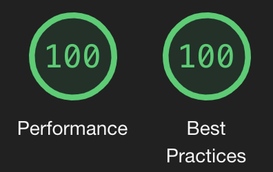

# Changelog

## 30-Jun-22

- Revising the READMEs.

## 18-Apr-22

- Rearranged the way `packages/app` uses the backend
   - now all backend details in `packages/backend`; also for the instance used for front-end development
- Backend CI runs work, again

## 20-Mar-22

- Updating to `firebase-jest-testing` 0.0.5-alpha.1
- Using Docker Compose healthchecks and `depends_on:` with `condition:`
  - means we don't need `dc-tools/n-user` any more!! 🪒
- Abandoning Node.js 14 (no longer testing with it in CI)

## 9-Jan-21

- Bumped Firebase Emulators to 10.0.1; the image now uses npm8

## 6-Sep-21

- Backend CI testing using Docker Compose
   - with `npm` running the tests

## 12-Aug-21

- Using Docker Compose for handling concurrency in testing.

## 16-Jun-21

- Going back to `firebase@9.0.0-beta.2`, to fix [#56](https://github.com/akauppi/GroundLevel-firebase-es/issues/56)

## 28-May-21

- LOTS of changes! 
  - backend testing now stable (all tests pass); uses [`firebase-jest-testing`](http://github.com/akauppi/firebase-jest-testing)
- Deployment works.

   
