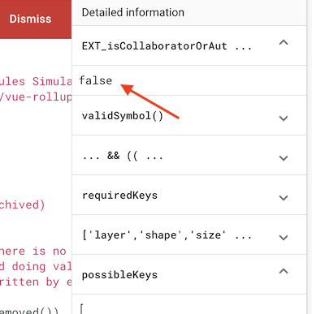
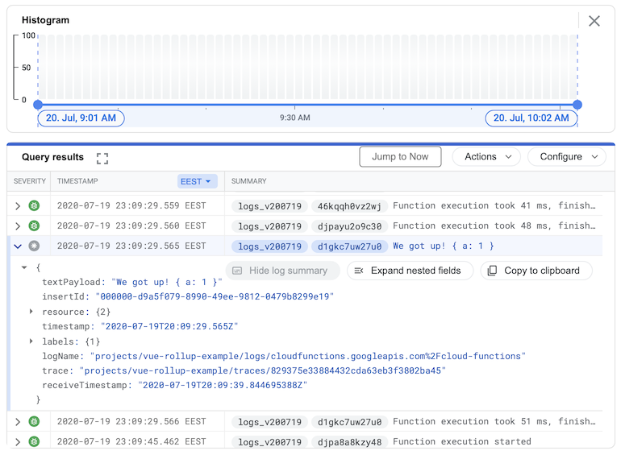

# Firebase tips


## Use creation date in the project id

Firebase automatically appends a uniqueness id to your project id (e.g. `mysome-5342`). You can edit this to your liking, and using `DDMMYY` format may provide extra benefit to a random number:

- you know when you created it (how stale it is)
- if you end up creating multiple projects for the same thing, it helps keep log

While you *can* likely get this info from elsewhere, why not just make randomness work for you. :)


## Firestore: use array/object or a collection?

Firestore works on the document-collection-document-... pattern ([Cloud Firestore Data model](https://firebase.google.com/docs/firestore/data-model)).

One can express a dataset either within a document, or as a combination of documents and subcollections. Here are the pros/cons of both approaches:

### Within a document

Pros:

- Simple, traditional.
- May be cheaper: access is charged by documents read, and access to multiple fields of a single document counts as 1 read. This may be the strongest reason to avoid splitting data to sub-collections.

Cons:

- ...

### As sub-collections

Pros:
- ...

Cons:
- ...


### Quotes

>Don't add subcollections unless you need it. I only add them when there is a large amount of related data that does not need to be pulled Everytime I retrieve root data.<sub>[source](https://www.reddit.com/r/Firebase/comments/bi45dr/firestore_is_there_any_good_reason_to_use/)</sub>

>You can't currently [2019] query across subcollections, but this feature is planned for the future.  When it is launched, it should make subcollections significantly more useful.<sub>[source](https://www.reddit.com/r/Firebase/comments/bi45dr/firestore_is_there_any_good_reason_to_use/)</sub>


>I use them [sub-collections] when I have lists of notifications for users. So there will be a users collection, and a notifications subcollection for each user.<sub>[source](https://www.reddit.com/r/Firebase/comments/bi45dr/firestore_is_there_any_good_reason_to_use/)</sub>


## Syntax highlighting of Security Rules on IntelliJ IDEs (kind of...)

See [this answer](https://stackoverflow.com/questions/46600491/what-is-the-name-of-the-language-used-for-cloud-firestore-security-rules/60848863#60848863) (StackOverflow) about setting up "file type associations" in IntelliJ IDEA - may also work in WebStorm.

In addition, set to 2 spaces:


## Understanding `firebase use`

It defines which Firebase project your development terminal and local instance started by, say, `npm run dev`, is connected to.

List the current shortcuts with:

```
$ firebase use
Active Project: prod (groundlevel-production)

Project aliases for /Users/asko/Git/GroundLevel-es6-firebase-web:

  dev (vue-rollup-example)
  default (vue-rollup-example)
* prod (groundlevel-production)

Run firebase use --add to define a new project alias.
```

As it says there, to make a new shortcut, run `firebase use --add`.

The shortcuts are folder specific and stored in the `.firebaserc` file:

```
$ more .firebaserc 
{
  "projects": {
    "dev": "vue-rollup-example",
    "default": "vue-rollup-example",
    "prod": "groundlevel-production"
  }
}
```

If you open a new terminal - as long as you are within the project folder - your in-use Firebase project will remain the same.

Doing `firebase use <shortcut>` changes the active project. 

<!-- tbd. Q: Where is the active project stored?  It does not change anything in the `.firebaserc` nor `firebase.json` files
-->


## Security Rules Online Simulator

The simulator can be very useful, providing detailed information on why a certain rule failed. But you need to know where to look.

### Rule, Evaluated

Scroll to the top right of the window. Here you see how Firebase evaluates your rule:



You can click each rule fragment open to see what it evaluates to. Any surprises lead you further.


### Entering `FieldValue` values

There is no GUI support for building a document with `FieldValue`s (e.g. server time stamp) but maybe we can fool the simulator by:

```
{
  _methodName: 'FieldValue.serverTimestamp'
}
```


## Viewing logs online

Easiest to get to the online logs:

```
$ firebase functions:log --only logs_v200719 --open
```

Click `Preview`.



Nice! 😀

See filtering info -> [Logs Based Metrics](https://firebase.google.com/docs/functions/writing-and-viewing-logs#logs-based_metrics) (Firebase docs)


## You can `debug()` security rules! (undocumented)

See [https://github.com/firebase/firebase-tools/issues/1166#issuecomment-472063944](https://github.com/firebase/firebase-tools/issues/1166#issuecomment-472063944)


## Debugging Security Rules tests

The `firestore-debug.log` file generated by the emulator may provide info about why some rules work different than intended:

```
...
INFO: operation failed: 
Function not found error: Name: [validUserInfoWrite]. for 'create' @ L334
...
```


## See the data used in Security Rules tests

Set the `projectId` to the same as your active project (see `.firebaserc`).

The `@firebase/testing` library allows writing to any projects (which is handy), but the emulator UI only shows the active one.

