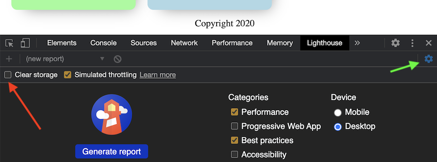

# Lighthouse

Google Chrome has a Lighthouse tool to evaluate your site's performance. It's good to use occasionally, with different settings.

Before usage:

- Open Chrome
- `Show` > `Developers` > `Developer tools` (or Alt-⌘-I shortcut on Mac)
- Unselect ⚙️ > `Clear storage`. Otherwise running Lighthouse will log you out <small>(if using Firebase authentication and not `?user=dev`)</small>.

   >

Make a report:

- Open Chrome and the web page. Sign in.
- `Show` > `Developers` > `Developer tools`
- `Lighthouse` tab
- Pick the check boxes you are interested in, and `Generate report`

So proud of those results!! :)

>Note: Recently (2022), it's Performance: 48. Not sure what causes that. `#tbd`

If there are places for improvement, Lighthouse offers you links for more information.

Note that the production builds (`index.html` and Rollup configuration) is optimized for HTTP/2 delivery. **Use Lighthouse only on production builds, not development.**

>Note: If your results are less than 100 and they can be improved by settings in this project, create an Issue.

## References

- [Running Lighthouse on Authenticated pages](https://github.com/GoogleChrome/lighthouse/blob/master/docs/authenticated-pages.md) (Lighthouse GitHub)

