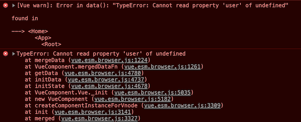

# Development tips

## Browser choice: Chrome rocks!

For the same error, Chrome (v80) gives way better console error messages than Safari (v13). It's simply faster to do basic development with Chrome.

Also, Chrome sports the "Vue.js devtools" plugin.[^1]

[^1]: Use the [beta](https://chrome.google.com/webstore/detail/vuejs-devtools/ljjemllljcmogpfapbkkighbhhppjdbg) tools, until support for Vue 3.0 is mainstream.

Safari:


Chrome:




## Why (not to) have `package-lock.json`?

`package-lock.json` is intended to ensure that one's CI (or other developers) get the same dependencies as you. It makes debugging more reproducible, and is likely a good thing to enable, if working as a team.

It's also a pain, and in many cases unnecessary.

Reasons not to have it:

- it causes commit noise

Reasons to have it:

- `npm audit` needs it.

If you want to run `npm audit`, do this:

```
$ rm .npmrc		# 'git restore' it later
$ npm install		# creates 'package-lock.json'
$ npm audit
```

To set back:

```
$ git restore .npmrc
$ rm package-lock.json
```

Of course, you can also choose to have it enabled. :)


## Using CommonJS dependencies

Vite will handle this automatically (development).

In Rollup, you need to:

- enable `@rollup/plugin-commonjs` in `package.json`
- uncomment `//import commonjs from '@rollup/plugin-commonjs';` and `//commonjs()` lines in `rollup.config.prod.js`

Test it. The setup hasn't been tested with CommonJS dependencies, so it would be nice to hear, whether these instructions are sufficient.

