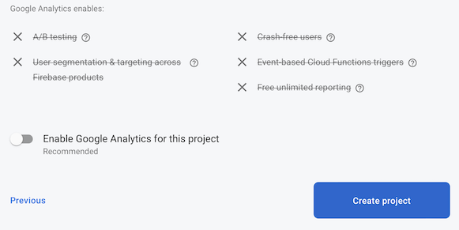

# No to Google Analytics - but why?

First, you *can* use Google Analytics with this repo if you want to. We'll go through when this could be meaningful, and why the default does not require it.

## Choice at Create project

>

Firebase presents you with the above choice when creating a project. It "recommends" enabling Google Analytics.

This recommendation is understandable. Google's business model works around advertising and the more apps enable Google Analytics, the more targeted such advertisement will be, one assumes.

The question is: does it benefit *you* as a web app author - or your users, in any way?

The dialog doesn't clearly indicate what the pros/cons of toggling the switch are. For example:

- what data does Google Analytics collect from your web app's users?
- where is this data being used?

Because of this uncertainty -- and reluctance to decide something on behalf of others -- this repo is not using the services mentioned here as depending on Google Analytics.

Instead:

- Userbase understanding is gathered using [Plausible](https://plausible.io) - who especially underline their dedication to users' freedom to value privacy.

- A/B testing is not yet (Jul 2022) implemented in the repo, but can be, using e.g. monitoring tools.

- Crash monitoring is implemented by [Sentry](https://sentry.io/welcome/).

   >Note: Firebase Crashlytics would anyways not be available for web apps, only mobile (Jul 2022).

## When would you use Google Analytics?

>Disclaimer: The author has no experience on Google Analytics. Take with  🧂.

- [ ] If your application shows ads
- [ ] If you already are using the product, and are familiar with it

In such a case, go right ahead but realize you're on your own!

## Reading

- [Google Analytics](https://www.techtarget.com/searchbusinessanalytics/definition/Google-Analytics) (article; Apr 2021)
