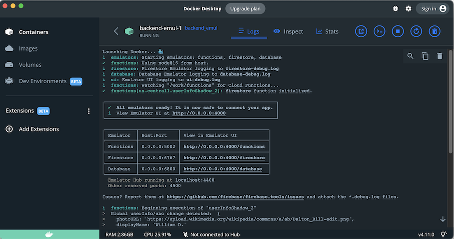

# Using Docker Compose V2


We are not going to details of DC here, but giving practical notes that aren't necessarily obvious from reading the manuals.

## 2.7.0 or 1.29.2? 🤔

Docker Compose 2 means that you can use Docker Compose commands as `docker compose` (before it was `docker-compose`). Docker Compose is now integrated with Docker itself, and comes bundled in the Docker Desktop applications.

However.

If you run this command:

```
$ docker compose version
Docker Compose version v2.7.0
```

..but if you look at Docker Desktop > `About Docker Desktop`:

> 

That says 1.29.2.

The author doesn't understand, why there are these two version numbers.

References: 

- [Compose V2 and the new docker compose command]() (Docker Compose docs)


## `docker compose up`

`up` launches a service, and its dependencies. It shows the service's output in the terminal and if you press Ctrl-C, the service is terminated.

Use this for e.g. debugging terminal output of starting emulators.


## `docker compose run`

`run` runs a certain task, making sure services such a task may require are also running.

Be aware that dependent services **remain running even after the task has finished**. This means two things:

- your subsequent runs are faster, since the background systems are already up and running
- the ports taken up by those services (and mapped to the Docker host, i.e. your `localhost`) **remain taken** until you close the composed stack.

To close the composed stack, you would normally do:

```
$ docker compose down
```

However, with this repo we have split Docker Compose definitions in multiple files, and the above command would usually leave services still running.

You can either visit each of the DC files (`-f docker-compose.some.yml`), but that's tedious. Open Docker Desktop > `Containers`, tick all services, `Delete 🗑`.


## Console output per container

You can *always* see any container's console output in the Docker Dashboard > `Containers` > `backend` > `emul-1`


Click the container's name to see its log:




## Building after changes to base DC file

Docker Compose allows definition files to be based on others, making a cascade. This is awesome. Unfortunately, it does not detect if we change something upstream, e.g. pumping up the version of Vite we'd like to use.

This would confuse the development experience. We've counteracted it by using Makefiles and time stamps, so that changes to base files automatically cause the necessary rebuilds.

This works, but is error-prone since it duplicates a dependency chain between DC files.
