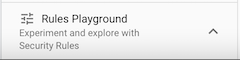
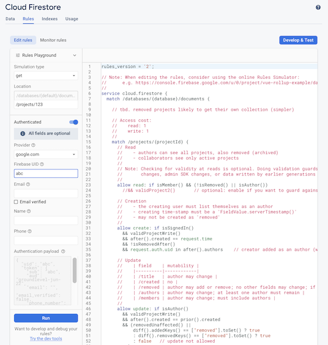
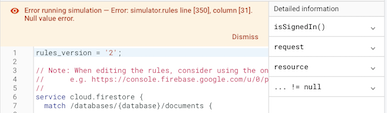

# Firebase tips

<!-- disabled
## Thing called Rules Playground

- [Quickly validate Security Rules](https://firebase.google.com/docs/rules/simulator) (Firebase docs)

After you have deployed your application:

- go to GCP Console > `Firestore` > `Rules` > `Rules Playground`

   



This is a tool that allows you to manually test how security rules would behave if you approached them with certain queries or writes.

**Pros**

- It's kind of fun!
- Provides better output of *why* a certain query would be rejected (or would pass) than other tools do.

**Cons**

- It doesn't match the emulator-centric (local) development model.

### Opinion

The Rules Playground is in the wrong location, currently. It is a remnant from the times before Firebase Emulators, when people needed to develop stuff online. We no longer do. Having the Rules Playground available in the local emulator UI would make sense.

Alternatively, it could be replaced with a command line tool that:

- checks whether Rules are valid (and gives proper error messages if not).
- for a given query/write would show whether it passes, or would fail

If such a tool would be guaranteed to behave 1-to-1 with the online implementation and be available as a Node.js library, it could be used for unit testing Security Rules.

Currently, Rules Playground is a niche tool, hidden away in the management/operational Firebase console that no longer should have any development tools.


### Bugs

The Rules Playground evaluates rules differently from real Firebase services (at least Firestore).

>

These rules pass in emulator and online deployment. The Rules Playground chokes at `resource.data`. 

Earlier on (before emulators were launched, ca. 2019) people compensated for such behaviour by protective coding, specially crafted for the simulator. Such tricks should not be necessary - instead, Firebase could remove deviations between the Rules Playground and the Real Thing.

Also, Rules Playground is slow.

---

For these reasons, expect Rules Playground to be deprecated at some point. It's good to be aware of it but it doesn't feel "production grade" quality.

The author wishes it to be shut, but after its unique rule evaluation insight have been brought to be available in the Firebase CLI or emulator UI.

<!_-- hidden
### Entering `FieldValue` values

There is no UI support for building a document with `FieldValue`s (e.g. server time stamp) but maybe we can fool the simulator by:

```
{
  _methodName: 'FieldValue.serverTimestamp'
}
```

>tbd. tell whether the above worked `#help`
--_>
-->

## You can `debug()` security rules!

Firebase Rules Reference > [rules.debug](https://firebase.google.com/docs/reference/rules/rules.debug) (Firebase docs)

>Note that the output goes to `firestore-debug.log`, not stdout.


## Debugging Security Rules tests

The `firestore-debug.log` file generated by the emulator may provide info about why some rules work different than intended:

```
...
INFO: operation failed: 
Function not found error: Name: [validUserInfoWrite]. for 'create' @ L334
...
```


## Similar but very different API's

>Note: This is not a bug report. Just a heads up that the API approaches differ between the libraries (and execution contexts) used. `firebase-admin` would be yet a third such.

Listening to changes to a document, using Cloud Firestore triggers (`firestore-functions`):

```
export blah = regionalFunctions.firestore
  .document('/userInfo/{uid}')
  .onWrite( async (change, context) => {
    // no change types
    // change.before: QueryDocumentSnapshot 
    // change.after: -''-
    //
    const uid = change.after.id;   // document id
```


Doing the same in client code (`@firebase/firestore`):

```
collection(db, "userInfo/{uid}")
  .onSnapshot( snapshot => {
    snapshot.docChanges().forEach( change => {
      // change.type: "added"|"modified"|...
      // change.doc.data(): 
```


||Cloud Functions trigger (server)|Firestore client|
|---|---|---|
|Change type|implied by one's choice of listener method: `.onCreate`,`.onUpdate`,`.onWrite`,`.onDelete`|change indicated by `change.type` (enum: "added"\|"modified"\|"removed")|
|Document id|`change.after.id`|`change.doc.id`|
|Previous contents|`change.before.data()`|n/a|
|New contents|`change.after.data()`|`change.doc.data()`|

These are two wholly separate APIs and there are reasons why they are so. Using GroundLevel, you don't really face this difference much since tracking Firebase collections happen via Vue.js reactive constructs. But it's good to be aware.

References:

- [Cloud Firestore function triggers](https://firebase.google.com/docs/functions/firestore-events#function_triggers) (Firebase docs)
- [View changes between snapshots](https://firebase.google.com/docs/firestore/query-data/listen#view_changes_between_snapshots) (Firebase docs)


## Key Visualizer

- [Overview of Key Visualizer](https://cloud.google.com/firestore/docs/key-visualizer) (Cloud Firestore docs)

*The Key Visualizer is a new thing (Jul 2022) and the author hasn't tried it in action, yet.*

