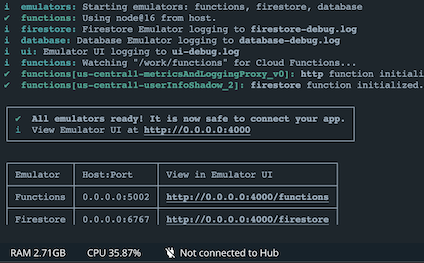
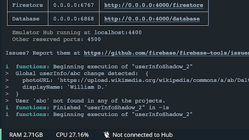

# Wishes for Firebase CLI

This file contains wishes regarding the `firebase-tools` (Firebase CLI), including emulator when command line is concerned.

Library/API/service wishes are in [Wishes for Firebase](./Wishes for Firebase.md).


## Act like a CLI!!!

CLI could feel more like a real command line tool (and less Python):

- be faster!!!!

  ```
  # time firebase --version
  11.3.0
  real	0m 5.63s
  user	0m 2.28s
  sys	0m 2.41s
  ```
   
   Launch (within a Docker container) takes 5.6s first time; 2.9s subsequent. Would <0.5s be possible???
  
- feed errors to `stderr` (not ever to `stdout`)
- exit with error codes when it fails (being addressed [here](https://github.com/firebase/firebase-tools/issues/4754))


## Firebase emulators should fail fast ‼️

The emulator should fail to start if:

- there is no configuration available
- ..or its initial state is broken

Current (`firebase-tools` 11.0.1) behavior is to log warning messages, but keep going.

This assumes the developer is keenly looking at the log output. When using Docker, they are not. It would be cleaner if the process would simply terminate.

Once things are launched, the current behavior makes sense. It allows the developer to make changes to the rules, see if they pass, without needing to restart the services. The author is not suggesting to change this behaviour.

Example 1:

```
$ firebase emulators:start --project=bunny --only functions,firestore
i  emulators: Starting emulators: functions, firestore
⚠  functions: The following emulators are not running, calls to these services from the Functions emulator will affect production: auth, database, hosting, pubsub
⚠  Your requested "node" version "14" doesn't match your global version "15"
⚠  functions: Unable to fetch project Admin SDK configuration, Admin SDK behavior in Cloud Functions emulator may be incorrect.
i  firestore: Firestore Emulator logging to firestore-debug.log
i  ui: Emulator UI logging to ui-debug.log
i  functions: Watching "/Users/asko/Git/GroundLevel-es-firebase/packages/backend/functions" for Cloud Functions...
⚠  The Cloud Functions emulator requires the module "firebase-functions" to be installed. This package is in your package.json, but it's not available. You probably need to run "npm install" in your functions directory.
i  functions: Your functions could not be parsed due to an issue with your node_modules (see above)
```

..but the process keeps running.

Example 2:

```
i  logging: Stopping Logging Emulator

Error: Failed to load initial Database Emulator rules:

database.rules.json:60:40: No such method/property 'value'.

69:40: No such method/property 'value'.

Error: An unexpected error has occurred.
```

..again, it keeps running. The developer sees this on the OS terminal:

```
 $ npm run start

> start
> npm run -s _prepDC && PROJECT_ID=demo-2 docker compose run --rm warmed-up && echo "Firebase Emulators are running. Use 'docker compose down' to run them down.
> "

[+] Running 3/3
 ⠿ Network backend_default      Created    0.1s
 ⠿ Container backend-emul-1     Created    0.4s
 ⠿ Container backend-warm-up-1  Created    0.4s
[+] Running 2/2
 ⠿ Container backend-emul-1     Healthy    23.0s
 ⠿ Container backend-warm-up-1  Started    0.7s
...
```

Nothing indicates anything to be wrong, here.

Despite the Realtime Database rules being wrong, the emulator still serves the port. Because of this, Docker Compose health check passes and there's *no way* the author can think of to automatically figure out the initial state is bad.


**It's actually worse (Cloud Functions not reloading if initial compilation fails)**

If Cloud Functions have an error that occurs in loading them, Firebase Emulators does *not* try to reload the scripts, but forces the developer to run down the service, and start it again.

*If* this would fail the whole emulation attempt, at launch, it would speed up the development cycle.


**Idea**

We could patch `firebase-tools` (since we use it via a Docker image) so that it does early failure.


## Firestore emulator: ability to load rules from multiple files 🌺🌸🌺

Currently (8.6.0), all rules must be in a single file, defined in `firebase.json`:

```
"rules": "../firestore.rules",
```

I would prefer a freedom to place separate collections' rules in separate files. This makes the source code more managable, as you can imagine (my project is small, yet has separate "projects", "symbols" and "invites" collections).

Implementation could allow an array in addition to the current string entry:

```
"rules": ["../firestore.rules", ...]
```

**Idea**

Provide a TypeScript generator for Firestore Security Rules. This would take away the need for an IDE syntax highlighter, as well as instantly allow using multiple source files.


## Firebase emulator: ability to check in tests whether Security Rules are healthy

When editing security rules, I normally have the IDE and the test output visible - not the terminal running the Firebase emulator.

If security rules are broken, the test output is garbage:

```
  ● '/projects' rules › user needs to be an author, to read a 'removed' project

    expect.assertions(2)

    Expected two assertions to be called but received one assertion call.

      67 | 
      68 |   test('user needs to be an author, to read a \'removed\' project', () => {
    > 69 |     expect.assertions(2);
         |            ^
      70 |     return Promise.all([
      71 |       expect( abc_projectsC.doc("2-removed").get() ).toAllow(),
      72 |       expect( def_projectsC.doc("2-removed").get() ).toDeny()

      at Object.<anonymous> (projectsC.test.js:69:12)
```

The Firebase testing library could provide a function to check the validity of the current Security Rules, from the emulator. I can then use this in a "before all" hook, and not run the tests if they are not going to work.


## Emulators: don't leak to the cloud

The `firebase emulators:exec` and `emulators:start` `--only` flag works like this:

- named services are emulated
- for other services, unless they are named `demo-{something}`, the cloud instances are used

*What is the use case of leaking to the cloud?*

As a developer, I would prefer to keep emulation and cloud completely separate. At the least, there should be (a `--only-only`?? :) ) flag, to state I just want emulated services.

Output from current `npm run dev` launch:

```
...
[emul] ⚠  functions: The following emulators are not running, calls to these services from the Functions emulator will affect production: database, hosting, pubsub
...
```

This seems like a left-behind from the time before local emulation. Time to Deprecate??

**Idea:**

Separate project, splitting current `firebase-tools` in half. CLI means cloud, emulators mean local. Full separation!


<!-- not needed, any more..
## `firebase use` to detect whether there's an active project

Current situation (`firebase-tools` 8.11.1):

```
$ firebase use | more

ESC[1mESC[31mError:ESC[39mESC[22m No active project
```

`firebase use` works differently, based on whether it's part of a pipe (above) or run interactively. This is not the problem.

When run as pipe, it shouldn't do the ANSI graphics (above). This is not the problem, either.

Return code is 0, even when there's no active project. This is the problem and causes one to parse the output, in order to know (in a script) whether there's an active project.

**Suggestion:**

`firebase use` could return with a non-zero exit code, if there is no current project.

This is a breaking change.
-->

## `firebase apps:sdkconfig` prints errors to `stdout` (and causes us to do extra dance to bring them to the user)

`firebase-tools` 11.0.1

`first/docker-compose.yml` could have:

```
      (firebase apps:sdkconfig > .captured)
```

Expected:

If there's an error, Firebase CLI prints such to `stderr` and the user (developer) sees it.

Actual:

The error is printed to `stdout`, and gets hidden.

>The error is:
>
>```
>$ cat .captured
>
>ESC[1mESC[31mError:ESC[39mESC[22m There are no apps associated with this Firebase project
>```

**Work-around:**

```
      ((firebase apps:sdkconfig > .captured) ||
        (cat >&2 .captured && false)
      )
```

There's way enough **needed complexity** in a repo like this. We don't need Firebase CLI to need **ANY SPECIAL TREATMENT** but it must follow the normal behaviour rules of any Unix-like CLI.


## Firestore emulator: evaluate the rules at launch (and complain!)

The Firestore emulator has just a single file of Security Rules. It could evaluate (compile) it at launch, fail if there are problems and show warnings if there are any.

It does not currently (8.6.0) do so. This is a launch with a syntax error in the rules file:

```
$ firebase emulators:start --only firestore
i  emulators: Starting emulators: firestore
✔  hub: emulator hub started at http://localhost:4400
i  firestore: firestore emulator logging to firestore-debug.log
✔  firestore: firestore emulator started at http://localhost:6767
i  firestore: For testing set FIRESTORE_EMULATOR_HOST=localhost:6767
✔  emulators: All emulators started, it is now safe to connect.
...
```

Now the error happens at runtime and may even get lost somewhere in test code (if it's ignored exceptions).


Warnings are shown only if the file is edited:

```
i  firestore: Change detected, updating rules...
⚠  ../firestore.rules:98:16 - WARNING Unused function: validProject2.
⚠  ../firestore.rules:110:35 - WARNING Invalid variable name: request.
✔  firestore: Rules updated.
```

It would be useful and fair to show these already at the launch.


## Firebase emulator: check for 'package.json' at launch!

```
$ npm run start
...
[emul] ┌───────────┬────────────────┬─────────────────────────────────┐
[emul] │ Emulator  │ Host:Port      │ View in Emulator UI             │
[emul] ├───────────┼────────────────┼─────────────────────────────────┤
[emul] │ Functions │ localhost:5002 │ http://localhost:4000/functions │
[emul] ├───────────┼────────────────┼─────────────────────────────────┤
[emul] │ Firestore │ localhost:6767 │ http://localhost:4000/firestore │
[emul] └───────────┴────────────────┴─────────────────────────────────┘
[emul]   Emulator Hub running at localhost:4400
[emul]   Other reserved ports: 4500
[emul] 
[emul] Issues? Report them at https://github.com/firebase/firebase-tools/issues and attach the *-debug.log files.
[emul]  
[init] Primed :)
[init] GCLOUD_PROJECT=bunny npm run _start_2 exited with code 0


[emul] ⚠  The Cloud Functions directory you specified does not have a "package.json" file, so we can't load it.
[emul] ⚠  functions: Could not find package.json
```

That error is logged only *once running tests*. The Functions emulator could just as well check that it's environment looks cosy, at launch. 

Similar to the "check rules early" mentioned above.


## Local emulator UI

..could hide the UI modules that aren't active. 

E.g. if we start with `--only functions,firestore`, only those boxes need to be visible in the UI.


## Way to suppress the "Received SIGTERM 2 times" warning

Running under Docker, this isn't relevant to our users:

```
[emul] ⚠  emulators: Received SIGTERM 2 times. You have forced the Emulator Suite to exit without waiting for 1 subprocess to finish. These processes may still be running on your machine: 
[emul] 
[emul] ┌────────────────────┬──────────────┬─────┐
[emul] │ Emulator           │ Host:Port    │ PID │
[emul] ├────────────────────┼──────────────┼─────┤
[emul] │ Firestore Emulator │ 0.0.0.0:6767 │ 30  │
[emul] └────────────────────┴──────────────┴─────┘
[emul] 
[emul] To force them to exit run:
[emul] 
[emul] kill 30
```

Would like to have a parameter (or `firebase.json` configuration) that allows this to be suppressed. Since we run under Docker, no unterminated processes will remain.


## `firebase emulators:start` behaves different from `emulators:exec`

*Not using `emulators:exec`, any more.*

This is a surprise for developers.

e.g. the `debug()` feature of Security Rules (undocumented) places the notes in `stdout` with `emulators:exec` but into `firestore-debug.log` if run via `emulators:start`.

The two commands look similar, and there's no cue to make us think they would work differently. 

Suggestion:

Bring the `:exec` and `:start` commands closer. Either merge them, or hide the internal implementation aspects (`start` is said to be a "wrapper") from the developers.


## Firebase hosting emulator: show 404's as errors

*Not using Firebase hosting emulator, any more.*

Currently shown as info (same as any lines):

```
i  hosting: 127.0.0.1 - - [15/Mar/2021:00:36:30 +0000] "GET /app.css HTTP/1.1" 404 146 "-" "Mozilla/5.0 (Macintosh; Intel Mac OS X 11_2_1) AppleWebKit/537.36 (KHTML, like Gecko) Chrome/88.0.4324.182 Safari/537.36"
```

Wouldn't it at least be good to show them as warnings? This would help spot places, where the front end is trying to reach a non-existing file.

I'd personally expect the lines as errors, but it's not really an error of the server... Your choice, but I think `info` is unhelpful.


## Faster launch

```
$ time firebase use
Active Project: prod-zurich (groundlevel-160221)
...
real	0m2.338s
user	0m1.291s
sys	0m0.396s
```

That 2.4 seconds (5.9s cold start) means I might not want to keep a project check in the `package.json`, for each serve.

Not sure where it spends the time.

>This has been reported, and Firebase are looking into it (`gcloud --version` is 2x faster than `firebase --version`). 


<!-- nah
## Firebase Hosting Emulator: does it support `HEAD`?

*Not using Firebase Hosting Emulator, any more.*

Doesn't seem to:

```
$ curl --head -v http://localhost:3000
*   Trying ::1...
* TCP_NODELAY set
* Connected to localhost (::1) port 3000 (#0)
> HEAD / HTTP/1.1
> Host: localhost:3000
> User-Agent: curl/7.64.1
> Accept: */*
> 
< HTTP/1.1 404 Not Found
HTTP/1.1 404 Not Found
< Access-Control-Allow-Origin: *
Access-Control-Allow-Origin: *
< Date: Thu, 22 Apr 2021 23:17:02 GMT
Date: Thu, 22 Apr 2021 23:17:02 GMT
< Connection: keep-alive
Connection: keep-alive
< Keep-Alive: timeout=5
Keep-Alive: timeout=5
< Content-Length: 0
Content-Length: 0

< 
* Connection #0 to host localhost left intact
* Closing connection 0
```

This is when the same `http://localhost:3000` returns 200 for `GET`.
-->

## Cloud Functions (or Firestore) emulator: doesn't warm up at launch 🍎🍎🍡

**Expected**

Just launching emulators would provide consistent performance, as if the functions are warmed up.

**Actual**

In running the backend tests, tests dealing with Cloud Functions take considerably longer on the first run (run under Docker):

```
[test-fns]   userInfo shadowing
[test-fns]     ✓ Central user information is distributed to a project where the user is a member (6395 ms)
...
[test-fns]   Can proxy application logs
[test-fns]     ✓ good log entries (3040 ms)
```

vs. subsequent runs:

```
[test-fns]   userInfo shadowing
[test-fns]     ✓ Central user information is distributed to a project where the user is a member (313 ms)
...
[test-fns]   Can proxy application logs
[test-fns]     ✓ good log entries (112 ms)
```

- 20 and 27 times more

**Why this matters**

The repo currently does "warm-up"s, which is unnecessary complexity (and delays as well).

While it makes sense in the cloud that Cloud Functions need to be warmed up, there is no benefit from this under emulation. The request is that the emulators be changed so that the "subsequent" (lesser) timings start instantly (or, at the least, some 5..10 seconds after) the server has started.

>This has been reported in GitHub, at some point. The Firebase response was "it works as intended" (i.e. laziness is **intentional**, even under emulation). Hard to understand, who benefits from this.. (did not ask)

- [#3488](https://github.com/firebase/firebase-tools/issues/3488) (Jun 2021)
- [#3594](https://github.com/firebase/firebase-tools/issues/3594) (Jul 2021)


## Emulators should be able to work with Docker `--network none` (fully offline)

If I add `--network none` to the Docker command, this happens:

```
$ npm run start

> prestart
> npm run -s _prepFunctions


> start
> $(docker-run-cmd) firebase emulators:start --project=demo-2 | grep -v -E "Detected demo project ID|You are not signed in to the Firebase CLI|You are not currently authenticated"

Launching Docker... 🐳
i  emulators: Starting emulators: auth, functions, firestore
⚠  Your requested "node" version "14 || ^16" doesn't match your global version "16"
i  firestore: Firestore Emulator logging to firestore-debug.log
i  ui: Emulator UI logging to ui-debug.log
i  functions: Watching "/work/functions" for Cloud Functions...
⚠  Error adding trigger: FirebaseError: HTTP Error: 503, io exception
i  emulators: Shutting down emulators.
i  ui: Stopping Emulator UI
⚠  Emulator UI has exited upon receiving signal: SIGINT
i  functions: Stopping Functions Emulator
i  firestore: Stopping Firestore Emulator
i  auth: Stopping Authentication Emulator
i  hub: Stopping emulator hub
i  logging: Stopping Logging Emulator

Error: HTTP Error: 503, io exception
```

On Docker Compose, with `dns: 0.0.0.0` on the Firebase Emulators service, we see:

```
emul_1  | Error: Failed to make request to https://firebase-public.firebaseio.com/cli.json
```

- [ ] What is `firebaseio.com`? Why is it called to?

What do we *users* expect Firebase Emulators to do? 

A nice step would be to:

- **openly document** where it's calling, and why
- allow a CLI option to run completely offline

Current behaviour (9.16.0): if no DNS, no running of emulators, either. 

>`emul_1 exited with code 1`

**Track**

- [#4565](https://github.com/firebase/firebase-tools/issues/4565): 

   >Sorry, the functions emulator does not work fully offline right now. To anyone else reading this, please considering adding an emoji reaction if this is important to you to help us prioritize.


## Stingy flushing 

`firebase-tools` 10.3.0

Starting the Firebase Emulators under Docker, the remainder of the launch status often doesn't reach Docker terminal:



Notice how the "box" is unfinished. The emulators have already reached a stable state, but the developer might remain confused.

Waiting does not help, here. Only once there's sufficient other output, the remainder of the box gets to be seen:



**Suggested solution**

Emulators could do an extra flush operation on the `stdout` output, when the status is ready (after the `Issues? Report ...` line). 


## New warnings about IPv6

Since ~11.14.2, this becomes a thing.

In the emulator output:

```
Step #2: [warn] ⚠  eventarc: Error when trying to check port 9299 on ::1: Error: listen EADDRNOTAVAIL: address not available ::1:9299 {"metadata":{"emulator":{"name":"eventarc"},"message":"Error when trying to check port 9299 on ::1: Error: listen EADDRNOTAVAIL: address not available ::1:9299"}}
```

This happens on an Alpine-based Docker image, where:

```
$ cat /sys/module/ipv6/parameters/disable
0
```

```
$ cat /proc/sys/net/ipv6/conf/all/disable_ipv6
1
```

```
$ ifconfig
eth0      Link encap:Ethernet  HWaddr 02:42:AC:11:00:02  
          inet addr:172.17.0.2  Bcast:172.17.255.255  Mask:255.255.0.0
          UP BROADCAST RUNNING MULTICAST  MTU:1500  Metric:1
          RX packets:17 errors:0 dropped:0 overruns:0 frame:0
          TX packets:0 errors:0 dropped:0 overruns:0 carrier:0
          collisions:0 txqueuelen:0 
          RX bytes:1462 (1.4 KiB)  TX bytes:0 (0.0 B)

lo        Link encap:Local Loopback  
          inet addr:127.0.0.1  Mask:255.0.0.0
          UP LOOPBACK RUNNING  MTU:65536  Metric:1
          RX packets:0 errors:0 dropped:0 overruns:0 frame:0
          TX packets:0 errors:0 dropped:0 overruns:0 carrier:0
          collisions:0 txqueuelen:1000 
          RX bytes:0 (0.0 B)  TX bytes:0 (0.0 B)
 
```

Notice how the IPv6 isn't disabled in one way, but is disabled in another. Also, there are no IPv6 devices available (no `inet6` lines in the `ifconfig` output).

Firebase emulators could check the `ifconfig` output (if the command is available) and not try anything IPv6 unless there's indication that such devices actually exist.

This would remove the unnecessary logging.
