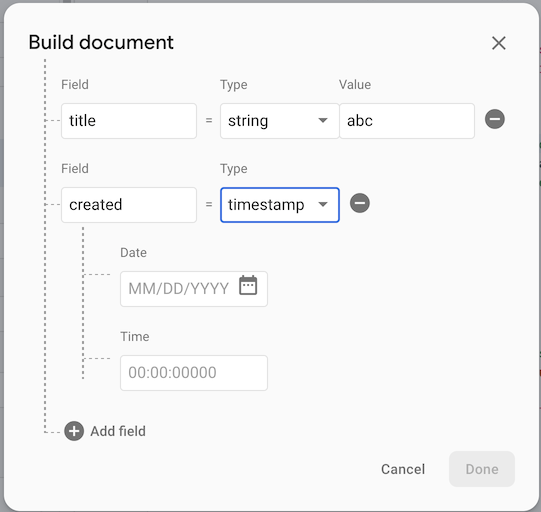

# Wishes for Firebase

Dear Firebase. You are awesome. If you ever run out of things to improve, here would be some ideas:

## Cloud Firestore

### Ability to insert "current server date" in the Firebase console

>

The dialog could have a "right now" or "server date" button, like the API allows a client to set a field to current date.

This would be even more valued, since it is not obvious to the user (me), whether I should fill in the UTC time, or a time in my local time zone. Having the suggested button would take away this consideration.

- Asko 13-Mar-2020 (not suggested to Firebase team)

### Abilitiy to insert "current server data" in a document for Security Rules simulator

I have a rule where creation of a document needs the creation time to be set using `FieldValue.serverTime`. Such a payload cannot be simulated, as far as I see:

>

Any timestamp I enter is bound to be different than the server time, thus always failing the rule.

