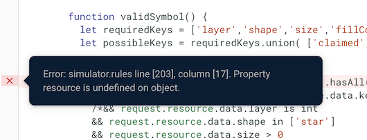
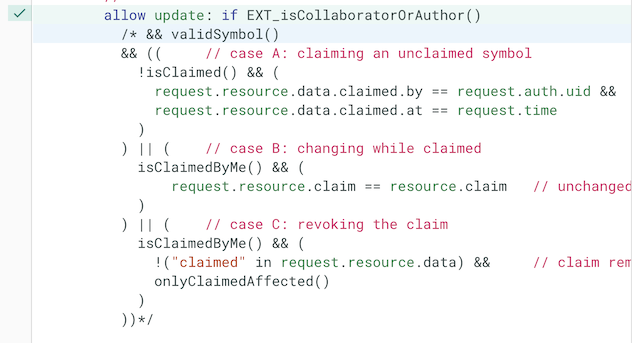
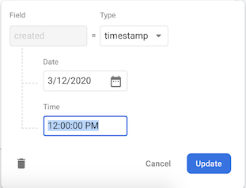
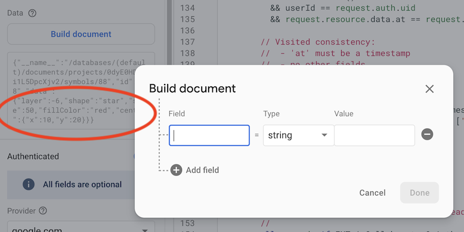
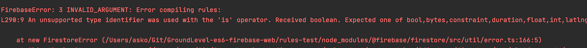
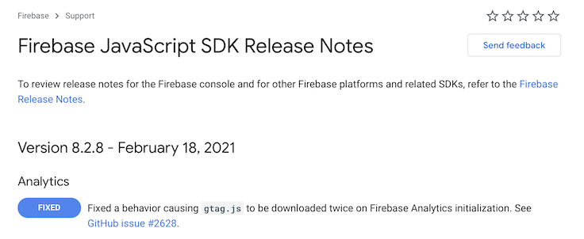

# Wishes for Firebase

Dear Firebase. You are awesome. If you ever run out of things to improve, here would be some ideas:

Hot list: 🌶

- ability to have immutable Rules evaluation (evaluation not changing the data set)
- online Simulator and local Firestore emulator should have 100% same logic

🙏


## Cloud Firestore

### Uniformity between the online Rules Simulator and the local Firestore emulator

This is mentioned widely on the Internet, but it took me a while before it really bit.

>

I cannot use the same `validSymbol()` for both reads and writes, in the simulator.

It seems the Simulator tries to say that it has `request` but there is no `request.resource`. The local emulator always has this (*) - even for gets. These two seem to be either from different code base, or from different times.

>(*) Jul 10th, local emulator is (`firebase` 8.4.3) is giving "Property resource is undefined on object. for 'list' @ L19" if `validProject` is enabled for reads. This may have changed, but consistency across all: cloud server, local emulation, cloud simulation would be HIGHLY APPRECIATED!

They are both crucial for development - complementing each other. But if their logic conflicts, it just adds to the pain of Firestore Security Rules development...

Surely something that deserves to get fixed.

i.e. Target:

- there should not need to be any special coding in Security Rules, for having them run on the online Simulator (or the local emulator)
- having contradictory evaluation of rules should always be treated as a bug, by Firebase personnel

### Online Simulator syntax highlighting of `/* ... */`

Block comments are allowed by the Security Rules evaluation, but not reflected in the syntax highlighting.




### Ability to insert "current server date" in the Firebase console (and Rules simulator)



<!--
<strike>The dialog could have a "right now" or "server date" button, like the API allows a client to set a field to current date.

This would be even more valued, since it is not obvious to the user (me), whether I should fill in the UTC time, or a time in my local time zone. Having the suggested button would take away this consideration.</strike>
-->

>♨️: With the online simulator, lack of this currently (Mar 2020) prevents testing for rules that expect server side timestamp in a field (e.g. `created`, `removed`).

INITIAL suggestion:

A means in the date picker to get the current time. (I don't know of the time zones applied: is it server's time, UCT or my local time zone).

ALTERNATIVE suggestion:

Adding `FieldValue` to the `Type` drop-down would be more in line with the Firestore data model, in general. The user could then choose the server timestamp from there, to get the "current" time.

These two are slightly different ideas.


### Firebase emulator API

See [Generate Test Reports](https://firebase.google.com/docs/firestore/security/test-rules-emulator) (Firebase docs)

For seeing test coverage, one needs to use a URL such that:

```
http://localhost:6767/emulator/v1/projects/<project_id>:ruleCoverage.html
```

*Here, the "project id" is what we name "session id". The run of a set of tests.*

This is okay when one uses a small set of stable test ids (and we'll likely go that way, because of this).

It would, however, be nice to be able to see the available "project id"s from the API. E.g. GET to `http://localhost:6767/emulator/v1/projects/` could list these, as a JSON array.[^1]

[^1]: Currently (Mar 2020), that gives a 404.

#### "Project id's" don't seem to matter??

I can use a query such as `http://localhost:6767/emulator/v1/projects/nosuch:ruleCoverage.html` and still get a valid response (there is no `nosuch` project). This is weird - would expect a 404.

Firebase tools v. 7.16.1.

>**Edit:** Instead, this is some kind of a caching problem. At times, the earlier results are available (e.g. changing project id in the URL from `abc` to `abcd`). Other times, one gets a 500.
>
>Someone at Firebase could have a look.
>Tested both with Safari and Chrome.

Also, I was surprised to see the results persist over emulator restarts. Wasn't expecting that, based on documentation.


<!-- 8.6.0 has, but it's not ideal (more about it later)
### 🌶 Firebase emulator to pick up changes to the rules

The emulator could have a "watch" mode to help in development.

<strike>`firebase emulators:exec` takes some seconds to set up the emulator. It makes sense, for rules development, to have an emulator running in the background.

However.. currently (firebase tools 7.16.1) the emulator does not change its behavior when a rules file is changed.</strike>

Could we have a `--watch` mode that would? 🥺

---

Edit: If one codes like this:

```
firebase.loadFirestoreRules({
  projectId: sessionId,
  rules: fs.readFileSync("dut.rules", "utf8")   // name must match that in 'firebase.json'
});
```

..in the test setup, the rules are forced to the Firestore emulator. Having a watch mode would simply simplify things (for the developer), not needing to have this code.
-->

### Firebase Rules playground (online) 'Build document' dialog (usability suggestion)

For more complex work, ability to copy-paste a JSON as the document would be welcome.

If we go by the dialog, ability to make changes to the previous document would be welcome.

>

Here, the document contents are non-trivial. When I click `Build document`, instead of being able to add or remove fields, I need to start creating it all from scratch.


### 🌶 Firestore Security Rules emulator: a "dry run" mode

When I first used the rules unit testing library (`@firebase/testing`, now `@firebase/rules-unit-testing`), I somehow supposed the underlying data would not get changed. It does.

Then created a means to protect the tests from this side effect. That means is now the [firebase-jest-testing](https://github.com/akauppi/firebase-jest-testing) library.

If the Firebase emulator provided a "dry run" flag, the library could get rid of the locks it now needs. This might also improve test performance, a bit.

The flag can also be a configuration for a particular project id, but since configuration at the moment (Aug 2020) is all over the place, I'm not advocating that unless it first gets gathered in a centralized way (e.g. `firebase.json` and emulator command line flags; away from source code!).


## Firestore emulator: evaluate the rules at launch (and complain!)

The Firestore emulator has just a single file of Security Rules. It could evaluate (compile) it at launch, fail if there are problems and show warnings if there are any.

It does not currently (8.6.0) do so. This is a launch with a syntax error in the rules file:

```
$ firebase emulators:start --only firestore
i  emulators: Starting emulators: firestore
✔  hub: emulator hub started at http://localhost:4400
i  firestore: firestore emulator logging to firestore-debug.log
✔  firestore: firestore emulator started at http://localhost:6767
i  firestore: For testing set FIRESTORE_EMULATOR_HOST=localhost:6767
✔  emulators: All emulators started, it is now safe to connect.
...
```

Now the error happens at runtime and may even get lost somewhere in test code (if it's ignored exceptions).



Warnings are shown only if the file is edited:

```
i  firestore: Change detected, updating rules...
⚠  ../firestore.rules:98:16 - WARNING Unused function: validProject2.
⚠  ../firestore.rules:110:35 - WARNING Invalid variable name: request.
✔  firestore: Rules updated.
```

It would be useful and fair to show these already at the launch.


## Firebase emulator: check for 'package.json' at launch!

```
$ npm run start
...
[emul] ┌───────────┬────────────────┬─────────────────────────────────┐
[emul] │ Emulator  │ Host:Port      │ View in Emulator UI             │
[emul] ├───────────┼────────────────┼─────────────────────────────────┤
[emul] │ Functions │ localhost:5002 │ http://localhost:4000/functions │
[emul] ├───────────┼────────────────┼─────────────────────────────────┤
[emul] │ Firestore │ localhost:6767 │ http://localhost:4000/firestore │
[emul] └───────────┴────────────────┴─────────────────────────────────┘
[emul]   Emulator Hub running at localhost:4400
[emul]   Other reserved ports: 4500
[emul] 
[emul] Issues? Report them at https://github.com/firebase/firebase-tools/issues and attach the *-debug.log files.
[emul]  
[init] Primed :)
[init] GCLOUD_PROJECT=bunny npm run _start_2 exited with code 0


[emul] ⚠  The Cloud Functions directory you specified does not have a "package.json" file, so we can't load it.
[emul] ⚠  functions: Could not find package.json
```

That error is logged only *once running tests*. The Functions emulator could just as well check that it's environment looks cosy, at launch. 

Similar to the "check rules early" mentioned above.


## Local emulator UI

..could hide the UI modules that aren't active. 

E.g. if we start with `--only functions,firestore`, only those boxes need to be visible in the UI.


## Config should be transparent to client code!!!

The configuration story for Firebase seems unclear (Jul 2020). 

While there is a config file (`firebase.json`), a Firebase employee mentioned that is only for hosting (reference missing). That's not true. It contains entries for `firestore` and `emulation`, but it does not consistently collect all Firebase configuration into itself, as it could.

>The `firebase-jest-testing` library hides these configuration steps from this application code. But they are still there; would rather have them in `firebase.json`.

Aim:

- Browser code should be absolutely same, whether running against emulator or cloud deployment

Means this block (in `init.vite.js`) should become void:

```
  const LOCAL = import.meta.env.MODE == "dev_local";
  if (LOCAL) {
    console.info("Initializing for LOCAL EMULATION");

    const DEV_FUNCTIONS_URL = "http://localhost:5001";
    const FIRESTORE_HOST = "localhost:6767";

    // As instructed -> https://firebase.google.com/docs/emulator-suite/connect_functions#web
    //
    // Note: source code states "change this [functions] instance". But it seems that another 'firebase.functions()'
    //    later must return the same instance, since this works. #firebase #docs #unsure
    //
    firebase.functions().useFunctionsEmulator(DEV_FUNCTIONS_URL);

    firebase.firestore().settings({   // affects all subsequent use (and can be done only once)
      host: FIRESTORE_HOST,
      ssl: false
    });
  }
```

Can we do that?

## Cloud Functions: ability to configure the default region in one place

---

**Edit 16-Feb-2021:**

It seems this boild down to two, separate issues:

- having to provide the Functions' region **in code**, as opposed to configuration.

   There should be a one clear place where one can say "I wish to use location ... for this project". If more complex use cases require more, that is fine, but the poor man's case must be simple!

- having to provide the region **in front end client**.

   Surely the Firebase JavaScript library can figure it out? Again, for complex cases there may be other requirements, but the 90% use cases should not need the location to be sprinkled around here and there!

---

The current situation on Cloud Functions regions is not completely clear (Aug 2020). There are cases where the code seems to prefer the global default region (e.g. emulation has this).

Overrides to regions can only be done on a function-by-function basis. This leads to the Internet [recommending](https://stackoverflow.com/questions/43569595/firebase-deploy-to-custom-region-eu-central1#43572246) things like a `regionalFunction` value - the approach taken also in this repo.

1. A developer should have a clear place to override the default region for their functions.
   - this place could be the `firebase.json` file?

2. The client should "just pick up" such a setting.
   - If needed, this can be done via the `__` URL mechanism

>Firebase says (@puf on Twitter) that the `__` configuration is only for hosting.
>
>To a user, it does not really seem that way, having `storageBucket`, `messagingSenderId` etc. How would `functionsDefaultRegion` be any different?

<!-- disabled
Note: Having the error message about CORS makes this especially nasty for developers.

See [SO 62042554](https://stackoverflow.com/questions/50278537/firebase-callable-function-cors/61725395#62042554). 

Also relevant: 

- [firebase deploy to custom region (eu-central1)](https://stackoverflow.com/questions/43569595/firebase-deploy-to-custom-region-eu-central1) (StackOverflow)

The current complexity is against the aim for simplicity that is the main selling argument of Firebase (you can do back-end without being a wizard class security specialist!).

There may be a need for overriding the region on a function-by-function basis, but there should also be a way to change the default (in configuration). This would be the way most people change their region. Such a change would not break code that currently uses the in-code settings.
-->

---

The [environment configuration](https://firebase.google.com/docs/functions/config-env) provides a solution to the first problem (not having regions in code). It should just be more clearly communicated in Firebase docs. (instead of recommending to stamp the region in code)


## `firebase emulators:start` behaves different from `emulators:exec`

This is a surprise for developers.

e.g. the `debug()` feature of Security Rules (undocumented) places the notes in `stdout` with `emulators:exec` but into `firestore-debug.log` if run via `emulators:start`.

The two commands look similar, and there's no cue to make us think they would work differently. 

Suggestion:

Bring the `:exec` and `:start` commands closer. Either merge them, or hide the internal implementation aspects (`start` is said to be a "wrapper") from the developers.


## Loading initial data - from JSON

>Note: This is already sufficiently handled by `firebase-jest-testing` and doesn't necessarily need support from Firebase emulator commands.

The import/export mechanism ([#1167](https://github.com/firebase/firebase-tools/issues/1167)) works on a binary data format that humans cannot directly read or edit.

That's one use case. Another is to prime an emulator with JSON data, instead of a snapshot. This is useful when one wants to tune the data by hand, and there is not too much of it.

Our current approach uses `local/init.js` to prime such data. It works, but is clumsy in the `package.json` command:

```
    "dev:local": "concurrently -n emul,dev-local \"firebase emulators:start --only functions,firestore\" \"npm run _dev_local_2\"",
    "_dev_local_2": "wait-on http://localhost:4000 && node --experimental-json-modules ./local/init.js && npx vite --port 3000 --mode dev_local",
```

This could be:

```
    "dev:local": "firebase emulators:exec --ui --only functions,firestore local/init.js \"npm run _dev_local_2\"",
    "_dev_local_2": "npx vite --port 3000 --mode dev_local",
```


<!-- think this is gone /17-Oct-20
## Firebase hosting BUG: wrong MIME type for `.js`

Firebase hosting defaults to `application/json` for JavaScript files, instead of `text/javascript`. This disallows their use in a browser (error from Chrome).

```
Failed to load module script: The server responded with a non-JavaScript MIME type of "application/json". Strict MIME type checking is enforced for module scripts per HTML spec.
```

Launched by:

```
$ firebase serve --only hosting --port 3010
```

`firebase.json`:

```
{
  "hosting": {
    "public": "public",
    "ignore": [],
    "rewrites": [
      {
        "source": "**",
        "destination": "/index.prod.html"
      }
    ]
  },
  ...
}
```

First aid: specify the correct content type in `firebase.json`:

```
{
  "hosting": {
    ...
    "headers": [
      {
        "source": "**/*.js",
        "headers": [
          {
            "key": "Content-Type",
            "value": "application/javascript"
          }
        ]
      }
    ]
  }
}
```

Firebase tools v. 8.4.3.

- [ ] Report to Firebase
-->

<!-- disabled: not reproducible? / haven't seen since
## Emulator should behave exactly as the online

Currently (Jul 2020, Firebase tools 8.4.3) the emulator chokes on something that is okay for the online implementation.

In browser console:

```
database.ts:2096 Uncaught Error in onSnapshot: FirebaseError: 
Property resource is undefined on object. for 'list' @ L19
```
-->

## Firestore JavaScript client could provide `Date`s?

Timestamps in the Firestore data are provided as: `{ seconds: int, nanos: int }`. There is a native JavaScript presentation for dates, `Date`, and the Firebase client provides `.toDate()` method for converting to it. 

But why is this not made automatically? What would be the use case that needs "more resolution" than a normal `Date`?

Are the timestamps even having more than 1ms resolution? Firebase docs suggest this, but let's see on server timestamps.

>tbd. Check some server-timestamp fields (in code); what are the `nanos` values for them?

For a document database (not real time database) I don't see a reason for sub-1ms resolution.

It would make sense that the client provides such data in the normal abstraction of the platform. Now the application code must convert individual fields.

Two ways to make such a change:

1. Derive from `Date` (or make a class that behaves the same), and have it also provide the `.seconds` and `.nanos` for backwards compatibility.
2. Have a global switch somewhere (initialization of the `.firebase.firestore`?), so application programmers can select the "old" or the "JavaScript" way.


## Firebase Security Rules: could allow set comparison without `.toSet()`

Sets are great. However, their use is a little verbose, at the moment (8.6.0).

It's a very common practise (shown also in Firebase samples) to compare the outcome of a `diff` to a constant set. This requires a `.toSet()` at the end:

```
diff().removedKeys() == ["removed"].toSet()
```

If the `.toSet()` is removed, one gets a warning:

```
⚠  ../firestore.rules:53:73 - WARNING The sub-expressions are not comparable, so this comparison will always return false.
```

Instead, the Firebase parser could imply a `.toSet()` when a set is compared with a constant array. This would make people's rules less verbose, and not break any existing code. So this would work:

```
diff().removedKeys() == ["removed"]
```

More readable? :)


## Firebase functions emulation: please allow region parameter (BUG)

```
const fns = window.LOCAL ? firebase.app().functions(/*functionsRegion*/) :
  firebase.app().functions(functionsRegion);
```

Application code now needs to have the above condition (firebase-tools 8.6.0, JavaScript client 7.16.1).

- With the region parameter, emulated call just disappears (no logging, no invocation)

>This seems to have been tested only with default region, in which case identical code can be used.


## Firebase emulation: expose in the client, whether it's running against local emulator

We now jump through hoops to get the front end know that it's running against an emulator.

The JavaScript library probably knows this. Can it somehow tell it to us?

This would mean the `window.LOCAL` mode can be taken from the library, instead of the build system and `import.meta.env.MODE`.

Suggestion:

- bring all the configuration of the server (emulator) available in one end point (preferably `__`)


## 🍎🍎🍎Testable billing for Security Rules

Asking about how many "reads" a certain security rule causes has been mentioned in community forums (especially newcomers).

Would you be able to add this to the emulator / `@firebase/rules-unit-testing` so that we can compare the reported "reads" count automatically to expected ones. I would add this as part of the security rules tests.

This makes the billing attestable.


<!-- seems done in 8.8.1
## Cloud Functions emulator: could watch for changes

Firebase emulator (firebase-tools 8.6.0) does not pick up changes to the functions sources.

Since the Security Rules emulator does watch for changes, this is at the least an inconsistency in the development experience.

Work-around:

- we could architect automatic restart using `npm`, but that adds complexity. Let's see what Firebase people say, first..
-->

## Firebase Performance Monitoring: the concept of version

Firebase Performance Monitoring has the concepts of version and build for mobile (iOS, Android) apps, but not for web apps (Sep 2020).

Isn't that a useful concept even when versions presumably update faster? I'd like to be able to tell Firebase the version and build (for production), preferably in `initializeApp` itself.

Firebase Performance Monitoring could then provide parity with the mobile versions. #pun


## Accessing Cloud Functions should be the same, whether there's emulation or not (regions)

It was not.

This code is now removed from the project (since we don't want to directly use Cloud Functions for offline friendly operation), but once it was in, calling a function needed to be different, if one has regions, based on them running in the cloud or emulated.

```
const fns = (window.LOCAL) ? firebase.app().functions() :
  firebase.app().functions(functionsRegion);

export { fns }
```

## Firebase Auth does not allow data URLs for `.photoURL`

It guards the URL formatting too strictly. [Data URLs](https://developer.mozilla.org/en-US/docs/Web/HTTP/Basics_of_HTTP/Data_URIs) are generally valid, and in mocking users it makes sense to provide an icon as a data URL string. No need to host separate pictures.

Also, Firebase error message states the data URLs not to be "valid URLs". But they are. Just not for Firebase.

See [/local/init.js](../local/init.js).

## Firebase JS SDK: please update the Changelog *before* publishing 

The current (2020-21) workflow at Firebase seems to be:

- publish an `npm` package
- (maybe) change the website, and let the users wait until changes propagate

This is not user friendly: I see with `npm outdated` that a new `firebase` package is out (8.2.9). What might it contain?

> 

Yeah, right. 

Ping for a day or so and eventually 8.2.9 info is out. **No other software package I use suffers from this**. Wouldn't it be nicer to have the release information out promptly, after the release? I'm okay with a 1..2 minute delay but hours. Not cool.

## Firebase JS SDK: educating on differences of `local` persistent options 

Firebase docs has a great [Authentication State Persistence](https://firebase.google.com/docs/auth/web/auth-state-persistence) page on the differences of the local, session and none persistence models.

The JS SDK has two ways of implementing the local: 

- indexedDB
- localStorage

Does the developer need to be aware of these, at all?

[This thread](https://groups.google.com/g/firebase-talk/c/wgSvjniKPQI) (Firebase discussion groups, may be restricted) has a comment (Mar 2018):

>I recommend that you stop relying on internal implementations of how we persist Auth state as that is subject to change and instead use our public APIs. Basically, anything that is not part of our public API is subject to change.

On the other hand, the author got the feeling that in the `@exp` API's `initializeAuth`, one should / can somehow make decisions of this kind. But the [documentation](https://modularfirebase.web.app/reference/auth.initializeauth) of that function is currently (7-Mar-21) giving no details.

This is LIKELY a BOGUS thing to even ask. Let's presume IndexedDB is the implementation and the developer does not need to care! :)


## References

- [Firebase Support Form](https://firebase.google.com/support/troubleshooter/contact)

