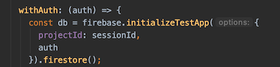

# Wishes for Firebase

Dear Firebase. You are awesome. If you ever run out of things to improve, here would be some ideas:

Hot list: 🌶

- ability to have immutable Rules evaluation (evaluation not changing the data set)
- ability to pick up if the rules file changes
- online Simulator and local Firestore emulator should have 100% same logic

🙏


## Cloud Firestore

### Uniformity between the online Rules Simulator and the local Firestore emulator

This is mentioned widely on the Internet, but it took me a while before it really bit.

>

I cannot use the same `validSymbol()` for both reads and writes, in the simulator.

It seems the Simulator tries to say that it has `request` but there is no `request.resource`. The local emulator always has this - even for gets. These two seem to be either from different code base, or from different times.

They are both crucial for development - complementing each other. But if their logic conflicts, it just adds to the pain of Firestore Security Rules development...

Surely something that deserves to get fixed.

i.e. Target:

- there should not need to be any special coding in Security Rules, for having them run on the online Simulator
- having contrdictory evaluation of rules should always be treated as a bug, by Firebase personnel

### Online Simulator syntax highlighting of `/* ... */`

Block comments are allowed by the Security Rules evaluation, but not reflected in the syntax highlighting.


### Ability to insert "current server date" in the Firebase console (and Rules simulator)


<!--
<strike>The dialog could have a "right now" or "server date" button, like the API allows a client to set a field to current date.

This would be even more valued, since it is not obvious to the user (me), whether I should fill in the UTC time, or a time in my local time zone. Having the suggested button would take away this consideration.</strike>
-->

>♨️: With the online simulator, lack of this currently (Mar 2020) prevents testing for rules that expect server side timestamp in a field (e.g. `created`, `removed`).

INITIAL suggestion:

A means in the date picker to get the current time. (I don't know of the time zones applied: is it server's time, UCT or my local time zone).

ALTERNATIVE suggestion:

Adding `FieldValue` to the `Type` drop-down would be more in line with the Firestore data model, in general. The user could then choose the server timestamp from there, to get the "current" time.

These two are slightly different ideas. My initial idea was more about usability (the date picker). If the server timestamp feature exists, there will be not so much value in the initial request.


### Firebase emulator API

See [Generate Test Reports](https://firebase.google.com/docs/firestore/security/test-rules-emulator) (Firebase docs)

For seeing test coverage, one needs to use a URL such that:

```
http://localhost:6767/emulator/v1/projects/<project_id>:ruleCoverage.html
```

*Here, the "project id" is what we name "session id". The run of a set of tests.*

This is okay when one uses a small set of stable test ids (and we'll likely go that way, because of this).

It would, however, be nice to be able to see the available "project id"s from the API. E.g. GET to `http://localhost:6767/emulator/v1/projects/` could list these, as a JSON array.[^1]

[^1]: Currently (Mar 2020), that gives a 404.

#### "Project id's" don't seem to matter??

I can use a query such as `http://localhost:6767/emulator/v1/projects/nosuch:ruleCoverage.html` and still get a valid response (there is no `nosuch` project). This is weird - would expect a 404.

Firebase tools v. 7.16.1.

>**Edit:** Instead, this is some kind of a caching problem. At times, the earlier results are available (e.g. changing project id in the URL from `abc` to `abcd`). Other times, one gets a 500.
>
>Someone at Firebase could have a look.
>Tested both with Safari and Chrome.

Also, I was surprised to see the results persist over emulator restarts. Wasn't expecting that, based on documentation.


### 🌶 Firebase emulator to pick up changes to the rules

The emulator could have a "watch" mode to help in development.

<strike>`firebase emulators:exec` takes some seconds to set up the emulator. It makes sense, for rules development, to have an emulator running in the background.

However.. currently (firebase tools 7.16.1) the emulator does not change its behavior when a rules file is changed.</strike>

Could we have a `--watch` mode that would? 🥺

---

Edit: If one codes like this:

```
firebase.loadFirestoreRules({
  projectId: sessionId,
  rules: fs.readFileSync("dut.rules", "utf8")   // name must match that in 'firebase.json'
});
```

..in the test setup, the rules are forced to the Firestore emulator. Having a watch mode would simply simplify things (for the developer), not needing to have this code.


### Firebase Rules playground (online) 'Build document' dialog (usability suggestion)

For more complex work, ability to copy-paste a JSON as the document would be welcome.

If we go by the dialog, ability to make changes to the previous document would be welcome.

>

Here, the doc is non-trivial. When I click `Build document`, instead of being able to add or remove fields, I need to start creating it all from scratch.


### 🌶 Firestore Security Rules emulator: a "dry run" mode

It took me a while (several days) to realize that the allowed rule evaluations (create, update, delete) actually do change the data they operate on.

This is not necessarily needed, for evaluating security rules. One can build tests with the assumption that changes are not applied. This in fact makes tests more easy to build, in my opinion, since the underlying data model stays untouched.

Even if this were a good idea, for backwards compatibility the current behaviour must of course remain, as a default.

<strike>Would you (Firebase) consider an `--immutable` or `--dry-run` flag to starting the emulator. If used, it would not apply a succesful rule evaluation to the data.</strike>

Edit: The above does not work, since the emulator is a full `--firestore` emulator, not just for rules.

Another alternative for this could be for the `initializeTestApp` call to have a `dryRun: true` option:



Each project using `@firebase/testing` for rules testing uses this call. It would likely take some collaboration between the emulator and the client side library, to mark "don't take this set/update/delete seriously", but the change in application code would be just one line.


## Firestore emulator: evaluate the rules at launch (and complain!)

The Firestore emulator has just a single file of Security Rules. It could evaluate (compile) it at launch, and fail if there are problems. 

It does not currently do so. This is a launch with a syntax error in the rules file:

```
$ firebase emulators:start --only firestore
i  emulators: Starting emulators: firestore
✔  hub: emulator hub started at http://localhost:4400
i  firestore: firestore emulator logging to firestore-debug.log
✔  firestore: firestore emulator started at http://localhost:6767
i  firestore: For testing set FIRESTORE_EMULATOR_HOST=localhost:6767
✔  emulators: All emulators started, it is now safe to connect.
...
```

Making sure rules do compile would reduce the number of times a "watch" mode is needed. If I start the emulator and there are rules, I do want to be notified up front if those rules don't compile.

Now the error happens at runtime and may even get lost somewhere in test code (if it's ignored exceptions).

>


<strike>## 🐶 Ternary operator would be nice to Rules Language

It is possible to fake an if-else in the Rules language already know, but it's uncomfortable and not very readable:

```
allow create: if true
  && ((      // if (inviting as author) invitor must be an author
    request.resource.data.asAuthor && (
      GLOBAL_isAuthor(request.resource.data.project)
    )
  ) || (      // else anyone in the project can invite
    !request.resource.data.asAuthor && (
      GLOBAL_isCollaboratorOrAuthor(request.resource.data.project)
    )
  ))
```

With the C-style ternary operator, this could be:

```
allow create: if true
  && request.resource.data.asAuthor ?
      GLOBAL_isAuthor(request.resource.data.project) :
      GLOBAL_isCollaboratorOrAuthor(request.resource.data.project)
```
</strike>

Available since ~May 2020. Use it.


## Ability to ES6 `import` `@firebase/testing`

It is currently (Apr 2020) exported only as common-JS:

```
$ ls node_modules/@firebase/testing/dist
index.cjs.js		index.cjs.js.map	index.d.ts		src			test
```

```
const firebase = require('@firebase/testing');   # works
import firebase from `@firebase/testing`;   # fails
```

It would be nice to have possibility of using ES6 `import` alongside the common-js `require`. Node.js now supports imports.


## Local emulator UI

..could hide the UI modules that aren't active. 

E.g. if we start with `--only functions,firestore`, only those boxes need to be visible in the UI.


## Cloud Functions: ability to configure the region in one place

If one wants to specify a region, it needs to be separately specified for both the server and the client. This specification happens in the code.

Instead, couldn't this be part of the project configuration? Then, the server (and emulator) would get it directly and the client (browser) via `/__/firebase/init.js`.

Note: Having the error message about CORS makes this especially nasty for developers.

See [SO 62042554](https://stackoverflow.com/questions/50278537/firebase-callable-function-cors/61725395#62042554). 

Also relevant: 

- [firebase deploy to custom region (eu-central1)](https://stackoverflow.com/questions/43569595/firebase-deploy-to-custom-region-eu-central1) (StackOverflow)

---

**Opinion:**

This complexity is against the aim for simplicity that is the main selling argument of Firebase (you can do back-end without being a wizard class security specialist! ).

There may be a need for overriding the region on a function-by-function basis, but there should also be a way to change the default (in configuration). This would be the way most people change their region. Such a change would not break code that currently uses the in-code settings.

---

**Firebase answers**

Firebase says (@puf on Twitter) that the `__` configuration is only for hosting.

To a user, it does not really seem that way, having `storageBucket`, `messagingSenderId` etc. How would `functionsDefaultRegion` be different of those?

---


## `firebase emulators:exec` does not enable the UI

The new (as of Jun 2020) emulator UI only occurs with `emulators:start` but not with `emulators:exec`.

This likely is due to Firebase staff thinking of `:start` as interactive and `:exec` as CI/CD faceless testing tool. But it's an artificial watershed. `:exec` is useful also for launching a dev mode command (avoids a package like `start-server-and-test`.

Compare:

```
# Provides emulator UI
"dev:local": "start-server-and-test \"firebase emulators:start --only functions,firestore\" 4000 \"node ./local/init.js && npx vite --port 3001\""

# Shorter & simpler
"__dev:local": "firebase emulators:exec --only functions,firestore \"node ./local/init.js && npx vite --port 3001\"",
``` 

Suggestion:

Bring the `:exec` and `:start` commands closer. Maybe they both can use a `--ui [on|off|<port>]` flag (that can be on in one, by default, and off in another, to provide compatibility with current behavior).


## Loading initial data - from JSON

The import/export mechanism ([#1167](https://github.com/firebase/firebase-tools/issues/1167)) works on a binary data format that humans cannot directly read or edit.

That's one use case. Another is to prime an emulator with JSON data, instead of a snapshot. This is useful when one wants to tune the data by hand, and there is not too much of it.

Our current approach uses `local/init.js` to prime such data. It works, but is clumsy in the `package.json` command:

```
"__dev:local": "firebase emulators:exec --only functions,firestore \"node ./local/init.js && npx vite --port 3001\"",
```

This could be:

```
"__dev:local": "firebase emulators:exec --only functions,firestore local/init.js \"vite --port 3001\"",
```

Here, `emulators:exec` would run the provided file, at launch, before starting the provided command. Cloud Function emulation would be switched off during the run of the init file.

Pros:
- Firebase does not need to take stand as to the data format (opposed to if loading JSON)

Cons:
- Separate loading file (`local/init.js`) needs to be provided


## Firebase hosting could provide config as ES module

Firebase hosting makes it easy to initialize project identity via `/__/firebase/init.js`. This file is supposed to be read in as a `script` tag.

This belongs to the bygone era, and should be complemented by an `import` friendly way of getting such configuration.

One could serve a module exporting the config object (and `init` if one wants to be compatible with the earlier way). Let's say the url for this would be `/__/firebase/init.mjs`.

This would allow: 

```
import * as firebase from 'firebase/app'
import { default as __ } from "/__/firebase/init.mjs"
firebase.initializeApp(__);
```

It feels a lot more module friendly that the app does the initialization.

  
## Firebase hosting BUG: wrong MIME type for `.js`

Firebase hosting defaults to `application/json` for JavaScript files, instead of `text/javascript`. This disallows their use in a browser (error from Chrome).

```
Failed to load module script: The server responded with a non-JavaScript MIME type of "application/json". Strict MIME type checking is enforced for module scripts per HTML spec.
```

Launched by:

```
$ firebase serve --only hosting --port 3010
```

`firebase.json`:

```
{
  "hosting": {
    "public": "public",
    "ignore": [],
    "rewrites": [
      {
        "source": "**",
        "destination": "/index.prod.html"
      }
    ]
  },
  ...
}
```

First aid: specify the correct content type in `firebase.json`:

```
{
  "hosting": {
    ...
    "headers": [
      {
        "source": "**/*.js",
        "headers": [
          {
            "key": "Content-Type",
            "value": "application/javascript"
          }
        ]
      }
    ]
  }
}
```

Firebase tools v. 8.4.3.

- [ ] Report to Firebase
 

## References

- [Firebase Support Form](https://firebase.google.com/support/troubleshooter/contact)

