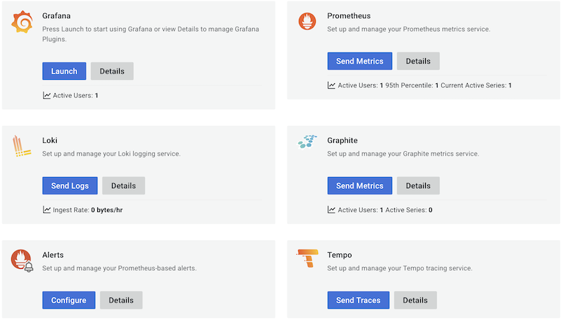

# Wishes for Grafana Cloud

## Remove Prometheus from the core mix (in favor or Mimir)?

Having Prometheus pretty front-center on the Grafana Cloud Free stack is confusing. When I post to `/influx` API, does that reach a Prometheus backend, or a (not visible) Mimir?

>

Perhaps this is just a branding problem. Grafana nicely boasts the LGTM stack, but there's no 'M' in the above picture.

That's why I'm asking.

If Mimir is the Prometheus, then maybe `Mimir / Prometheus`, dual logos, and eventually fading away the Prometheus side would do.

Now, it's just adding to the confusion. I want to meet M.

## No jumping tabs, please!

Pushing one of the `Stacks` ... `Manage subscription` buttons opens a **separate browser tab** into the Cloud Portal, leaving the particular Dashboard behind.

This is unusual web behaviour. Unusual is bad.

Since the buttons are placed where tabs normally would be, one would expect to remain in the same "application". Also, in a tab UI, one tab is always active. These guidelines are not in force here. The buttons are links to an **external software** but don't indicate that, visually.

The damage is that:

- I end up getting a bunch of browser tabs opened. <small>I'm pretty bad closing the ones I open myself, please don't make it worse..</small>
- I simply get lost!!

I don't think there's a genuine need for these buttons. You may keep a link to "Grafana Cloud Portal" (that opens a new window, not a tab), and note in text that users, stacks etc. are dealt with, under there.

## Dim Support for free tier

Currently (Sep-22), the Portal UI provides a warning about `Add Stack` (see below). It should do the same for `Support` since Grafana will not provide support for free tier users, creating such a ticket. Don't take us that far - a note similar to the one depicted would suffice and be consistent!

>

## Why two user ids?

Within the same Grafana Cloud account, I have separate user id for Prometheus (metrics) and Loki (logs).

- https://grafana.com > `My Account`
- `Prometheus` > `Send Metrics`
  - observe the `username: 507028` (for the author)
- (back) > `Loki` > `Send Logs`
  - observe `User: 252484` (for the author)

Is this intended?

>Note: Also other services have their own id's, e.g. Graphite and Tempo.

<!-- AGED
## Easier collection from Firebase

This likely falls on this repo to do.

---

Grafana is aimed at server-side data collection, but they *could* make it easier for web apps to provide metrics.

Currently (Jul 2022), Grafana Cloud *needs* (seems to need) an external Prometheus instance. They **tbd. link to docs** support PushGateway but only for *another* Prometheus instance to do `remote_write` (maybe wrong spelling) data passing to them.

**Expected**

Grafana Cloud would be a full, cloud based observability service **including** long-term storage for the metrics.

**Actual**

There is a storage component in Mimir, but there's no API to feed it peacemeal.

### Alternatives

- [Managed Service for Prometheus](https://cloud.google.com/managed-prometheus) (Google Cloud) can be used.
- Some Open... system that *looked* to fit the bill (provide an API to push to Grafana Cloud), then casually mentioned "you just need ... Kubernetes". 🥺
- ... Maybe others
-->
