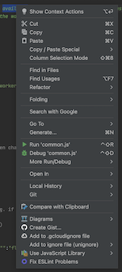

# Wishes for IntelliJ

## Allow macOS "Look up"

The OS-wide "look up" is great for checking one's spelling.

Unfortunately, it's not there in IntelliJ's (WebStorm IDE's) context menu:

**Expected**

When right-clicking on a word in a comment (to check its spelling, or meaning), WebStorm IDE should allow macOS "Look Up" functionality, as most other software does.

**Actual**

The menu above shows - there is no escape to OS level features.

**Work-around**

Copy-paste the word to e.g. TextEdit, and use right click there.
