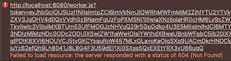

# Wishes for Vite

## Web workers

Using Web Workers is described [here](https://vitejs.dev/guide/features.html#web-workers).

There are some rough edges (`3.1.0-beta.2`).

### Using `new Worker`

```
// Note: Vite (3.1.0-beta.2) does not allow string interpolation within the worker thread URL.
//    <<
//      $ npm run build
//      ...
//      [vite] Internal server error: `new URL(url, import.meta.url)` is not supported in dynamic template string.
//    <<
//
//const w = new Worker(new URL(`./worker.js?token=${token}`, import.meta.url), {type: 'module'});   // FAILS 'npm run build'
const w = new Worker(new URL('./worker.js?token='+token, import.meta.url), { type: 'module' });
```

As described, one cannot use string interpolation to make the necessary URL. That's fine - but the error message could be better. (or, maybe it's the `URL` constructor at fault, here..).

---

Though the above code works in development, it doesn't after a build:

```
$ npm run build
$ npm run serve
...
```



There is no `dist/worker.js`.

*How to make one??*


### Using `import`


