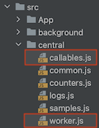

# Wishes for Vite

## Web workers

Using Web Workers is described [here](https://vitejs.dev/guide/features.html#web-workers).

There are some rough edges (`3.1.0-beta.2`) that have been around for a while ([#403](https://github.com/vitejs/vite/issues/403); Jun 2020).

I believe this to be mostly a documantation issue. The instructions don't clearly indicate what all needs to be considered, to use Workers...

Let me highlight the case in this repo.

### What I tried (and expected to just work)



I had placed two files, `worker.js` and `callables.js` among the main source code. `src/central/common.js` would create the workers, like so:

```
const w = new Worker(new URL('./worker.js?token='+token, import.meta.url), { type: 'module' });
```

**This works in development.** Thus, there should be no doubt, that it also works for production?

It builds. Thus more confirmation that things are right. Right??

At runtime, the Worker files are simply not there.


>Note: I am using `manualChunks` for naming the main thread's chunks. Maybe that is contributing to things not working out-of-the-box.

It seems (based on [this comment](https://github.com/vitejs/vite/issues/403#issuecomment-646332979); Jun 2020):

>Since the worker file should be left un-bundled for production, you can place in public and then do `new Worker('/worker.js')` (files in public are referenced from root).
>
>I guess what @ashubham want is to be able to import the work script (and automatically inlining it into the bundle), which is a reasonable feature request, but standard worker usage should just work when it's inside public.

This **requirement to place things in `public` is NOT MENTIONED in the docs**. 

<small> Let's check. [Link](https://vitejs.dev/guide/features.html#web-workers). Nope. Not there.</small>

Maybe something's changed between Jun 2020 and Aug 2022. Maybe following the docs should work, and it's simply a bug. But at the least, this is confusing!!!

### Work-around

Made symbolic links from `public` to the two files.

This works, because they don't import any libraries; they are self-sufficient.

Maintaining such links is not a long-term strategy, though. If Vite expects worker files to be under `public`, it should:

1. say so in the docs
2. fail use of them via `./` in development, and build

- [ ] Create an issue at Vite, preferably with a simple, reproducable repo.

