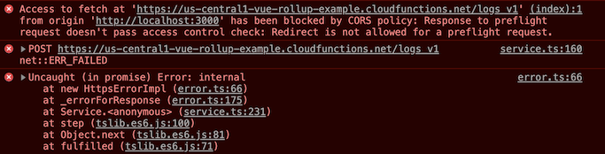

# Known Issues

## [Vue warn]: Extraneous non-props attributes...

See [StackOverflow](https://stackoverflow.com/questions/61972744/vue-3-beta-warning-extraneous-non-props-attributes).

Don't know how to mitigate those warnings. Something that came with Vue.js 3 (beta). #help

## Warning when doing `npm install`

```
npm WARN @rollup/plugin-commonjs@11.0.2 requires a peer of rollup@^1.20.0 but none is installed. You must install peer dependencies yourself.
```

Normal. Comes likely via Vite's use of Rollup. Should go away once the dependency is updated to Rollup 2.x world.


<!-- disabled - but it was weird. The link is worth keeping.
## CORS problems with `npm run dev` and Cloud Functions

>

Not sure what causes this.

Look at [this thread](https://stackoverflow.com/questions/50278537/firebase-callable-function-cors). Weird!!!
-->
