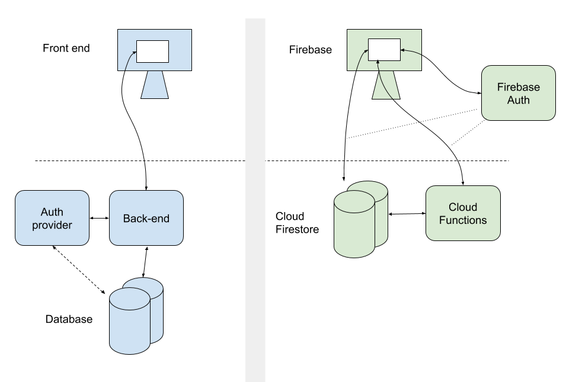

# GroundLevel ♠️ Firebase ♠️ ES modules

[](https://gitter.im/akauppi/GroundLevel-firebase-web)

<!-- Using 'img' to be able to scale from Markdown.
- Unfortunately, not able to do proper left-alignment (try out what works in GitHub; only that really matters..)
-->


<br />

**A modern (ES modules based) Web App template**

- great tools selected for you: [Vue.js 3](https://v3.vuejs.org), [Vite](https://github.com/vitejs/vite), [Firebase](https://firebase.google.com), [Jest](https://jestjs.io), [Cypress](https://www.cypress.io), web components [with Svelte 3](https://dev.to/silvio/how-to-create-a-web-components-in-svelte-2g4j), [Cloud Build](https://cloud.google.com/build), [Cloud Logging](https://cloud.google.com/logging/)
- built on 2020's technology (ES9, async/await), aiming to stay up to date and lean
- covers all the way to deployment (CI/CD) and operations

<!-- (after "great tools", but it's waporware)
- buildable with [Jailed!](https://github.com/akauppi/Jailed); no need to expose one's development maching to all those `npm` dependencies
-->

<br clear=all />

><font size="+5">🪤</font> Calling something "modern" seems to be a subjective term (always is). If you think ["Angular, React and Vue" are modern](https://stackoverflow.blog/2021/02/24/what-i-wish-i-had-known-about-single-page-applications/) (in 2021), maybe *post-modern* is the appropriate term for this repo.

[painting]

This repo is intended for professionals and beginners alike. Its main point is to showcase how easy, and effective, making web applications in the 2020's can be, when modern tools and techniques are used.

The repo showcases a full, social web app and has an emphasis on *operating* such an app. In this it deviates from most templates. In fact, you can see it as course material for modern web development, if you want.

## Pre-requisites and tools

To complete the "course" 🏌️‍♂️⛳️ you'll need:

- **A computer** with the following tools installed:

   - `node` v. 14.3 or later
   - `npm` - version 7.7 or later
   - `bash` and following command line tools: `sed`, `curl`, `grep`, `sort`
   - Java Runtime Environment (JRE) -- SE 8 or later

  <!-- tbd. update above list of command line tools (it's not complete)
  --> 

  For Windows development, we recommend the [WSL2](https://docs.microsoft.com/en-us/windows/wsl/install-win10) environment with eg. Ubuntu LTS.

- **A capable IDE**

  An IDE (integrated debugger and editor) is where you spend most of your time. Pick a good one. Learn to use it well. Here are two suggestions:
  
  - [Visual Studio Code](https://code.visualstudio.com) - free
  - [WebStorm](https://www.jetbrains.com/webstorm/) - free 30 days trial, then € 59 / 47 / 35 /year - worth it!!

- **Basic Knowledge** of:
  - HTML
  - JavaScript
  - CSS

  We use the EcmaScript 6 (and 2018) features in the code, where-ever possible. Meaning no `var`, no `this` 😡, yes Promises and `async`/`await`. No Webpack. If you learn JavaScript from scratch, pay attention what year your material was made. Or just *dive in!* and learn from the code - the chef recommends this way!

  >Hint: [MDN resources](https://developer.mozilla.org) are a great place to learn the basics, and advanced material alike. Eg. [JavaScript](https://developer.mozilla.org/en-US/docs/Web/JavaScript) You might even have it in your native language! Check the  button.

- A **credit card** to deploy Cloud Functions

  While most Firebase features are available in the free (and default) "Spark" plan, Cloud Functions require the "Blaze" plan since summer 2020.
  
  This might not be that bad.
  
  - you can still play with the emulators even completely without a Firebase account
  - if your application doesn't need Cloud Functions, remove those code and deploy.
  - even if you use Cloud Functions, chances are *there are not actual costs* since the Firebase free tiers apply to the "Blaze" plan as well.

  For more information: [Firebase pricing](https://firebase.google.com/pricing)

- A **decent resolution screen** or two. 

  In web development, this should not be overlooked. If you need to work on a low-resolution laptop screen (most PCs!), consider adding an external monitor.
  
  You will need to leave things like backend monitoring open while doing development. And it's often best to be able to view 2-3 files, *at once* in one's IDE. The more pixels you have, the better. Having more pixel real estate [has been shown](https://insights.samsung.com/2019/12/05/pushing-productivity-with-pixels-why-monitor-resolution-matters/) to have a direct correlation with productivity.

  The author is pleased with a single LG UltraFine 4K monitor.

## Additional material

The [wiki](https://github.com/akauppi/GroundLevel-firebase-es/wiki) has supporting matterial on setting up the development environment, or teaching deeper knowledge. Wiki material is localized, unlike the repo.


## Firebase

<a href="https://firebase.google.com"></a>

This repo uses the [Firebase](https://firebase.google.com) serverless framework for a lot of things: authentication, database, background functions, performance monitoring.

Firebase allows a mere mortal to create fully functional cloud-based applications. You don't need to set up and maintain servers. You still have a "back end" but it's operated for you. You don't need to care about scalability (though you need to care about costs). Interface definitions become less burdensome than in traditional REST API / GraphQL world, since your front end deals directly with the database. Authentication and access rights management are integrated in the database (instead of a separate back end service you need to build).

>

*Figure 1. Traditional microservice vs. Firebase approach <sub>[source](https://docs.google.com/drawings/d/15_rPDZDOCHwdL0RIX8Rg3Der1tb4mx2tMi9asQ_aegw)</sub>*

There are similar offerings from other companies, but they are a year or two behind, in the ease of use, based on the author's opinion.

>Note: You *don't* have to know anything in advance about Firebase. But their educational material is good and fun. It's recommended to check those out in parallel with this repo.


## Google Cloud

Firebase and Google Cloud have a relation. Firebase runs on top of Google Cloud (and is owned by Google). They have separate dashboards, but some Firebase tasks require one to visit the Google Cloud tools side.

We stay at the Firebase side of things most of the time, exceptions being CI/CD (Cloud Build) and central logging (Cloud Logging).

You'll be instructed about Google Cloud where necessary, and both of the above mentioned services can be replaced by others, of your choice (but you'll need to make the necessary changes).

## Requirements

As global tools, you will need:

- `npm`
- `bash`

We aim to support development on:

- Any Linux
- Windows 10: Ubuntu under WSL2
- latest macOS version

>The author has an idea on how to bring these closer to each other, via the tooling we use for CI/CD, but that's going to wait for a while. Please ask, if you are interested.


## Getting started

```
$ npm install
```

This installs some common packages, Firebase JS SDK as the most important one. Subpackages use them from the root, and this is where you update the common ones.

---

If you are mostly interested in UI development, and don't want to create a Firebase project just yet, go to the `packages/app` directory and see its `README.md`.

If you continue here, we'll do a real speed run 🏃‍♀️🏃🏃‍♂️
through the three subpackages, and end up having a clone of the sample application installed *on your Firebase account*, in the cloud. 

---

### Create a Firebase project

Follow the instructions in [the wiki](https://github.com/akauppi/GroundLevel-firebase-es/wiki/FI%200.1-firebase) so that you have a Firebase project created.

>Hey, what language is this?? It's Finnish. Try your luck. Contribution of translating those instructions to English is welcome! 🙂

You *will* need a credit card for creating the "Blaze" plan. If you don't want to do that yet, choose the free plan and continue as far as you can. 👍

---

Okay, have the Firebase project? Let's check in.

```
$ npm run activate
```

Select the project you want to use and give it an alias. The alias doesn't really matter, `abc` is just fine..

>Note: The repo uses `firebase use --add` underneath, and distributes your selection to the subpackages. If you need to change your active project, do it here at the root level - otherwise your packages will be using different Firebase projects and that'd be... unhelpful.

Now, you should be able to see your selected project:

```
$ npx firebase-tools use
Active Project: testing-220321
...
```

The repo has three subpackages:

- `packages/backend`
- `packages/app`
- `packages/app-deploy`

We'll briefly visit each of these, in turn.


### Back-end: build and deploy

```
$ cd packages/backend
```

Install the dependencies and deploy the database access rules and Cloud Functions:

```
$ npm install
```

```
$ npm run deploy
...

=== Deploying to 'testing-220321'...

i  deploying firestore, functions
i  firestore: reading indexes from ./firestore.indexes.json...
i  cloud.firestore: checking ./firestore.rules for compilation errors...
✔  cloud.firestore: rules file ./firestore.rules compiled successfully
i  functions: ensuring required API cloudfunctions.googleapis.com is enabled...
i  functions: ensuring required API cloudbuild.googleapis.com is enabled...
✔  functions: required API cloudbuild.googleapis.com is enabled
✔  functions: required API cloudfunctions.googleapis.com is enabled
i  functions: preparing ./functions directory for uploading...
i  functions: packaged ./functions (32.02 KB) for uploading
✔  firestore: deployed indexes in ./firestore.indexes.json successfully
i  firestore: latest version of ./firestore.rules already up to date, skipping upload...
✔  functions: ./functions folder uploaded successfully
✔  firestore: released rules ./firestore.rules to cloud.firestore
i  functions: updating Node.js 14 (Beta) function userInfoShadow_2(europe-west6)...
i  functions: updating Node.js 14 (Beta) function logs_1(europe-west6)...
✔  functions[userInfoShadow_2(europe-west6)]: Successful update operation. 
✔  functions[logs_1(europe-west6)]: Successful update operation. 
✔  Deploy complete!

Project Console: https://console.firebase.google.com/project/testing-220321/overview
```

If you saw that, the backend is now ready in the cloud. Well done!

You can visit the given URL to see the dashboard. Check the `Firestore` and `Functions` pages.

Next, we'll prepare the front end and deploy it as well.

### Front end: build

```
$ cd ../app
```

```
$ npm install
```

The web app needs to be built.

```
$ npm run build
...
vite v2.1.2 building for production...
✓ 47 modules transformed.
dist/aside-keys.js   17.85kb / brotli: 5.62kb
dist/aside-keys.js.map 28.60kb
dist/style.css       5.21kb / brotli: 1.45kb
dist/app.es.js       35.40kb / brotli: 8.86kb
dist/app.es.js.map   72.08kb
dist/vue-router.js   51.80kb / brotli: 11.50kb
dist/vue-router.js.map 169.41kb
dist/vue.js          127.87kb / brotli: 25.31kb
dist/vue.js.map      465.31kb
```

What we now have is the web app's *logic*. It is not ready for deployment, yet. We'll handle that next.

### Front end: deploy

>Note: In this repo, developing and packaging the app for deployment are separated. This is not a normal pattern but has its benefits: separation of concerns, allows different teams to have ownership of the features vs. how those features are operated in the cloud.

```
$ cd ../app-deploy-ops
```

```
$ npm install
```

```
$ npm run build
```

This build used the previously built *app logic* and wrapped it with code involved in running an app on the cloud.

The build *does not* run the app build (you could change that pretty easily); you'd go to the `packages/app` to build and test changes there, then come back here for deploying them. 

In practise, CI/CD takes care of such details, but that's the last thing we'll cover. 🙂

```
$ npm run deploy
...

=== Deploying to 'testing-220321'...

i  deploying hosting
i  hosting[groundlevel-160221]: beginning deploy...
i  hosting[groundlevel-160221]: found 3 files in roll/out
✔  hosting[groundlevel-160221]: file upload complete
i  hosting[groundlevel-160221]: finalizing version...
✔  hosting[groundlevel-160221]: version finalized
i  hosting[groundlevel-160221]: releasing new version...
✔  hosting[groundlevel-160221]: release complete

✔  Deploy complete!

Project Console: https://console.firebase.google.com/project/testing-220321/overview
Hosting URL: https://testing-220321.web.app
```

Now, head to the provided URL and you should see the app alive and kicking!!! 👶

Have a go with it!

---

As you can imagine, there are *tons* of details around each of the phases we took. 

We didn't touch testing at all (backend and front end have tests).

..but the purpose was to get you from 0 to cloud as fast as possible, and hopefully that happened!


## Where to go next?

You have some options. 

If you pick one, come back for the rest later. It doesn't really matter, in which order you cover these, but it would be useful to cover them all.

- Backend development ([`packages/backend`](packages/backend/README.md))

  All the cloud services that your front end relies on: database, server-side functions, data models and access rights of the stored data.

- Front-end development ([`packages/app`](packages/app/README.md))

  Developing the front end. You can do this without a Firebase project.
  
- Front-end deployment ([`packages/app-deploy-ops`](packages/app-deploy-ops/README.md))

  Deploying the front end, with a logging adapter attached.

- CI/CD ([`builds/`](builds/README.md))

  Making sure PRs don't break the code; deploying code that gets merged to `master`.

- Operations ([`ops/`](ops/README.md))

  Advice on what to do once the app is out.


## Making it yours!

By now, you have deployed the sample app to your own Firebase project. It's now an independent *instance* of that application, unattached to the one run by the original authors.

Once you start making heavier modifications - that's why the repo exists, it's intended as a "ground level" of your spectacular app! - we hope that you remove the "GroundLevel" branding. Do so:

```
$ git rm -rf branding 
```

```
$ git grep GroundLevel
...
```

We don't mind you keeping the reference, but many `.md` files likely deserve to be removed/edited, for your app. That command helps you find the mentions.

You *may* mention in your docs that the app was based on GroundLevel, but are not required to do so. See the [LICENSE.md](LICENSE.md).

Apropos, the License. 

You may now remove the top part of it:

>This license applies to the software (contents of the GitHub repo), except
graphic art.
>
>In particular:
>
>- `branding/*`
>- `**/public/favicon.*`
>
>Those files are PROPRIETARY to this project, and not to be used in other circumstances.
>You may, however, create a fork of this GitHub repo and continue working with the graphic
>files. Forks are regarded as just a way to collaborate and contribute, for the sake of
>the project itself.
>
>For the rest of the repo (code, configs and textual documentation), this applies:
>...


# Credits

Thanks to Jaakko Roppola for wonderful icon art!! 🙌

Thanks to Jonatas Walker for his [jonataswalker/vue-rollup-example](https://github.com/jonataswalker/vue-rollup-example) template. Based this work on it, then changed a few things.

Thanks to Gaute Meek Olsen for his template and [associated blog entry](https://gaute.dev/dev-blog/vue-router-firebase-auth) (Nov '19). This taught me how to use a Promise with `firebase.auth().onAuthStateChanged` properly.

Thanks to [Bootstrap Icons](https://icons.getbootstrap.com/) for SVG icon art.


# Contribution

As always, contributions and discussions are welcome.

- Please use primarily [GitHub Issues](https://github.com/akauppi/GroundLevel-es-firebase/issues) for questions and bug reports.
- For casual conversation, head to the [Gitter](https://gitter.im/akauppi/GroundLevel-firebase-web).

   *We'll head for a Discord server, once more people are involved.*

Have Fun, and spread the word!!


# References

### Serving ES6 modules, HTTP/2 etc.

- [Using Native JavaScript Modules in Production Today](https://philipwalton.com/articles/using-native-javascript-modules-in-production-today/) (blog, Aug 2019)
   - this step-by-step guidance was instrumental in making the production build work with ES modules. Brilliant write!!! 💎

### Other app templates

- [Firelayer](https://firelayer.io)
  - seems visually pleasing!
  - likely Vue.js 2?
  - likely uses bundling

*tbd. When someone has checked Firelayer in detail, and can make a brief (2 sentence!) summary on how it differs from GroundLevel, that is a welcome #contribution!*

### Online forums

- [Firebase developers](https://discord.gg/BN2cgc3) (Discord server)


# Other full app templates

||Front-end framework|Database|Auth|bundler|purpose|
|---|---|---|---|---|---|
|[cypress-realworld-app](https://github.com/cypress-io/cypress-realworld-app)|React|(none)|local JSON database|??|Showcasing use of Cypress]
