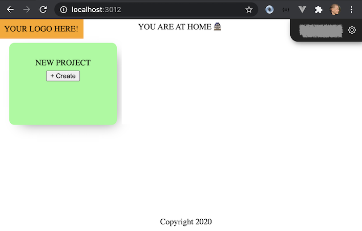

# GroundLevel ♠️ Firebase ♠️ ES modules

[](https://gitter.im/akauppi/GroundLevel-firebase-web)

<!-- Using 'img' to be able to scale from Markdown.
- Unfortunately, not able to do proper left-alignment (try out what works in GitHub; only that really matters..)
-->


<br />

**A modern (ES modules based) Web App template**

- great tools selected for you: [Vue.js 3](https://v3.vuejs.org), [Vite](https://github.com/vitejs/vite), [Firebase](https://firebase.google.com), [Jest](https://jestjs.io), [Cypress](https://www.cypress.io), web components [with Svelte 3](https://dev.to/silvio/how-to-create-a-web-components-in-svelte-2g4j), [Cloud Build](https://cloud.google.com/build), [Cloud Logging](https://cloud.google.com/logging/)
- buildable with [Jailed!](https://github.com/akauppi/Jailed); no need to expose one's development maching to all those `npm` dependencies
- built on 2020's technology (ES9, async/await), aiming to stay up to date and lean
- covers all the way to deployment (CI/CD) and operations

<!-- tbd. add operational tools to the mix, once selected
-->

<br clear=all />

><font size="+5">🪤</font> Calling something "modern" seems to be a subjective term (always is). If you think "[Angular, React and Vue" are modern](https://stackoverflow.blog/2021/02/24/what-i-wish-i-had-known-about-single-page-applications/) (in 2021), maybe "post-modern" is a more appropriate term for this repo. 😛

This repo is intended for professionals and beginners alike. Its main point is to showcase how easy, and effective, making Web Applications in the 2020's is, when (only) modern tools are used.


## Easy for beginners

We learn by reading other people's code. Actual code. This template is made with that in mind. It's not a partial template, and doesn't create a to-do list.

<!-- tbd.
There's going to be a [narrative](...) that discusses the design in more detail. -->

For medium and pro level software engineers, you should still get something out of this. The project features e.g.

- social invites
- collaboration
- interactive SVG graphics
- testing
- production builds
- CI/CD setup
- operations / metrics

This hopefully makes the app not only easy, but interesting as well.

But let's cut the chace and get started! 😀

>Note: Many of the features are still pending (the sample itself has become the *last* thing to finish!). Don't let that discourage yourself - head further and see whether dragons lie there! <font size="+5">🐉</font>


## Firebase

<a href="https://firebase.google.com"></a>

This repo uses the [Firebase](https://firebase.google.com) serverless framework for a lot of things: authentication, database, background functions, performance monitoring.

Firebase allows a mere mortal to create fully functional cloud-based applications. You don't need to set up and maintain servers. You still have a "back end" but it's operated for you. You don't need to care about scalability (though you need to care about costs). Interface definitions become less burdensome than in traditional REST API / GraphQL world, since your front end deals directly with the database. Authentication and access rights management are integrated in the database (instead of a separate back end service you need to build).

>

*Figure 1. Traditional microservice vs. Firebase approach <sub>[source](https://docs.google.com/drawings/d/15_rPDZDOCHwdL0RIX8Rg3Der1tb4mx2tMi9asQ_aegw)</sub>*

There are similar offerings from other companies, but they are a year or two behind, in the ease of use, based on the author's opinion.

>Note: You *don't* have to know anything in advance about Firebase. But their educational material is good and fun. It's recommended to check those out in parallel with this repo.


## Google Cloud

Firebase and Google Cloud have a relation. Firebase runs on top of Google Cloud (and is owned by Google, as a sub-brand). They have separate dashboards, but some Firebase tasks require one to visit the Google Cloud tools side.

In this repo, we stay at the Firebase side of things, except for CI/CD which is done with Cloud Build and logging, where Cloud Logging is used.

This is clearly a balancing of simplicity vs. advanced features.


## Requirements

As global tools, you will need:

- `npm`
- `firebase` CLI (Command Line Interface)

  ```
  $ npm install -g firebase-tools
  ```

>💡 From time to time, run the `npm install -g firebase-tools` command again, to update the tools. Especially worth it if you run into problems.

The project is developed on macOS, but with the dawn of [Jailed!](...), we'll be able to make it more OS agnostic. The aim is that you can develop on Linux, Windows or Mac, alike.

### An editor

You need an editor for seeing and modifying the code. 

- [WebStorm](https://www.jetbrains.com/webstorm/) (€ 59 -> 47 -> 35 per year for individual use with [discounts / free licenses for selected groups](https://www.jetbrains.com/webstorm/buy/#discounts?billing=yearly))
- [Visual Studio Code](https://code.visualstudio.com)

*Please suggest other IDEs you feel are good for a newcomer. Oldtimers likely won't convert, anyhow. ;)*

<!-- tbd.
### Big enough screen

In programming, the more you can see on the screen at once, the better. The author is very pleased with a single 4K screen, while others use multiple displays. Don't try to cram your vision to an old HD monitor - at least have two. It's like tunnel vision with eye glasses.


<_!-- tbd. make own photo, with code and blur everything but center 
-->


## Getting started


There's a choice you need to make. 

Are you more interested in:

<font color=green>🅐</font> - [Run for the Cloud](#choice-a)<br />
<font color=lilac>🅑</font> - [UI development, first](#choice-b)

<br clear=all />


<a name="choice-a"></a>
### <font size="+3" color=green>🅐</font> - Run for the Cloud

With this route, we'll sign you up to Firebase "blaze" plan and create a project. Then proceed to build and deploy the application online, without making any changes to it, yet.

After the application works, you can look into the various parts of it and start making changes.

---


<a name="choice-b"></a>
### <font size="+3" color=lilac>🅑</font> - UI development, first

With this route, we focus on the application source code and set it up, running locally under emulation. You can make changes to the code and see them pop up on the screen.

Here, you don't need to set up a Firebase account, at all. 

Later, you can look at the deployment part. At this point, you need a Firebase account and project.

---


<!-- disabled...


### Tie to your Firebase project
   
```
$ firebase use --add
```
   
The alias you choose doesn't really matter. `"abc"` is okay.

This creates the file `.firebaserc`. You can now use the project from `firebase` command.

```
$ firebase use
Active Project: prod-zurich (groundlevel-160221)
...
```

### No tests?

The `app` and `backend` sub-packages have tests. By the time code reaches us, it's expected to pass the tests.

- The application package is responsible for front-end development and testing.
- We are responsible for front-end *deployment* and *operational monitoring* (of both the app and back-end).
- The back-end package is responsible for back-end development, testing, *and deployment*.

Responsibilities:

<table>
  <thead>
    <tr>
      <th></th>
      <th>development</th>
      <th>testing</th>
      <th>deployment</th>
      <th>monitoring</th>
    </tr>
  </thead>
  <tbody>
    <tr>
      <td>app</td>
      <td colspan=2><pre>packages/app</pre></td>
      <td colspan=2>us</td>
    </tr>
    <tr>
      <td>back-end</td>
      <td colspan=3><pre>packages/backend</pre></td>
      <td>us</td>
    </tr>
  </tbody>
</table>

<!-- Editor's note
Using 'table' to be able to merge cells. Seems 'rowspan' is "on GitHub markdown whitelist"
--_>

Because the back-end sub-project takes care of its own deployment, we need to visit there in order to get things up in the cloud.

## Deployment of back-end

We'll just do this fast. There are more information in [packages/backend/README.md](packages/backend/README.md).

```
$ pushd packages/backend

$ npm test     
...
```

The tests should all pass, or be ignored. Note that they run with local emulation; cloud is not involved, yet.

```
$ firebase use --add    # provide the same id as above
```

We need to do this `firebase use --add` separately for each directory where `firebase` CLI is used.

<details style="background-color: #eff; cursor: pointer">
<summary>The longer story..</summary>
<div style="margin: 0 1em">
<p>Firebase stores its state in `~/.config/configstore/firebase-tools.json`. The active projects are stored per folder path:

<pre>
"activeProjects": {
  "/Users/asko/Git/cicp-proto": "cicp-proto-240219",
  "/Users/asko/Git/vue-rollup-example-with-firebase-auth": "dev",
  ...
</pre>

This means if you eg. rename a folder, you'll likely need to redo `firebase use --add`.
</div>
</details>

### State your region

```
$ firebase functions:config:set regions.0="europe-west6"
```

>Note: The convention of `regions.0` is picked up from [here](https://firebase-wordpress-docs.readthedocs.io/en/latest/intro/cloud-functions-deployment.html#change-cloud-functions-regions).


### Deploy

>Note: Check that your Firebase CLI version is >= 9.4.0. There was a bug with deployment (affecting Node 15) in prior versions.
>
```
$ firebase --version
9.4.0
```

```
$ npm run deploy
...
> firebase deploy --only functions,firestore


=== Deploying to 'groundlevel-160221'...

i  deploying firestore, functions
i  firestore: reading indexes from ./firestore.indexes.json...
i  cloud.firestore: checking ./firestore.rules for compilation errors...
✔  cloud.firestore: rules file ./firestore.rules compiled successfully
i  functions: ensuring required API cloudfunctions.googleapis.com is enabled...
i  functions: ensuring required API cloudbuild.googleapis.com is enabled...
✔  functions: required API cloudfunctions.googleapis.com is enabled
✔  functions: required API cloudbuild.googleapis.com is enabled
i  functions: preparing ./functions directory for uploading...
i  functions: packaged ./functions (31.44 KB) for uploading
✔  firestore: deployed indexes in ./firestore.indexes.json successfully
i  firestore: latest version of ./firestore.rules already up to date, skipping upload...
✔  functions: ./functions folder uploaded successfully
✔  firestore: released rules ./firestore.rules to cloud.firestore
...
i  functions: creating Node.js 14 (Beta) function userInfoShadow_2(europe-west6)...
✔  functions[userInfoShadow_2(europe-west6)]: Successful create operation. 

✔  Deploy complete!

Project Console: https://console.firebase.google.com/project/groundlevel-160221/overview

> postdeploy
> tools/hack.sh 2

```

Now your data base access rules and background functions are running in Google cloud. 👏🙂

```
$ popd    # back to root
```


## Front end build & deployment

This is done in the `packages/app-deploy-ops` sub-package.

```
$ pushd packages/app-deploy-ops

$ npm run build
...
688	public/dist
0	public/hack
720	public
```

This uses Rollup to build the sample app for good tightness. The final numbers indicate the size of your application, in kB.

>Note: In addition, there is a `stats.html` file generated that shows the contents of the output in detail.

But... it's more fun to RUN an application! Unfortunately, this means we must take a side tour to the back end repo in order to have the back end deployed.


`<CLIP>`

### Running the production build, locally

```
$ npm run serve
...
i  hosting: Serving hosting files from: public
✔  hosting: Local server: http://0.0.0.0:3012
```

Open [localhost:3012](http://localhost:3012) and you should see something like:

>

You can try the application. It should work against the back-end of the Firebase project you created, storing data there. Close and re-open the browser. You should be able to see your data.


### Deploying

The front-end you were using was still running locally. Let's get also it online.

```
$ firebase deploy --only hosting
...

✔  Deploy complete!

Project Console: https://console.firebase.google.com/project/YOUR_PROJECT/overview
Hosting URL: https://YOUR_PROJECT.web.app
```

That's it. You should now be able to reach your application at the given URL (`https://YOUR_PROJECT.web.app`).


---

Next: [Make it Yours](README.2-yours.md)

<!--
## Next steps

- [Make it Yours](README.yours.md)
   - How to edit the application front-end and back-end, to make the app Yours. 😀
- [Operations](README.operations.md)
- [Design approaches](README.design.md)
   - Discussion on the decisions taken and how you can do things differently.
- [Credits and References](README.credits.md)
   - Credits to people who've helped in the project and references to further reading.
-->