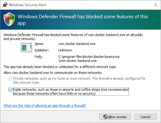

# GroundLevel

<!-- not active; we're going for Discourd, #later
[](https://gitter.im/akauppi/GroundLevel-firebase-web)
-->

<!-- CI Cloud Build badges: tbd.
- backend deployment of master
- app deployment of master

https://github.com/leg100/cloud-build-badge
-->

<!-- Using 'img' to be able to scale from Markdown.
- Unfortunately, not able to do proper left-alignment (try out what works in GitHub; only that really matters..)
-->


**A modern (ES modules based and "Serverless") Web App template**

Great tools selected for you: 

[Vite](https://github.com/vitejs/vite)
- [Firebase](https://firebase.google.com)
- [Vue.js 3](https://vuejs.org)
- [Jest](https://jestjs.io)
- [Cypress](https://www.cypress.io)
- [Cloud Build](https://cloud.google.com/build)
- [Plausible](https://plausible.io)
- [Sentry](https://sentry.io)

<!-- tbd. Add operational tools
-->

<font color=green>&check;</font> Built on 2020's technology (ES2022, async/await), aiming to stay up to date and lean.

<font color=green>&check;</font> Covers deployment (CI/CD).

<font color=green>&check;</font> Covers operational monitoring.

<br clear=all />

This repo is intended for professionals and beginners alike. Its main point is to showcase how easy making, maintaining and expanding web applications in the 2020's can be, when modern tools and techniques are used.

Much of starting a web app goes into setting up the frameworks. Especially so with modern (ES modules based) workflows, where frameworks (such as Vite, Jest and Node itself) have been growing fast. Apply this repo and you should be up, developing *your web app* already on the first week!

The repo is intended to *keep developing* and the author wants to find a way where you can track its changes to your app, as if the workflow itself were the dependency.

Finally, the repo has an emphasis on *operating* a real app. You can also see it as course material for modern web development. See [Training](TRAINING.md) if you are interesting in arranging an actual course.


## Pre-requisites and tools

You'll need:

- **A computer** with the following tools installed:

   - `node` 16+
   - `npm` - version 8+
   - `bash` and following command line tools: `sed`, `curl`, `grep`, `sort`
   - Docker Desktop [on Mac](https://docs.docker.com/desktop/mac/install/) or [on Windows](https://docs.docker.com/desktop/windows/install/) 

      >Docker is used extensively, e.g. for running the Firebase Emulators, and various development environments and tasks. The workflow presented always uses Firebase CLI through a Docker container, so you don't need to have it installed on your development machine. <!-- This should also be somewhat safer since the Firebase credentials are not stored locally on developers' computers. -->
  
  For Windows development, we require [WSL2](https://docs.microsoft.com/en-us/windows/wsl/install-win10) with an Ubuntu LTS image. WSL2 also happens to be a requirement for Docker Desktop for Windows.

<!-- tbd. write something once we do..  
  Once [WSLg](https://devblogs.microsoft.com/commandline/the-initial-preview-of-gui-app-support-is-now-available-for-the-windows-subsystem-for-linux-2/) (blog, Apr 2021) is publicly available, we'll use it in the front end testing (Cypress).
-->

   <details style="margin-left: 2em"><summary><b>Important note on file systems (Windows 10 + WSL2)</b></summary>
  The folder you clone the repo to *must reside within the WSL2 file system*. Docker performance is dismal if you link to (or directly use) `/mnt/c/` or the like. Don't. Instead create the folder within WSL2 and have the IDE tools reach it, remotely.
   </details>

   <details style="margin-left: 2em;"><summary><b>Linux</b></summary>
   *The repo is not tested as extensively on Linux, as on Mac and Windows. Having said that, it should work (= will be made to work ;).*
   
   You can either:
   
   - Use [Docker Desktop for Linux](https://docs.docker.com/desktop/linux/install/) which brings a similar developer experience as that on Mac/Windows.
   - Use Docker Compose v2 from the command line. You'll need to install it; see [Install Docker Compose](https://docs.docker.com/compose/install/#install-compose-on-linux-systems) > `Linux`
   </details>
   
- **A capable IDE**

  An IDE (Integrated Debugger and Editor) is where you spend most of your time. Pick a good one. Learn to use it well. Here are some suggestions:
  
  - [Visual Studio Code](https://code.visualstudio.com) - free
  - [WebStorm](https://www.jetbrains.com/webstorm/) - free 30 days trial, then € 59 / 47 / 35 /year

- **Basic Knowledge** of:
  - HTML
  - JavaScript
  - CSS

  We use ECMAScript features (up to ES2018) in the code, where-ever possible. Meaning no `var`, no `this` (ever!), yes `Promise`s and `async`/`await`. No Webpack. If you learn JavaScript from scratch, pay attention what year your material was made. Or just *dive in!* and learn from the code - the chef recommends this way!

  >Hint: [MDN resources](https://developer.mozilla.org) are a great place to learn the basics, and advanced material alike. Eg. [JavaScript](https://developer.mozilla.org/en-US/docs/Web/JavaScript). You might even have it in your native language.

- A **credit card** to deploy Cloud Functions

  Using Cloud Functions requires the "Blaze" plan, which means setting up billing. 
  
  However, note:
 
  - You can still play with the emulators completely without a Firebase account.
  - If your application doesn't need Cloud Functions, remove them.
  - Even if you use Cloud Functions, chances are *there aren't actual costs* since the Firebase free tiers are rather generous and apply to the "Blaze" plan as well.

Apropos, Firebase. What is it??


## Firebase

<a href="https://firebase.google.com"></a>

This repo uses the [Firebase](https://firebase.google.com) serverless framework for authentication, database, background functions and hosting.

Firebase allows a mere mortal to create fully functional cloud-based applications. You don't need to set up and maintain servers. You still have a back end but it's operated for you. You don't need to care about scalability (though you need to care about costs). Interface definitions become less burdensome than in traditional REST API world, since your front end deals directly with the database. Authentication and access rights management are integrated in the database (instead of a separate back end service you need to build).

>

*Figure 1. Traditional microservice vs. Firebase approach <sub>[source](https://docs.google.com/drawings/d/15_rPDZDOCHwdL0RIX8Rg3Der1tb4mx2tMi9asQ_aegw)</sub>*

There are similar offerings from other companies, but they are a year or two behind, in the ease of use, based on the author's opinion <sub>(last checked ~2021)</sub>.

<!-- hidden
>*This field is changing, though. [AWS Amplify](https://aws.amazon.com/amplify/?nc=sn&loc=0) offers a similar, but less tightly knit solution, based on GraphQL. [Supabase](http://supabase.io/) directly claims to be a Firebase alternative, based on PostgreSQL and an open source approach.*

The author is open to trying the approach with non-Firebase products, but they need to provide a 100% offline emulator experience, which Firebase does.
-->

<p></p>

>You *don't* have to know anything in advance about Firebase. However, some of their Youtube material is good, start eg. with [Welcome to Firebase](https://www.youtube.com/watch?v=zHomxNDEJqY) (1:00). It's recommended to learn Firebase in parallel with using this repo.

<!-- whisper
The videos don't always state which platforms they apply to, and iOS/Android seems to be preferred (implied default) over web.
-->


### Google Cloud Platform

Firebase and Google Cloud Platform (GCP) have a relation. Firebase runs on top of GCP (and is owned by Google). They have separate dashboards, but some Firebase tasks require one to visit the GCP Console. When you create a Firebase project, a GCP project of the same name is also created (and is where your code really runs!).

We stay at the Firebase side of things most of the time, except CI/CD (Cloud Build) and operations.

<!-- tbd. ^-- add mention of the GCP things we end up using in ops... Cloud Logging? 
-->

You'll be instructed about GCP where necessary. 


## Folder structure

```
├── ci                   # all CI/CD setup
├── DEVS                 # notes about developing the repo (optional)
├── firebase-ci-builder.sub # sub-repo for the Docker image
├── first                # (tools for manual deployment)
├── ops                  # operational monitoring
└── packages
    ├── app              # front-end logic and looks
    └── backend          # Firestore Security Rules, Cloud Functions
```

These are the major folders.

The two `packages`, `ci` and `ops` each contain their own documentation.


## Getting started

```
$ npm install
```

This installs some common tools, especially ESLint, used in multiple parts of the repo. Subpackages see them from the root, and this is where you update their versions.

Each of the `packages` has its own `npm install` that you'll run separately. We'll come back to that, soon.


### Update the submodules

We use a Docker image for running Firebase Emulators. The recipe for building this image comes from the [firebase-ci-builder](https://github.com/akauppi/firebase-ci-builder) repo and is linked here as a git submodule.

>Git submodules are a repo-within-a-repo. Once you initialize the submodules and `cd` to `firebase-ci-builder.sub`, you are no longer changing the GroundLevel repo. 
>
>This is very handy, but it's good to know what's going around. 
>
>Note: Using `.sub` postfix for submodules is just a convention for making explicit, where the repos change.

As a one-time thing, run these commands:

```
$ git submodule init
$ git submodule update
```

The `firebase-ci-builder.sub` folder is now populated. 


### Build the CI builder

<details style="border: 2px solid lightblue; padding: 0.4em;"><summary>Note to Windows users:</summary>

   
If you get this warning about Docker Desktop, at least
   
- **uncheck the "public networks" checkbox**. It's not needed.
   
It seems weird to the author that Windows would default to opening up things like that. Anyways, things continue to proceed in the background, regardless of what you select, but at least consider this.
</details>

```
$ (cd firebase-ci-builder.sub && ./build)
...
 => => naming to docker.io/library/firebase-ci-builder:11.0.1-node18-npm8
```

>*Note:* Did you use the parantheses in the command above? Without them, you'll end up in the `firebase-ci-builder.sub` folder. `cd ..` to climb back.

You don't need to push this image anywhere - it's enough that it resides on your development machine. The image is launched by the sub-packages whenever Firebase Emulators are required.

>You can test it:
>
>```
>$ docker run -it --rm firebase-ci-builder:11.0.1-node18-npm8 firebase --version
>11.0.1
>```


### Tour of the subpackages 🚌

The application is divided into subpackages, each having their own `README` and `npm install`.

We'll briefly mention them, as if shown from a bus window. To do the work, step out to each of the folders separately, study their contents and make changes.

>*'subpackage'* is an `npm` term (whereas *'submodule'* is a git term). It means a folder with its own `package.json` so you need to separately run `npm install` within it.


**`packages/backend`**

This folder has the Firebase back-end features:

- Firestore Security Rules describe your database's access rights
- Cloud Functions provide back-end functionality

We provide means to test these things. Deployment is done using CI/CD.

**`packages/backend/functions`**

A sub-subpackage ;), this folder runs Firebase Functions. It's only ever exercised via Firebase Emulators (Docker), or in the cloud. Do not run the install on it.


**`packages/app`**

This is where your web app lives.

The logic, the looks, the authentication. Everything that gets shipped to your customers once they open the right URL.

You can develop the code with Hot Module Reloading, thanks to Vite, seeing changes in the browser while you edit the underlying HTML, CSS or ECMAScript.

Once you're pleased, test the creature using Cypress.


### Create a Firebase project

This repo uses Firebase as your cloud presence. It:

- hosts your database
- runs server-side functions
- hosts the client-side files
- offers you a console to supervise the above

Follow the instructions in [Firebase](https://github.com/akauppi/GroundLevel-firebase-es/wiki/EN-0.1-firebase) (Wiki) to create your Firebase account and a project.

>You *will* need a credit card for creating the "Blaze" plan (which is needed for deploying the default back-end).


## First deployment

Have the Firebase project? Great! 🎉

You can now deploy the current contents of the repo manually, to be able to see the app online. It will take ~5-10 minutes.

>Note. The recommended way of deployment is with a CI/CD pipeline, but setting such up takes longer. Having at least the backend deployed in the cloud enables you to use `dev:online` mode in front end development (more about that in `packages/app`).

- Step aside to [first/README](first/README.md)
   - follow the instructions
   - ...and then return here.


### `firebase.staging.js`

The `first` script also fetched the *access values* (author's term) of the Firebase project you selected, and placed them in a local file. Let's take a look.

```
$ cat firebase.staging.js
export default {
  "projectId": ...,
  "appId": ...,
  "locationId": ...,
  "apiKey": ...,
  "authDomain": ...,
}
```

The values are *not* secrets - anyone having access to your URL will be able to get them. Try with `https://<your-app>.web.app/__/firebase/init.json`. 🙂

It's customary for Firebase web apps to read the values from there, but this repo prefers baking them into the front-end itself. This removes one return trip from the launch of the web app, making it a bit snappier. The author hopes you appreciate this!

>It also allows hosting the front-end elsewhere than Firebase Hosting, if that were to be advantageous.

### Multiple stages

You can have multiple deployment environments, and you can share the environments with your team by adding the file(s) into git. For more details on this, see [docs/Staging](docs/Staging.md).


<!-- Comes elsewhere...
## Setting up CI/CD

Eventually, we hope you'll like to move to automated deployment.

See [ci/README](ci/README.md) for instructions on how to set up a CI/CD pipeline.

This expects you to have a GitHub fork of the repo, and to want to use Cloud Build for running the CI/CD.

>Also other vendors provide cloud CI/CD. GitHub has one, and setting it up should be simpler than the dance needed to get two cloud services to collaborate. Cloud Build was selected because of the Firebase Google background, and because it allows Docker images to be used as build steps.
-->

## Where to go next?

Check these subfolders:

- 🖌📐 Backend: [`packages/backend`](packages/backend/README.md)
- 💅 Front-end: [`packages/app`](packages/app/README.md)
- 🌀 CI/CD ([`ci/README`](ci/README.md))
- 🌀 Operational monitoring ([`ops/README`](ops/README.md))


Check this documentation:

- [Living with Docker Compose](docs/Living%20with%20Docker%20Compose.md)

   Information that helps you be more effective with Docker Compose, which we use for running the Firebase Emulators.

<!--
- [Moving in!](docs/Moving%20in!.md)

   Instructions on what to consider when turning this repo to serve *your* needs. Removing the branding, mainly.
-->

We hope you are active also in the development - and giving feedback - of the GroundLevel repo. It doesn't serve its purpose unless it becomes the growing ground, a fertile soil, for many flowerful web apps! 

🌷🌸🌼🌹🥀🌻🌾🌹🌺💐


<!--
## Credits

Thanks to:

- Jaakko Roppola for wonderful icon art!! 🙌

- Jonatas Walker for his [jonataswalker/vue-rollup-example](https://github.com/jonataswalker/vue-rollup-example) template. Based this work on it (in 2019), then changed a few things.

- Gaute Meek Olsen for his template and [associated blog entry](https://gaute.dev/dev-blog/vue-router-firebase-auth) (Nov '19). This taught me how to use a Promise with `firebase.auth().onAuthStateChanged` properly.
-->

<!-- hidden...
## Contribution

As always, contributions and discussions are welcome.

- Please use primarily [GitHub Issues](https://github.com/akauppi/GroundLevel-es-firebase/issues) for questions and bug reports.
- For casual conversation, head to the [Gitter](https://gitter.im/akauppi/GroundLevel-firebase-web).

Have Fun, and spread the word!!
-->

## References

<!-- (aged; now using Vite)
### Serving ES6 modules, HTTP/2 etc.

- [Using Native JavaScript Modules in Production Today](https://philipwalton.com/articles/using-native-javascript-modules-in-production-today/) (blog, Aug 2019)
   - this step-by-step guidance was instrumental in making the production build work with ES modules. Brilliant write!!! 💎
-->

### Other app templates

- [Firelayer](https://firelayer.io)
  - seems visually pleasing!
  - likely Vue.js 2?
  - likely uses bundling

- [cypress-realworld-app](https://github.com/cypress-io/cypress-realworld-app)
  - Showcasing use of Cypress

*tbd. When someone has checked Firelayer in detail, and can make a brief (2 sentence!) summary on how it differs from this repo, that is most welcome. `#contribution`*

### Online forums

- [Firebase developers](https://discord.gg/BN2cgc3) (Discord server)


---

<font color=gray><p align="center">Made 2019-22 in [Lauttasaari](https://www.myhelsinki.fi/fi/näe-ja-koe-naapurustot/läntiset-naapurustot/lauttasaari)</p></font>
