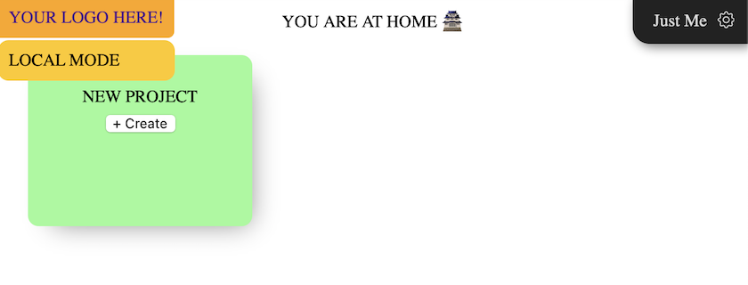

# GroundLevel ♠️ Firebase ♠️ ES modules

[](https://gitter.im/akauppi/GroundLevel-firebase-web)

<!-- Using 'img' to be able to scale from Markdown.
- Unfortunately, not able to do proper left-alignment (try out what works in GitHub; only that really matters..)
-->


<br />

**A modern (ES modules based) Web App template**

- great tools selected for you: [Vue.js 3](https://v3.vuejs.org), [Vite](https://github.com/vitejs/vite), [Firebase](https://firebase.google.com), [Jest](https://jestjs.io), [Cypress](https://www.cypress.io), web components [with Svelte 3](https://dev.to/silvio/how-to-create-a-web-components-in-svelte-2g4j), [Cloud Build](https://cloud.google.com/build), [Cloud Logging](https://cloud.google.com/logging/)
- buildable with [Jailed!](https://github.com/akauppi/Jailed); no need to expose one's development maching to all those `npm` dependencies
- built on 2020's technology (ES9, async/await), aiming to stay up to date and lean
- covers all the way to deployment (CI/CD) and operations

<!-- tbd. add operational tools to the mix, once selected
-->

<br clear=all />

><font size="+5">🪤</font> Calling something "modern" seems to be a subjective term (always is). If you think "[Angular, React and Vue" are modern](https://stackoverflow.blog/2021/02/24/what-i-wish-i-had-known-about-single-page-applications/) (in 2021), maybe "post-modern" is a more appropriate term for this repo. 😛

This repo is intended for professionals and beginners alike. Its main point is to showcase how easy, and effective, making Web Applications in the 2020's is, when (only) modern tools are used.


## Easy for beginners

We learn by reading other people's code. Actual code. This template is made with that in mind. It's not a partial template, and doesn't create a to-do list.

<!-- tbd.
There's going to be a [narrative](...) that discusses the design in more detail. -->

For medium and pro level software engineers, you should still get something out of this. The project features e.g.

- social invites
- collaboration
- interactive SVG graphics
- testing
- production builds
- CI/CD setup
- operations / metrics

This hopefully makes the app not only easy, but interesting as well.

But let's cut the chace and get started! 😀

>Note: Many of the features are still pending (the sample itself has become the *last* thing to finish!). Don't let that discourage yourself - head further and see whether dragons lie there! <font size="+5">🐉</font>


## Firebase

<a href="https://firebase.google.com"></a>

This repo uses the [Firebase](https://firebase.google.com) serverless framework for a lot of things: authentication, database, background functions, performance monitoring.

Firebase allows a mere mortal to create fully functional cloud-based applications. You don't need to set up and maintain servers. You still have a "back end" but it's operated for you. You don't need to care about scalability (though you need to care about costs). Interface definitions become less burdensome than in traditional REST API / GraphQL world, since your front end deals directly with the database. Authentication and access rights management are integrated in the database (instead of a separate back end service you need to build).

>

*Figure 1. Traditional microservice vs. Firebase approach <sub>[source](https://docs.google.com/drawings/d/15_rPDZDOCHwdL0RIX8Rg3Der1tb4mx2tMi9asQ_aegw)</sub>*

There are similar offerings from other companies, but they are a year or two behind, in the ease of use, based on the author's opinion.

>Note: You *don't* have to know anything in advance about Firebase. But their educational material is good and fun. It's recommended to check those out in parallel with this repo.


## Google Cloud

Firebase and Google Cloud have a relation. Firebase runs on top of Google Cloud (and is owned by Google, as a sub-brand). They have separate dashboards, but some Firebase tasks require one to visit the Google Cloud tools side.

In this repo, we stay at the Firebase side of things, except for CI/CD which is done with Cloud Build and logging, where Cloud Logging is used.

This is clearly a balancing of simplicity vs. advanced features.


## Requirements

As global tools, you will need:

- `npm`
- `firebase` CLI (Command Line Interface)

  ```
  $ npm install -g firebase-tools
  ```

>💡 From time to time, run the `npm install -g firebase-tools` command again, to update the tools. Especially worth it if you run into problems.

The project is developed on macOS, but with the dawn of [Jailed!](...), we'll be able to make it more OS agnostic. The aim is that you can develop on Linux, Windows or Mac, alike.

### An editor

You need an editor for seeing and modifying the code. 

- [WebStorm](https://www.jetbrains.com/webstorm/) (€ 59 -> 47 -> 35 per year for individual use with [discounts / free licenses for selected groups](https://www.jetbrains.com/webstorm/buy/#discounts?billing=yearly))
- [Visual Studio Code](https://code.visualstudio.com)

*Please suggest other IDEs you feel are good for a newcomer. Oldtimers likely won't convert, anyhow. ;)*

<!-- tbd.
### Big enough screen

In programming, the more you can see on the screen at once, the better. The author is very pleased with a single 4K screen, while others use multiple displays. Don't try to cram your vision to an old HD monitor - at least have two. It's like tunnel vision with eye glasses.


<_!-- tbd. make own photo, with code and blur everything but center 
-->


## Getting started


There's a choice you need to make. 

Are you more interested in:

<font color=green>🅐</font> - [Run for the Cloud](#choice-a)<br />
<font color=lilac>🅑</font> - [UI development, first](#choice-b)

<br clear=all />


<a name="choice-a"></a>
### <font size="+3" color=green>🅐</font> - Run for the Cloud

With this route, we'll sign you up to Firebase "blaze" plan and create a project. Then proceed to build and deploy the application online, without making any changes to it, yet.

After the application works, you can look into the various parts of it and start making changes.

---

There are three subpackages in the repo: `backend`, `app` and `app-deploy-ops`. In this tour, we are visiting them all. For more details on each one of them, check their particular `README` files.

#### 0. Create a Firebase project

Follow the instructions in [README.firebase.md](./README.firebase.md) so that you have a Firebase project created.

#### 1. Build and deploy the back-end

```
$ cd packages/backend
```

```
$ firebase use --add
```

Select the project you want to use and give it an alias. The alias doesn't really matter, `abc` is just fine..

Now, you should be able to see your selected project:

```
$ firebase use
Active Project: testing-220321
...
```

Next, we'll install the dependencies and deploy the database access rules and Cloud Functions:

```
$ npm install
```

```
$ npm run deploy
...

=== Deploying to 'testing-220321'...

i  deploying firestore, functions
i  firestore: reading indexes from ./firestore.indexes.json...
i  cloud.firestore: checking ./firestore.rules for compilation errors...
✔  cloud.firestore: rules file ./firestore.rules compiled successfully
i  functions: ensuring required API cloudfunctions.googleapis.com is enabled...
i  functions: ensuring required API cloudbuild.googleapis.com is enabled...
✔  functions: required API cloudbuild.googleapis.com is enabled
✔  functions: required API cloudfunctions.googleapis.com is enabled
i  functions: preparing ./functions directory for uploading...
i  functions: packaged ./functions (32.02 KB) for uploading
✔  firestore: deployed indexes in ./firestore.indexes.json successfully
i  firestore: latest version of ./firestore.rules already up to date, skipping upload...
✔  functions: ./functions folder uploaded successfully
✔  firestore: released rules ./firestore.rules to cloud.firestore
i  functions: updating Node.js 14 (Beta) function userInfoShadow_2(europe-west6)...
i  functions: updating Node.js 14 (Beta) function logs_1(europe-west6)...
✔  functions[userInfoShadow_2(europe-west6)]: Successful update operation. 
✔  functions[logs_1(europe-west6)]: Successful update operation. 
✔  Deploy complete!

Project Console: https://console.firebase.google.com/project/testing-220321/overview
```

If you saw that, the backend is now ready in the cloud. Well done!

You can visit the given URL to see the dashboard. Check the `Firestore` and `Functions` pages.

Next, we'll prepare the front end and deploy it as well.

#### 2. Build the front end

```
$ cd ../app
```

Do again the `firebase use` - we haven't synchronized the subpackages on this, but could.

```
$ firebase use --add
```

```
$ npm install
```

The web app needs to be built.

```
$ npm run build
...
vite v2.1.2 building for production...
✓ 47 modules transformed.
dist/aside-keys.js   17.85kb / brotli: 5.62kb
dist/aside-keys.js.map 28.60kb
dist/style.css       5.21kb / brotli: 1.45kb
dist/app.es.js       35.40kb / brotli: 8.86kb
dist/app.es.js.map   72.08kb
dist/vue-router.js   51.80kb / brotli: 11.50kb
dist/vue-router.js.map 169.41kb
dist/vue.js          127.87kb / brotli: 25.31kb
dist/vue.js.map      465.31kb
```

What we now have is the web app's *logic*. It is not ready for deployment, yet. We'll handle that next.

#### 3. Deploy the front end

>Note: In this repo, developing and packaging the app for deployment are separated. This is not a normal pattern in front end development but has its benefits: separation of concerns, allows different teams to have ownership of the features vs. how those features are kept alive on the cloud.

```
$ cd ../app-deploy-ops
```

You know the drill:

```
$ firebase use --add
```

```
$ npm install
```

```
$ npm run build
```

```
$ npm run deploy
...

=== Deploying to 'testing-220321'...

i  deploying hosting
i  hosting[groundlevel-160221]: beginning deploy...
i  hosting[groundlevel-160221]: found 3 files in roll/out
✔  hosting[groundlevel-160221]: file upload complete
i  hosting[groundlevel-160221]: finalizing version...
✔  hosting[groundlevel-160221]: version finalized
i  hosting[groundlevel-160221]: releasing new version...
✔  hosting[groundlevel-160221]: release complete

✔  Deploy complete!

Project Console: https://console.firebase.google.com/project/testing-220321/overview
Hosting URL: https://testing-220321.web.app
```

Now, head to the provided URL and you should see the app alive and kicking!!!

[https://testing-220321.web.app](https://testing-220321.web.app)

As you can imagine, there are *tons* of details around each of the phases we took. 

We didn't touch testing at all (each stage has tests).

Deployment is normally done using CI/CD - there's a [separate story](...) for setting that up. *🚧Work in progress*

..but the purpose was to get you from 0 to Cloud as fast as possible, and hopefully that happened!

Next, have a look at each of the subpackages in the order you like:

- [packages/backend](packages/backend/README.md)
- [packages/app](packages/app/README.md)
- [packages/app-deploy-ops](packages/app-deploy-ops/README.md)

You can start developing your own app, now. See [README.2-yours](README.2-yours.md).

---

<a name="choice-b"></a>
### <font size="+3" color=lilac>🅑</font> - UI development, first

With this route, we focus on the application source code and set it up, running locally under emulation. You can make changes to the code and see them pop up on the screen.

You don't need to set up a Firebase account, just yet. 

Later, you'll continue to the deployment part. At that point, you need a Firebase account and project.

---

```
$ cd packages/app
```

```
$ npm install
```

```
$ npm run dev
...
[emul] i  emulators: Starting emulators: auth, functions, firestore
[emul] ⚠  emulators: It seems that you are running multiple instances of the emulator suite for project app. This may result in unexpected behavior.
[emul] ⚠  functions: The following emulators are not running, calls to these services from the Functions emulator will affect production: database, hosting, pubsub
[emul] ⚠  Your requested "node" version "14 || >=15" doesn't match your global version "15"
[emul] ⚠  functions: Unable to fetch project Admin SDK configuration, Admin SDK behavior in Cloud Functions emulator may be incorrect.
[emul] i  firestore: Firestore Emulator logging to firestore-debug.log
[emul] i  ui: Emulator UI logging to ui-debug.log
[emul] i  functions: Watching "/Users/asko/Git/GroundLevel-es-firebase/packages/app/node_modules/@local/backend/functions/" for Cloud Functions...
[init] (node:20644) ExperimentalWarning: Importing JSON modules is an experimental feature. This feature could change at any time
[init] (Use `node --trace-warnings ...` to show where the warning was created)
[emul] ✔  functions[userInfoShadow_2]: firestore function initialized.
[emul] ✔  functions[logs_1]: http function initialized (http://localhost:5002/app/us-central1/logs_1).
[emul] 
[emul] ┌─────────────────────────────────────────────────────────────┐
[emul] │ ✔  All emulators ready! It is now safe to connect your app. │
[emul] │ i  View Emulator UI at http://localhost:4000                │
[emul] └─────────────────────────────────────────────────────────────┘
[emul] 
[emul] ┌────────────────┬────────────────┬─────────────────────────────────┐
[emul] │ Emulator       │ Host:Port      │ View in Emulator UI             │
[emul] ├────────────────┼────────────────┼─────────────────────────────────┤
[emul] │ Authentication │ localhost:9100 │ http://localhost:4000/auth      │
[emul] ├────────────────┼────────────────┼─────────────────────────────────┤
[emul] │ Functions      │ localhost:5002 │ http://localhost:4000/functions │
[emul] ├────────────────┼────────────────┼─────────────────────────────────┤
[emul] │ Firestore      │ localhost:6767 │ http://localhost:4000/firestore │
[emul] └────────────────┴────────────────┴─────────────────────────────────┘
[emul]   Emulator Hub running at localhost:4400
[emul]   Other reserved ports: 4500
[emul] 
[emul] Issues? Report them at https://github.com/firebase/firebase-tools/issues and attach the *-debug.log files.
[emul]  
[init] Primed :)
[init] Pre-bundling dependencies:
[init]   firebase/app
[init]   firebase/auth
[init]   firebase/firestore
[init]   firebase/functions
[init]   vue
[init]   (...and 5 more)
[init] (this will be run only when your dependencies or config have changed)
[init] 
[init]   vite v2.1.2 dev server running at:
[init] 
[init]   > Local:    http://localhost:3000/
[init]   > Network:  http://192.168.1.62:3000/
[init] 
[init]   ready in 912ms.
[init] 
```

Open [http://localhost:3000?user=dev](http://localhost:3000?user=dev)

You should see a simple UI:

>

&nbsp;
>Note: In "dev:local" mode, you claim to be a certain user by the query param `user=<uid>`. There are premade material for some users.

Good.

Now, let's make changes to the source code. Open your IDE and edit ..hmm.. the file `src/pages/Project.vue` (you can edit absolutely anything you want, of course).

```
    <div>
      PROJECT PAGE YIPPIYAY!
    </div>
```

Switch back to the app. Open a project. Do you see the new text?

>*tbd. This part is broken in the app. Please use your imagination, for now...*

Note: You don't have to build the app when making changes. Vite - a tool we use underneath - does it for you.

For more details, check out the [packages/app/README.md](packages/app/README.md) guidance.

When ready, please finish by following the [🅐 route](#choice-a). Then, forward to [Making it Yours](README.2-yours.md).


<!-- Keep around
## Subpackage organization

There are three subpackages. This table shows their responsibilites:

<table>
  <thead>
    <tr>
      <th></th>
      <th>development</th>
      <th>testing</th>
      <th>deployment</th>
      <th>monitoring</th>
    </tr>
  </thead>
  <tbody>
    <tr>
      <td>app</td>
      <td colspan=2><pre>packages/app</pre></td>
      <td colspan=2><pre>packages/app-deploy-ops</pre></td>
    </tr>
    <tr>
      <td>back-end</td>
      <td colspan=3><pre>packages/backend</pre></td>
      <td>open</td>
    </tr>
  </tbody>
</table>

<! -- what does back-end monitoring mean (checking the logs); where is it 

-->


