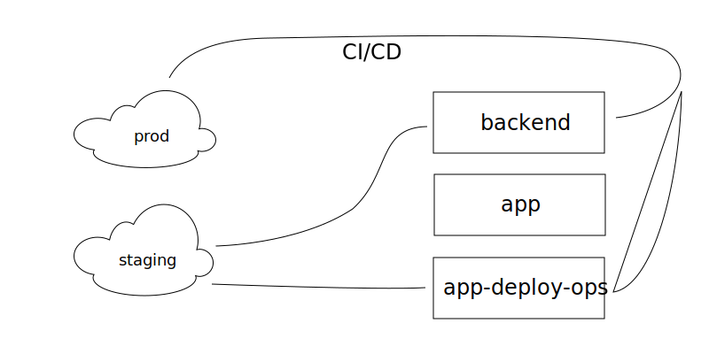
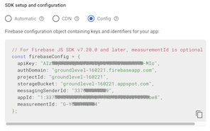

# GroundLevel ♠️ Firebase ♠️ ES modules

[](https://gitter.im/akauppi/GroundLevel-firebase-web)

<!-- Using 'img' to be able to scale from Markdown.
- Unfortunately, not able to do proper left-alignment (try out what works in GitHub; only that really matters..)
-->


<br />

**A modern (ES modules based) Web App template**

- great tools selected for you: [Vue.js 3](https://v3.vuejs.org), [Vite](https://github.com/vitejs/vite), [Firebase](https://firebase.google.com), [Jest](https://jestjs.io), [Cypress](https://www.cypress.io), web components [with Svelte 3](https://dev.to/silvio/how-to-create-a-web-components-in-svelte-2g4j), [Cloud Build](https://cloud.google.com/build), [Cloud Logging](https://cloud.google.com/logging/)
- built on 2020's technology (ES9, async/await), aiming to stay up to date and lean
- covers all the way to deployment (CI/CD) and operations

<br clear=all />

This repo is intended for professionals and beginners alike. Its main point is to showcase how easy, and effective, making web applications in the 2020's can be, when modern tools and techniques are used.

The repo showcases a full, social web app and has an emphasis on *operating* such an app. In this it deviates from most templates. You can also see it as course material for modern web development (see [Training](TRAINING.md) for courses).

## Pre-requisites and tools

To complete the "course" 🏌️‍♂️⛳️ you'll need:

- **A computer** with the following tools installed:

   - `node` v. 14.3+ or 16.x
   - `npm` - version 7.7 or later
   - `bash` and following command line tools: `sed`, `curl`, `grep`, `sort`
   - Docker

  Docker is used for launching the Firebase Emulators, which are used both in development, testing and CI. Alternatively, one can install the `firebase-tools` CLI on one's machine.
  
  For Windows development, we require [WSL2](https://docs.microsoft.com/en-us/windows/wsl/install-win10) with eg. Ubuntu LTS image.

  ><details><summary>**Important note for Windows users..**</summary>
  The folder you clone the repo to *must reside within the WSL2 file system*. Docker performance is dismal if you link to (or directly use) `/mnt/c/` or the like. Don't. Instead create the folder within WSL2 and have the IDE tools reach it, remotely.
  </details>
  
- **A capable IDE**

  An IDE (integrated debugger and editor) is where you spend most of your time. Pick a good one. Learn to use it well. Here are two suggestions:
  
  - [Visual Studio Code](https://code.visualstudio.com) - free
  - [WebStorm](https://www.jetbrains.com/webstorm/) - free 30 days trial, then € 59 / 47 / 35 /year

- **Basic Knowledge** of:
  - HTML
  - JavaScript
  - CSS

  We use the ECMAScript 6 (up to ES2018) features in the code, where-ever possible. Meaning no `var`, no `this` 😡, yes Promises and `async`/`await`. No Webpack. If you learn JavaScript from scratch, pay attention what year your material was made. Or just *dive in!* and learn from the code - the chef recommends this way!

  >Hint: [MDN resources](https://developer.mozilla.org) are a great place to learn the basics, and advanced material alike. Eg. [JavaScript](https://developer.mozilla.org/en-US/docs/Web/JavaScript) You might even have it in your native language! Check the  button.

- A **credit card** to deploy Cloud Functions

  While most Firebase features are available in the free (and default) "Spark" plan, Cloud Functions require the "Blaze" plan since summer 2020.
  
  This might not be that bad.
  
  - you can still play with the emulators completely without a Firebase account
  - if your application doesn't need Cloud Functions, remove them and deploy
  - even if you use Cloud Functions, chances are *there aren't actual costs* since the Firebase free tiers apply to the "Blaze" plan as well.


## Firebase

<a href="https://firebase.google.com"></a>

This repo uses the [Firebase](https://firebase.google.com) serverless framework for a lot of things: authentication, database, background functions, performance monitoring.

Firebase allows a mere mortal to create fully functional cloud-based applications. You don't need to set up and maintain servers. You still have a "back end" but it's operated for you. You don't need to care about scalability (though you need to care about costs). Interface definitions become less burdensome than in traditional REST API world, since your front end deals directly with the database. Authentication and access rights management are integrated in the database (instead of a separate back end service you need to build).

>

*Figure 1. Traditional microservice vs. Firebase approach <sub>[source](https://docs.google.com/drawings/d/15_rPDZDOCHwdL0RIX8Rg3Der1tb4mx2tMi9asQ_aegw)</sub>*

There are similar offerings from other companies, but they are a year or two behind, in the ease of use, based on the author's opinion.

>*This field is changing, though. [AWS Amplify](https://aws.amazon.com/amplify/?nc=sn&loc=0) offers a similar, but less tightly knit solution, based on GraphQL. [Supabase](http://supabase.io/) directly claims to be a Firebase alternative, based on PostgreSQL and an open source approach.*

<p />

>Note: You *don't* have to know anything in advance about Firebase. But their educational material is good and fun (Youtube, especially!). It's recommended to check those out in parallel with this repo.


## Google Cloud

Firebase and Google Cloud have a relation. Firebase runs on top of Google Cloud (and is owned by Google). They have separate dashboards, but some Firebase tasks require one to visit the Google Cloud tools side.

We stay at the Firebase side of things most of the time, exceptions being CI/CD (Cloud Build) and central logging (Cloud Logging).

You'll be instructed about Google Cloud where necessary, and both of the above mentioned services can be replaced by others, of your choice (but you'll need to make the necessary changes).

## Requirements

We aim to support development on:

- Latest macOS version
- Windows 10: Ubuntu under WSL2
- Any Linux

## Folder structure

```
├── DEVS     # notes about developing the repo (optional)
├── ci       # all CI/CD setup
├── firebase-ci-builder.sub   # sub-repo for the Docker image
├── hack     # needed until Firebase fixes one thing
├── packages
│   ├── app
│   ├── app-deploy-ops
│   └── backend
└── tools    # common scripts to the `packages`
```

The three `packages` each contain their own documentation.


## Getting started

```
$ npm install
```

This installs some common packages, such as Firebase JS SDK. Subpackages use them from the root, and this is where you update their versions.

```
$ git submodule update
```

This updates the contents of `firebase-ci-builder.sub` submodule.


### Build the Docker image

We use a Docker image for running Firebase Emulators. Before advancing, let's build that image:

```
$ (cd firebase-ci-builder.sub && ./build)
...
 => => naming to docker.io/library/firebase-ci-builder:9.11.0-node16-npm7                                                                                                                                                                              0.0s 
```

You don't need to push this image anywhere - it's enough that it resides on your development machine. This image is launched by the sub-packages whenever Firebase Emulators are required.

>You can test it:
>
>```
>$ docker run -it firebase-ci-builder:9.11.0-node16-npm7 firebase --version
9.11.0
>```

<!-- hidden
Alternatively, you can use a native `firebase-tools` installation. See [Docker vs. native `firebase-tools`](Docker%20vs.%20native%20firebase-tools.md).
-->

## Speed run 

If you continue here, we'll do a real speed run 🏃‍♀️🏃🏃‍♂️
through the three sub-packages, set up a Firebase project (and account), CI/CD to Cloud Build and end up having a clone of the sample application installed *on your Firebase account*, in the cloud.

Alternatively, you can study each of the individual sub-packages' `README`s (plus `ci`) and come back here later..


### Backend

```
$ cd packages/backend
$ npm install
...
$ npm test
...
```

The tests should pass, running against the Docker image you built.

>**Windows users:**
>
>
>
>If you get this warning about Docker Desktop, at least
>
>- **uncheck the "public networks" checkbox**. It's not needed.
>
>It seems weird to the author that Windows would default to opening up things like that. Anyways, things continue to proceed in the background, regardless of what you select, but at least **do not press OK** without removing that one checkbox.

Let's proceed to the front end.

### App

```
$ cd ../app
$ npm install
...
$ npm run build
...
$ npm test
...
```

These tests are done using [Cypress](https://www.cypress.io). They work against the backend we left running - if you didn't, they'll launch the back-end automatically, but that is a bit slower.

The output of this stage (in `vitebox/dist/`) *is* the web app. All the looks, styling and front end features are done here.

What's missing is the operational readiness that adds performance monitoring, central logging and crash detection to the app.

### App-deploy-ops

This sub-package wraps the output of the "app" build to be ready for deployment.

```
$ cd ../app-deploy-ops
$ npm install
...
$ npm run build
...
```

There are no tests here.

Next, in order to deploy the app (backend and front-end) we need a Firebase project.

## Deployment to staging

>

For development, it is good to have a project online where you can see your changes in real environment. These are called "staging" projects and we'll set up one now, for you / your team.

>Note: You can also set up just one project, but in a realistic scenario you want to restrict access to users' data and therefore shift production projects away from development, eg. so that deployment to them happens only via CI/CD.
>
>Some developers may be fond of "dev" environments. With Firebase Emulators doing a good job for development, the need for such is reduced, but if you need one, it's just setting up another staging environment (for the person or team needing it). That is, you can have any number of staging environments you want.


### 1. Create a Firebase project

Follow the instructions in [0.1 Firebase](https://github.com/akauppi/GroundLevel-firebase-es/wiki/EN-0.1-firebase) (Wiki).

>You *will* need a credit card for creating the "Blaze" plan. If you don't want to do that yet, choose the free plan and continue as far as you can. 👍

### 2. Create a `firebase.staging.js` file

There are two places in the development that require an online Firebase backend.

||command|comments|
|---|---|---|
|`app`|`npm run dev:online`|Development against a cloud back-end|
|`app-deploy-ops`|`npm run serve`|Checking how the deployment candidate works, before deploying it|

To use these commands, a `firebase.staging.js` file needs to be created in the repo's root.


#### Alternative A: Create by Firebase CLI

```
$ (cd packages/backend && npx firebase-tools use --add)
... select the appropriate project ...
```

>Note: The `npx firebase-tools use --add` "must be run from a Firebase project directory". We have two such: `packages/backend` and `packages/app-deploy-ops`.
>These two are *not* connected which means you need to separately select the project in both of them. This is due to the Firebase toolchain that doesn't really know the concept of a monorepo. For now, it's enough we've set the project in the `packages/backend` folder.

```
$ npm run createStagingJs
```

That creates the file.


#### Alternative B: Copy-paste from online

You can also just create the file by hand.

- Visit Firebase Console > (project) > `⚙️` `Project settings` > `Your apps` > `SDK setup and configuration` > `◉ Config`

   

With data from there, create a `firebase.staging.js` file of this kind:

```
const config = {
  "projectId": "test-staging-15",
  "appId": "...",
  "locationId": "...",
  "apiKey": "...",
  "authDomain": "test-staging-15.firebaseapp.com",
};
export default config;
```

This file is now used by both `packages/app` and `packages/app-deploy-ops`, to know where to find a backend in the cloud. Next, let's deploy one.


### 3. Deploy the backend

```
$ cd packages/backend

$ npx firebase-tools use --add    # ..unless you already did this

$ npx firebase-tools deploy --only functions,firestore
```

That should deploy the Firestore Security Rules, index settings and Cloud Functions.

Let's try it!

```
$ cd ../app

$ npm run dev:online
...
```

This command should now work, and at [localhost:3001](http://localhost:3001) you have an app with a cloud-backed back-end.

**This may be your first deployment**. Let's celebrate for a while!! 🎉🎉🎪🤹‍♀️🎺


### 4. Sharing the staging (optional)

Now that the back-end is deployed, you can easily share it with the team by simply adding `firebase.staging.js` to the version control.

- edit `.gitignore` and remove (or comment out) the line excluding `firebase.staging.js`
- add `firebase.staging.js` to the git repo
- edit `package.json`; remove or comment out the `createStagingJs` target so the file won't get accidentially overridden
- remove `packages/backend/sh/create-staging.sh` since it's no longer required

This is useful if you want the whole team to always share the same staging environment.

>Note: The values are not really secrets. Anyone having access to your web app (before login) is able to figure them out.


## Setting up CI/CD

Production deployments are intended to be done using CI/CD. 

See [ci/README](ci/README.md) for instructions on how to set up a CI/CD pipeline.

This expects you to have a GitHub fork of the repo, and to want to use Cloud Build for running the CI/CD.

Also other vendors provide cloud CI/CD. GitHub has one, and setting it up is simpler than the dance needed to get two cloud services to collaborate. Using Cloud Build was selected because of the Firebase Google background, and because it allows Docker images to be used as build steps.


### Trying your deployment

Once you have the CI/CD deployment running, visit the application's web site:

e.g. [https://groundlevel-160221.web.app](https://groundlevel-160221.web.app)


## Where to go next?

You have some options. 

If you pick one, come back for the rest later. It doesn't really matter, in which order you cover these, but it would be useful to cover them all.

- Backend development ([`packages/backend`](packages/backend/README.md))

  All the cloud services that your front end relies on: database, server-side functions, data models and access rights of the stored data.

- Front-end development ([`packages/app`](packages/app/README.md))

  Developing the front end. You can do this without a Firebase project.
  
- Front-end ops ([`packages/app-deploy-ops`](packages/app-deploy-ops/README.md))

  Adding operational robustness to the app's front end.

- CI/CD ([`ci/`](ci/README.md))

  Making sure PRs don't break the code; deploying code that gets merged to `master`.

<!-- disabled
- Operations ([`ops/`](ops/README.md))

  Advice on what to do once the app is out.
-->

## Making it yours!

By now, you have deployed the sample app to your own Firebase project. It's now an independent *instance* of that application, unattached to the one run by the original authors.

Once you start making heavier modifications - that's why the repo exists, it's intended as a "ground level" of your spectacular app! - we hope that you remove the "GroundLevel" branding. Do so:

```
$ git rm -rf branding 
```

```
$ git grep GroundLevel
...
```

We don't mind you keeping the reference, but many `.md` files likely deserve to be removed/edited. That command helps you find the mentions.

You *may* mention in your docs that the app was based on GroundLevel, but are not required to do so. See the [LICENSE.md](LICENSE.md).

Apropos, the License. 

You may now remove the top part of it:

>This license applies to the software (contents of the GitHub repo), except
graphic art.
>
>In particular:
>
>- `branding/*`
>- symbolic links to `branding`
>
>Those files are PROPRIETARY to this project, and not to be used in other circumstances.
>You may, however, create a fork of this GitHub repo and continue working with the graphic
>files. Forks are regarded as just a way to collaborate and contribute, for the sake of
>the project itself.
>
>For the rest of the repo (code, configs and textual documentation), this applies:
>...

### Follow the letter of the license

Notice that the license states:

>The above copyright notice and this permission notice shall be included in all
copies or substantial portions of the Software.

ie. do not remove the license. You may, of course, become active in further developing the app template and we'd like to hear if you use it.


# Credits

Thanks to Jaakko Roppola for wonderful icon art!! 🙌

Thanks to Jonatas Walker for his [jonataswalker/vue-rollup-example](https://github.com/jonataswalker/vue-rollup-example) template. Based this work on it, then changed a few things.

Thanks to Gaute Meek Olsen for his template and [associated blog entry](https://gaute.dev/dev-blog/vue-router-firebase-auth) (Nov '19). This taught me how to use a Promise with `firebase.auth().onAuthStateChanged` properly.


# Contribution

As always, contributions and discussions are welcome.

- Please use primarily [GitHub Issues](https://github.com/akauppi/GroundLevel-es-firebase/issues) for questions and bug reports.
- For casual conversation, head to the [Gitter](https://gitter.im/akauppi/GroundLevel-firebase-web).

*We'll move to a Discord server, once more people are involved.*

Have Fun, and spread the word!!


# References

### Serving ES6 modules, HTTP/2 etc.

- [Using Native JavaScript Modules in Production Today](https://philipwalton.com/articles/using-native-javascript-modules-in-production-today/) (blog, Aug 2019)
   - this step-by-step guidance was instrumental in making the production build work with ES modules. Brilliant write!!! 💎

### Other app templates

- [Firelayer](https://firelayer.io)
  - seems visually pleasing!
  - likely Vue.js 2?
  - likely uses bundling

- [cypress-realworld-app](https://github.com/cypress-io/cypress-realworld-app)
  - Showcasing use of Cypress

*tbd. When someone has checked Firelayer in detail, and can make a brief (2 sentence!) summary on how it differs from this repo, that is a welcome `#contribution`!*

### Online forums

- [Firebase developers](https://discord.gg/BN2cgc3) (Discord server)


