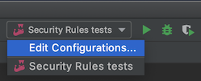
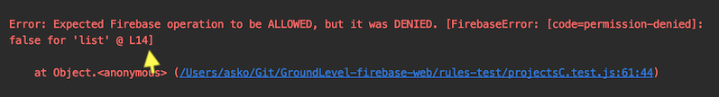

# Developer notes

## WebStorm shared run configurations

If you are using the WebStorm IDE, you should have a shared run configurations (`../.idea/runConfigurations`). This allows you to run the tests from the IDE, and/or debug them.

Launch the Firebase emulator on the background, as mentioned earlier.

## Debugging in WebStorm IDE

In IntelliJ WebStorm, create a Run configuration by `Run` > `Edit Configurations...`:

You can set breakpoints in the UI or use the `debugger` statement to bring up the IDE. 

Start a debugging run of the tests from the `Debug > Run All tests` icon

>Note: The screenshot has aged. Check the env.vars and parameters you'll need from the `package.json`.

## Seeing relevant `firestore.rules` line

When a test fails, there's a "L15" or similar mention:

>

Use this to pinpoint the rule that caused the unexpected behaviour.

## WARNING: Use of dates in `data.js`

Firebase Web client can take JavaScript `Date` objects and convert them to its `Timestamp` automatically.

HOWEVER, `Date.now()` and `Date.parse` do <u>not</u> produce Date objects but Unix epoch numbers, so be warned.

||Use|
|---|---|
|Current time|`new Date()`|
|Specific time|`new Date('27 Mar 2020 14:17:00 EET')`|

*Note: We could detect these automatically by applying the access rules also to the admin setup. That would catch the discrepancies. Now we don't do it, and we don't test validity of reads, either, so these go through.*
