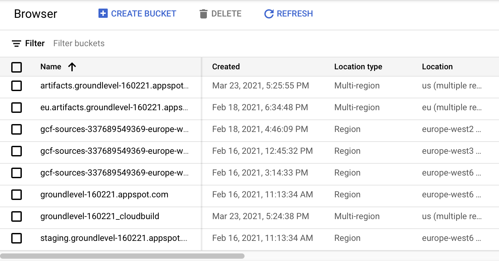

# Developer notes

## Hints 🤫

Run at project root:

```
$ gcloud meta list-files-for-upload
```


## `.gcloudignore`

Cloud Build ignores the files in the *root*'s `.gitignore` automatically but:

- it does not check the global `.gitignore`
- it does not check `.gitignore`s in subdirectories (this one is not so fine)

For these reasons, the repo has its own `.gcloudignore`, to keep the transports small.


## Use of Cloud Storage 

Cloud Build uses Cloud Storage (of the same project) to store files. During the development of the repo, the buckets looked like this:

>

The `groundlevel-160221_cloudbuild` is the important one for us.

It has a `source/` folder with `.tgz` packages.

If you have problems, check that the packaging is how you'd imagine it to be.


### Build logs

One omission in the above screen capture is build logs.

`gcloud builds submit --help` states that they should be stored (by default) in a bucket:

```
gs://[PROJECT_NUMBER].cloudbuild-logs.googleusercontent.com/
```

>*tbd. Where can I see Cloud Build logs?*


## Semi-cloud builds

This command is a middle ground between the local build and Cloud Build. If the author understands right, it:

- runs a Cloud Build run, triggered from the command line

```
$ gcloud builds submit ..
```

It's cheap for you to use. No Docker instances; just ~0.5MB upload to the cloud, and you see the console output in real time.

Maybe useful.

### Enable Kaniko caching

>If you run builds using the gcloud builds submit --tag [IMAGE] command, you can enable Kaniko cache by setting the property builds/use_kaniko to True as shown below:
>
>```
>$ gcloud config set builds/use_kaniko True
>```

Do it. 

## Troubleshoot manually

To launch a Docker container, similar to what `gcloud builds submit` does:

```
# at project root
$ docker run -it --volume `pwd`:/workspace eu.gcr.io/groundlevel-160221/firebase-custom-builder:latest /bin/bash
bash-5.0#
```

You can now execute the build steps and debug, if something doesn't work right. Faster than changing `cloudbuild.yaml`.

>Note DIFFERENCES: Whereas Cloud Build copies files and **excludes** certain ones, here you see a mapping of the actual disk contents on your host. If you remove something, it's removed in the host.

---

>**Have enough RAM in Docker**
>
>Docker default for the author was 2GB. Things work, but performance is *really* sluggish. (may not be the RAM, though...)

---

## References

- `gcloud topic gcloudignore`
