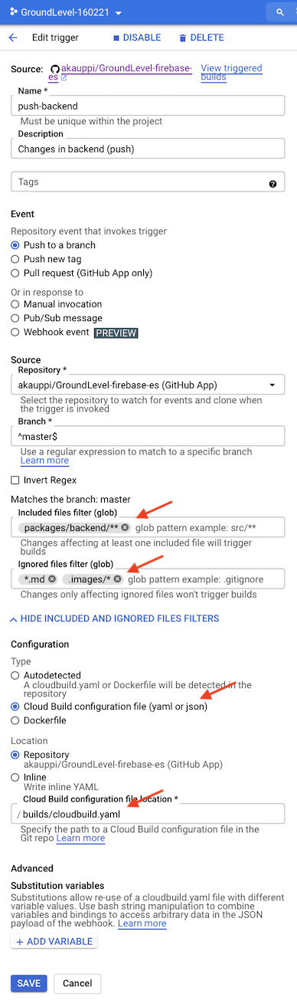
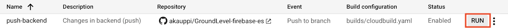

# Build

This folder contains the guidance for Cloud Build to automatically test and deploy subpackages, when the repo contents are being pushed to the server.

<!-- tbd. explain more -->

>Note: Commands in this document are intended to be executed in the `builds` folder.

## Requirements

- `gcloud` Google Cloud Platform CLI

   Follow [Installing Google Cloud SDK](https://cloud.google.com/sdk/docs/install)
	
	>Note: At least earlier, on macOS, it was best to run the `./google-cloud-sdk/install.sh` in the folder that would remain the install target. 
	>
	>The author has `gcloud` under `~/bin/google-cloud-sdk`.

   ```
   $ gcloud --version
	Google Cloud SDK 332.0.0
	...
   ```

- `docker`
- GNU `make`

   The last two are needed for creating a custom builder.
   
## Build the builder 👷👷

We need a Cloud Build builder image that contains:

- `firebase` with emulators
- `npm`
- some command line tools

Such an image is available at [akauppi/firebase-custom-builder](https://github.com/akauppi/firebase-custom-builder). You could clone that repo, but we've already set it up for you as a [Git submodule](https://gist.github.com/gitaarik/8735255) of the [akauppi/firebase-custom-builder](https://github.com/akauppi/firebase-custom-builder) for convenience.

>Submodules are great, but rarely used. This is the first time the author uses them in an open source project.

To build the builder and push it to your Container Registry:

```
$ cd firebase-custom-builder
$ make build push-latest
...
$ cd ..
```

>Note: For more details, and/or contributions, consult the builder's repo stated above.

### Why a custom builder?

There is a [community builder for Firebase](https://github.com/GoogleCloudPlatform/cloud-builders-community/tree/master/firebase) but it's no match to what we need.

- no emulation support (no Java) 

Ideally, one of you reading this takes on the challenge of bringing the image we use to the community level. Even then, it is possible that you'd want to curry up some additions to it, as part of your project build chain, so this "building the builder" is not completely in vain.

### Why not host the custom builder image publicly?

Costs. A builder is ~700MB and easily gathers download costs if even 100's of people start pulling it. 

>Note: If you have a solution for this issue, the author is happy to hear!

### How to update the submodule?

Just `cd` into it, and do the normal `git pull`.

### Check the image got pushed

GCP console > `Container Registry` > `Images`:

>

Note that the "hostname" should be something near you. If you got it wrong, just remove the image and rebuild with another domain.


## Setting up Cloud Build

### 1. Enable GitHub App triggers

- In [GitHub Marketplace](https://github.com/marketplace), enable the "Google Cloud Build" application
- Add your GitHub repo to the Cloud Build app

### 2. Grant Firebase IAM roles to the Cloud Build service account

This allows Cloud Build to use the `firebase` CLI as your project's admin.

- Google Cloud console > `Cloud Build` > `Settings`
- Change `Firebase Admin` to `Enabled`

>

#### +1: `iam.serviceAccountUser` role

There was one more role needed, not covered in the normal documentation. Deploying Cloud Functions needs this.

Get the number from the "Service account email" (above screenshot).

Use the Firebase project id.

```
$ MEMBER=serviceAccount:337......369@cloudbuild.gserviceaccount.com
$ PROJECT_ID=...
$ gcloud iam service-accounts add-iam-policy-binding $PROJECT_ID@appspot.gserviceaccount.com --member=$MEMBER --role=roles/iam.serviceAccountUser
Updated IAM policy for serviceAccount [...]
...
```

<!-- Error that brought to this (from CI/CD log):
...
Step #4: i  functions: updating Node.js 14 (Beta) function userInfoShadow_2(europe-west6)...
Step #4: ⚠  functions: failed to update function userInfoShadow_2
Step #4: HTTP Error: 403, Missing necessary permission iam.serviceAccounts.actAs for $MEMBER on the service account groundlevel-160221@appspot.gserviceaccount.com.
Step #4: Grant the role 'roles/iam.serviceAccountUser' to $MEMBER on the service account groundlevel-160221@appspot.gserviceaccount.com.
Step #4: You can do that by running 'gcloud iam service-accounts add-iam-policy-binding groundlevel-160221@appspot.gserviceaccount.com --member=$MEMBER --role=roles/iam.serviceAccountUser'.
Step #4: In case the member is a service account please use the prefix 'serviceAccount:' instead of 'user:'.
Step #4: If this is a cross-project service account usage. Ask a project owner to grant you the iam.serviceAccountUser role on the service account and/or set the iam.disableCrossProjectServiceAccountUsage org policy to NOT ENFORCED on the service account project. Please visit https://cloud.google.com/functions/docs/troubleshooting for in-depth troubleshooting documentation.
Step #4: 
-->

---

With that, deploying a Cloud Function in Cloud Build succeeds. 😅

>Note: Would changing the `Service Account User` in the screenshot have done the same? Likely. 
>
>Interestingly, the GUI does not change the state of `Service Account User` to `ENABLED` - maybe it contains more roles than the one we changed at the command line?

---

### 3. Add "API Keys Admin" role to the Cloud Build service account

>*Note: [Deploying to Firebase](https://cloud.google.com/build/docs/deploying-builds/deploy-firebase) mentions this but the community Firebase builder `README` doesn't. Things might work without it, too?*

- Google Cloud console > `IAM & Admin`
- Spot `@cloudbuild.gserviceaccount.com` account on the list > <font size="+1.5">`✎`</font> (edit)
- Add the `API Keys Admin` role:

>


## Set your `gcloud` project

<!-- Edirot's note: Not sure if this is the best place? 
-->

Using the same project name as with `firebase use`:

```
$ gcloud config set project testing-230321
Updated property [core/project].
```

<!-- disabled (enable if we get problems; for the author Resource Manager APIs were both enabled; normal and "v2"
### Enable GCP APIs

GCP docs state:

>Enable the Cloud Build, Firebase, and Resource Manager APIs.

Check these by:

- GCP Console > Getting Started > `Enable and disable APIs` (you can get there also via the left side menu)
- `Enable APIs and Services` 

       

This really sucks; there are N APIs for Firebase. Forget it!
-->


## Building locally (optional)

There is a `cloud-build-local` tool that allows one to run Cloud Build scripts, locally. Let's try it!

>Note: The local builder can build on only Linux or macOS.<sub>[source](https://cloud.google.com/build/docs/build-debug-locally#restrictions_and_limitations)</sub>

```
$ gcloud components install cloud-build-local
```

We should now be able to run Cloud Builds locally on the repo.

```
$ cloud-build-local -dryrun=true ..
```

The dry run proves that the build configuration looks solid but does not execute the build steps.

### Real build

>Note: If you execute the below command, it will carry on a deployment!

```
$ cloud-build-local -dryrun=false ..
```

<details>
<summary>Build output</summary>

```
$ cloud-build-local -dryrun=false ..
2021/03/26 10:03:52 Warning: The server docker version installed (20.10.5) is different from the one used in GCB (19.03.8)
2021/03/26 10:03:52 Warning: The client docker version installed (20.10.5) is different from the one used in GCB (19.03.8)
Using default tag: latest
latest: Pulling from cloud-builders/metadata
Digest: sha256:ac630903464f3fa39c8c1698c9d867dfdbc66d55e09c0518725440af1bf95b18
Status: Image is up to date for gcr.io/cloud-builders/metadata:latest
gcr.io/cloud-builders/metadata:latest
2021/03/26 10:04:35 Started spoofed metadata server
2021/03/26 10:04:35 Build id = localbuild_7b99d6da-d98f-4954-bca4-88f59486a339
2021/03/26 10:04:35 status changed to "BUILD"
BUILD
Starting Step #0
Step #0: Already have image (with digest): eu.gcr.io/groundlevel-160221/firebase-custom-builder
Step #0: /workspace/packages/backend
Finished Step #0
2021/03/26 10:04:36 Step Step #0 finished
Starting Step #1
Step #1: Already have image (with digest): eu.gcr.io/groundlevel-160221/firebase-custom-builder
Step #1: npm WARN deprecated request@2.88.2: request has been deprecated, see https://github.com/request/request/issues/3142
Step #1: npm WARN deprecated har-validator@5.1.5: this library is no longer supported
Step #1: npm WARN deprecated request-promise-native@1.0.9: request-promise-native has been deprecated because it extends the now deprecated request package, see https://github.com/request/request/issues/3142
Step #1: 
Step #1: > core-js@3.6.5 postinstall /workspace/packages/backend/node_modules/core-js
Step #1: > node -e "try{require('./postinstall')}catch(e){}"
Step #1: 
Step #1: Thank you for using core-js ( https://github.com/zloirock/core-js ) for polyfilling JavaScript standard library!
Step #1: 
Step #1: The project needs your help! Please consider supporting of core-js on Open Collective or Patreon: 
Step #1: > https://opencollective.com/core-js 
Step #1: > https://www.patreon.com/zloirock 
Step #1: 
Step #1: Also, the author of core-js ( https://github.com/zloirock ) is looking for a good job -)
Step #1: 
Step #1: 
Step #1: > protobufjs@6.10.2 postinstall /workspace/packages/backend/node_modules/protobufjs
Step #1: > node scripts/postinstall
Step #1: 
Step #1: npm WARN lifecycle @local/back-end@~postinstall: cannot run in wd @local/back-end@ (cd functions && npm install) (wd=/workspace/packages/backend)
Step #1: npm WARN optional SKIPPING OPTIONAL DEPENDENCY: fsevents@^2.2.1 (node_modules/jest-haste-map/node_modules/fsevents):
Step #1: npm WARN notsup SKIPPING OPTIONAL DEPENDENCY: Unsupported platform for fsevents@2.3.2: wanted {"os":"darwin","arch":"any"} (current: {"os":"linux","arch":"x64"})
Step #1: 
Step #1: added 9 packages from 20 contributors, removed 12 packages, updated 613 packages and audited 580 packages in 57.549s
Step #1: 
Step #1: 42 packages are looking for funding
Step #1:   run `npm fund` for details
Step #1: 
Step #1: found 0 vulnerabilities
Step #1: 
Finished Step #1
2021/03/26 10:05:36 Step Step #1 finished
Starting Step #2
Step #2: Already have image (with digest): eu.gcr.io/groundlevel-160221/firebase-custom-builder
Step #2: 
Step #2: > @local/back-end@ test /workspace/packages/backend
Step #2: > npm run ci
Step #2: 
Step #2: 
Step #2: > @local/back-end@ ci /workspace/packages/backend
Step #2: > npm run ci:seq
Step #2: 
Step #2: 
Step #2: > @local/back-end@ ci:seq /workspace/packages/backend
Step #2: > firebase emulators:exec --project=bunny --only firestore,functions "npm run _ci_init && npm run --silent _ci_fns && npm run --silent _ci_rules"
Step #2: 
Step #2: i  emulators: Starting emulators: functions, firestore
Step #2: ⚠  functions: The following emulators are not running, calls to these services from the Functions emulator will affect production: auth, database, hosting, pubsub
Step #2: ⚠  Your requested "node" version "^14 || ^15" doesn't match your global version "14"
Step #2: ⚠  functions: You are not signed in to the Firebase CLI. If you have authorized this machine using gcloud application-default credentials those may be discovered and used to access production services.
Step #2: ⚠  functions: Unable to fetch project Admin SDK configuration, Admin SDK behavior in Cloud Functions emulator may be incorrect.
Step #2: i  firestore: downloading cloud-firestore-emulator-v1.11.12.jar...
Step #2: 
Step #2: i  firestore: Firestore Emulator logging to firestore-debug.log
Step #2: i  functions: Watching "/workspace/packages/backend/functions" for Cloud Functions...
Step #2: ✔  functions[userInfoShadow_2]: firestore function initialized.
Step #2: ✔  functions[logs_1]: http function initialized (http://localhost:5002/bunny/us-central1/logs_1).
Step #2: i  Running script: npm run _ci_init && npm run --silent _ci_fns && npm run --silent _ci_rules
Step #2: 
Step #2: > @local/back-end@ _ci_init /workspace/packages/backend
Step #2: > node test/prime-docs.js
Step #2: 
Step #2: Primed :)
Step #2: (node:124) ExperimentalWarning: VM Modules is an experimental feature. This feature could change at any time
Step #2: (Use `node --trace-warnings ...` to show where the warning was created)
Step #2: PASS test-fns/userInfo.test.js
Step #2:   userInfo shadowing
Step #2:     ✓ Central user information is not distributed to a project where the user is not a member (315 ms)
Step #2:     ○ skipped Central user information is distributed to a project where the user is a member
Step #2: 
Step #2: Test Suites: 1 passed, 1 total
Step #2: Tests:       1 skipped, 1 passed, 2 total
Step #2: Snapshots:   0 total
Step #2: Time:        1.399 s
Step #2: Ran all test suites.
Step #2: i  functions: Beginning execution of "userInfoShadow_2"
Step #2: >  Global userInfo/xyz change detected:  { displayName: 'blah', photoURL: 'https://no-such.png' }
Step #2: >  User 'xyz' not found in any of the projects.
Step #2: i  functions: Finished "userInfoShadow_2" in ~1s
Step #2: (node:172) ExperimentalWarning: VM Modules is an experimental feature. This feature could change at any time
Step #2: (Use `node --trace-warnings ...` to show where the warning was created)
Step #2: Cleared and primed!
Step #2: Docs primed for test-rules.
Step #2: PASS test-rules/projectsC/index.test.js
Step #2:   '/projects' rules
Step #2:     ✓ unauthenticated access should fail (593 ms)
Step #2:     ✓ user who is not part of the project shouldn't be able to read it (175 ms)
Step #2:     ✓ user who is an author or a collaborator can read a project (that is not 'removed') (272 ms)
Step #2:     ✓ user needs to be an author, to read a 'removed' project (46 ms)
Step #2:     ✓ any authenticated user may create a project, but must include themselves as an author (429 ms)
Step #2:     ✓ An author can change '.title' (122 ms)
Step #2:     ✓ An author can not change the creation time (96 ms)
Step #2:     ✓ An author can mark a project '.removed' (94 ms)
Step #2:     ✓ An author can remove the '.removed' mark (109 ms)
Step #2:     ✓ An author can add new authors, and remove authors as long as one remains (313 ms)
Step #2:     ✓ no user should be able to delete a project (only cloud functions or manual) (42 ms)
Step #2: 
Step #2: PASS test-rules/projectsC/symbolsC.test.js
Step #2:   '/projects/.../symbols' rules
Step #2:     ✓ unauthenticated access should fail (131 ms)
Step #2:     ✓ user who is not part of the project shouldn't be able to read (73 ms)
Step #2:     ✓ project members may read all symbols (306 ms)
Step #2:     ✓ all members may create; creator needs to claim the symbol to themselves (391 ms)
Step #2:     ✓ members may claim a non-claimed symbol (269 ms)
Step #2:     ✓ members may do changes to an already claimed (by them) symbol (125 ms)
Step #2:     ✓ claim cannot be changed (e.g. extended) (50 ms)
Step #2:     ✓ members may delete a symbol claimed to themselves (103 ms)
Step #2:     ○ skipped members may revoke a claim
Step #2: 
Step #2: PASS test-rules/invitesC.test.js
Step #2:   '/invites' rules
Step #2:     ✓ no-one should be able to read (254 ms)
Step #2:     ✓ only a member of a project can invite; only author can invite as-author (484 ms)
Step #2:     ✓ validity: server time; identifying oneself; 'email:project' as id (189 ms)
Step #2: 
Step #2: PASS test-rules/userInfoC.test.js
Step #2:   '/userInfo' rules
Step #2:     ✓ no-one should be able to read (169 ms)
Step #2:     ✓ only the user themselves can write the info (443 ms)
Step #2: 
Step #2: PASS test-rules/projectsC/userInfoC.test.js
Step #2:   '/projects/.../userInfo/' rules
Step #2:     ✓ unauthenticated access should fail (115 ms)
Step #2:     ✓ user who is not part of the project shouldn't be able to read (61 ms)
Step #2:     ✓ project members may read all symbols (74 ms)
Step #2:     ✓ all members may create their own entry (133 ms)
Step #2:     ✓ one cannot create an entry for another member (36 ms)
Step #2:     ✓ members may update the 'lastActive' field (of their own doc) (45 ms)
Step #2:     ✓ members may not update the 'lastActive' field of other members (46 ms)
Step #2:     ✓ members may not update fields that Cloud Function updates (42 ms)
Step #2:     ✓ members may not delete their document (47 ms)
Step #2: 
Step #2: Test Suites: 5 passed, 5 total
Step #2: Tests:       1 skipped, 33 passed, 34 total
Step #2: Snapshots:   0 total
Step #2: Time:        7.951 s
Step #2: Ran all test suites.
Step #2: ✔  Script exited successfully (code 0)
Step #2: i  emulators: Shutting down emulators.
Step #2: i  functions: Stopping Functions Emulator
Step #2: i  firestore: Stopping Firestore Emulator
Step #2: i  hub: Stopping emulator hub
Finished Step #2
2021/03/26 10:06:11 Step Step #2 finished
Starting Step #3
...
```
</details>


**Troubleshooting**

Check the Issues if you have problems with the tool. Especially [Gets stuck during build](https://github.com/GoogleCloudPlatform/cloud-build-local/issues/79).


## Setting up Triggers

Cloud Build > `Triggers` > `Create Trigger`

Something like this:

>

Note: The intention is not to give a 100% working set of properties.

## Manual run

You can trigger new runs (say, for debugging) by the `Run` button under Cloud Build > `Triggers`:

>


## CI/CD

The author's intention is that the following would happen:

- When someone pushes changes to `master` (or merges a PR to it), and if the changes have to do with `packages/backend/**` (except for `*.md` and documentation images),
  - `npm test` would need to pass, in that folder
  - `npm deploy` would automatically be run; keeping the cloud backend always on-par with `master`

If either of these fails, such a push would fail.

- When someone creates a PR that targets `master`, and (..same conditions on source as above..),
  - `npm test` would need to pass

If that fails, creating such a PR would fail.

---

...and the same, with `packages/app/` and `packages/app-deploy-ops`, with slight modifications.

Note that pushing changes to `packages/app` should trigger deployment, even if the deployment harness (`packages/app-deploy-ops`) is unchanged.


## Maintenance

>Cloud Build does not automatically delete contents in this bucket. To delete objects you're no longer using for builds, you can either set up lifecycle configuration on the bucket or manually delete the objects.

So each build you do (at least using the `gcloud builds submit` command) adds to a pile of sources.

Pay it a visit some day.


## Sum it up

Setting up the *culture* of CI/CD and a working *delivery pipeline* may be the most important things to do *early on*. It should not be hard, and hopefully this page and folder has made it easy for you.

Once you have the road clear, it's motivating to build the product. CI/CD's job is to *reduce the friction* of shipping working features to your audience, for receiving their feedback, in turn.

That sounds important, right?

Now, go build the product!! 💪🤩🎉


## References

- [Cloud Build](https://cloud.google.com/build/) (GCP)
- [Creating GitHub App triggers](https://cloud.google.com/build/docs/automating-builds/create-github-app-triggers) (Cloud Build docs)
- [Deploying to Firebase](https://cloud.google.com/build/docs/deploying-builds/deploy-firebase) (Cloud Build docs)
- [Building and debugging locally](https://cloud.google.com/build/docs/build-debug-locally) (Cloud Build docs)
- `gcloud builds submit --help`

