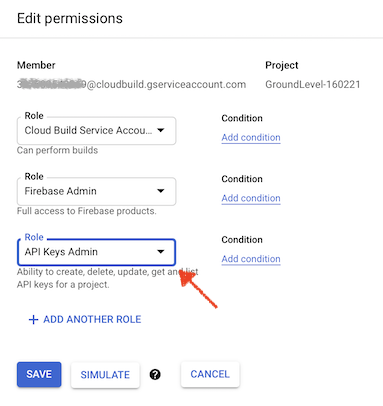

# Build

This folder contains the guidance for Cloud Build to automatically test and deploy subpackages, when the repo contents are being pushed to the server.

<!-- tbd. explain more -->

*Note: Commands in this document are intended to be executed in the `builds` folder.*

## Requirements

- `gcloud` Google Cloud Platform CLI

   Follow [Installing Google Cloud SDK](https://cloud.google.com/sdk/docs/install)
	
	```
	$ gcloud components install beta
	```

   ```
   $ gcloud --version
	Google Cloud SDK 332.0.0
	beta 2021.03.12
	...
   ```

	>Note: At least earlier, on macOS, it was best to run the `./google-cloud-sdk/install.sh` in the folder that would remain the install target. 
	>
	>The author has `gcloud` under `~/bin/google-cloud-sdk`.

	**Beta needed:** We need the `beta` features because `gcloud build submit ..` did not work (`gcloud` SDK 332.0.0), but `gcloud beta build submit ..` (beta 2021.03.12) seems to.

- `docker` (optional)

   We are using a custom build step. If you develop that further, you might want to have Docker installed.
   
### Set your `gcloud` project

Using the same project name as with `firebase use`:

```
$ gcloud config set project testing-230321
Updated property [core/project].
```

<!-- disabled (enable if we get problems; for the author Resource Manager APIs were both enabled; normal and "v2"
### Enable GCP APIs

GCP docs state:

>Enable the Cloud Build, Firebase, and Resource Manager APIs.

Check these by:

- GCP Console > Getting Started > `Enable and disable APIs` (you can get there also via the left side menu)
- `Enable APIs and Services` 

       

This really sucks; there are N APIs for Firebase. Forget it!
-->

### Build the builder 👷👷

Follow the instructions in [akauppi/firebase-custom-builder](https://github.com/akauppi/firebase-custom-builder) (GitHub).

The outcome is an image in *your* Container Registry that can be used for running our tests, under Cloud Build.

Check the image: 

- GCP console > `Container Registry` > `Images`

>

Note that the "hostname" should be something near you. If you got it wrong, just remove the image and rebuild with another domain.

>Note: Push the image also as `:latest`.

## Setting up Cloud Build


### 1. Enable GitHub App triggers

- In [GitHub Marketplace](https://github.com/marketplace), enable the "Google Cloud Build" application
- Add your GitHub repo to the Cloud Build app

### 2. Grant Firebase IAM roles to the Cloud Build service account

This allows Cloud Build to use the `firebase` CLI as your project's admin.

- Google Cloud console > `Cloud Build` > `Settings`
- Change `Firebase Admin` to `Enabled`

>


### 3. Add "API Keys Admin" role to the Cloud Build service account

>*Note: [Deploying to Firebase](https://cloud.google.com/build/docs/deploying-builds/deploy-firebase) mentions this but the community Firebase builder `README` doesn't. Things might work without it, too?*

- Google Cloud console > `IAM & Admin`
- Spot `@cloudbuild.gserviceaccount.com` account on the list > <font size="+1.5">`✎`</font> (edit)
- Add the `API Keys Admin` role:

>


<!-- tbd. SKIP - did not work; #fix one day?
## Building locally (optional)

There is a `cloud-build-local` tool that should be able to run builds on your computer, but the author did not get it to work. Let's skip it (it would be optional, anyhow).

>Note: The local builder can build on only Linux or macOS.<sub>[source](https://cloud.google.com/build/docs/build-debug-locally#restrictions_and_limitations)</sub>

We should now be able to run Cloud Builds locally on the repo.

```
$ gcloud components install cloud-build-local
```

```
$ cloud-build-local -dryrun=true ..
```

<details>
<summary>Dry run output</summary>

```
$ cloud-build-local ..
2021/03/24 10:33:55 RUNNER - [docker ps -a -q --filter name=step_[0-9]+|cloudbuild_|metadata]
2021/03/24 10:33:55 RUNNER - [docker network ls -q --filter name=cloudbuild]
2021/03/24 10:33:55 RUNNER - [docker volume ls -q --filter name=homevol|cloudbuild_]
2021/03/24 10:33:57 Build id = localbuild_b29c87e8-e15a-4e8c-85cc-e85256dc94e6
2021/03/24 10:33:57 RUNNER - [docker volume create --name homevol]
2021/03/24 10:33:57 status changed to "BUILD"
BUILD
2021/03/24 10:33:57 RUNNER - [docker inspect eu.gcr.io/groundlevel-160221/firebase-custom-builder]
: Already have image: eu.gcr.io/groundlevel-160221/firebase-custom-builder
2021/03/24 10:33:57 RUNNER - [docker run --rm --name step_0 --volume /var/run/docker.sock:/var/run/docker.sock --privileged --volume cloudbuild_vol_a42441e7-7d53-4971-afdd-9f75bbb59f5f:/workspace --workdir /workspace/packages/backend --volume homevol:/builder/home --env HOME=/builder/home --network cloudbuild --volume /tmp/step-0/:/builder/outputs --env BUILDER_OUTPUT=/builder/outputs --entrypoint bash eu.gcr.io/groundlevel-160221/firebase-custom-builder -c npm install
npm test
npm run deploy
]
2021/03/24 10:33:57 Step  finished
2021/03/24 10:33:57 RUNNER - [docker rm -f step_0]
2021/03/24 10:33:57 status changed to "DONE"
DONE
2021/03/24 10:33:57 RUNNER - [docker volume rm homevol]
2021/03/24 10:33:57 Warning: this was a dry run; add --dryrun=false if you want to run the build locally.
```
</details>

The dry run proves that the build configuration looks solid but does not execute the build steps.

### Real build

```
$ cloud-build-local -dryrun=false ..
```

<details>
<summary>Build output</summary>

```
$ cloud-build-local -config cloudbuild.yaml -dryrun=false ..
2021/03/25 12:59:02 Warning: there are left over step containers from a previous build, cleaning them.
2021/03/25 12:59:03 Warning: there are left over step volumes from a previous build, cleaning it.
2021/03/25 12:59:11 Warning: The server docker version installed (19.03.12) is different from the one used in GCB (19.03.8)
2021/03/25 12:59:11 Warning: The client docker version installed (19.03.12) is different from the one used in GCB (19.03.8)
2021/03/25 12:59:50 Error copying source to docker volume: exit status 1
```
</details>

>*<font color=red>BUG: As you can see, the build fails. Have not debugged it further. See [#37](https://github.com/akauppi/GroundLevel-firebase-es/issues/37) and `#help`? 😊.</font>*
-->

## Running Cloud Build manually

>As of 25-Mar-21, `gcloud builds submit ..` causes an error. Let's use the "beta" version, instead.

<!-- Editor's note:
tbd. Occasionally test whether the normal version starts to work. Then remove notions of beta.
-->

```
$ gcloud beta builds submit ..
```

<font color=orange>...tbd. continue...</font>


## Setting up Triggers

GCP Console > Cloud Build > Triggers > Create Trigger

<font color=orange>...tbd. details and a screenshot</font>


## References

- [Cloud Build](https://cloud.google.com/build/) (GCP)
- [Creating GitHub App triggers](https://cloud.google.com/build/docs/automating-builds/create-github-app-triggers) (Cloud Build docs)
- [Deploying to Firebase](https://cloud.google.com/build/docs/deploying-builds/deploy-firebase) (Cloud Build docs)
- [Building and debugging locally](https://cloud.google.com/build/docs/build-debug-locally) (Cloud Build docs)
- `gcloud builds submit --help`

