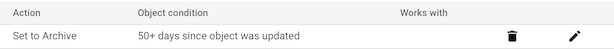

# Developer notes

## `.gcloudignore`

Cloud Build ignores the files in the *root*'s `.gitignore` automatically but:

- it does not check the global `.gitignore`
- it does not check `.gitignore`s in subdirectories

For these reasons, the repo has its own `.gcloudignore`, to keep the transports small.

## Use of Cloud Storage 

Cloud Build uses Cloud Storage (of the same project) to store files. During the development of the repo, the buckets looked like this:

>

The `*_cloudbuild` bucket has a `source/` folder with `.tgz` packages.

>Note: These `.tgz` files are not big (~120 kB) but they do add up. You may want to wipe the folder, or set a lifecycle that automatically wipes them, for it.

There is a lifecycle step defined that moves the contents to "archive" within 50 days of not being touched.

>

You can also define them to be outright removed in - say - 10..30 days.  All you will lose is old build logs (the author thinks). Decide for yourself.

- `ADD A RULE` > `Delete` > `Age` `30` days

## Viewing builds

See GCP Console > Cloud Build for your runs; logs and everything.

`https://console.cloud.google.com/cloud-build/builds?project=ci-builder`

>See: [Viewing build results](https://cloud.google.com/build/docs/view-build-results) (Cloud Build docs)

## References

- `gcloud topic gcloudignore`
- `gcloud builds submit --help`
