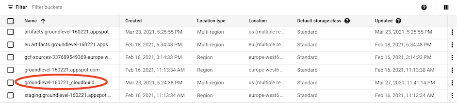

# Developer notes


## `.gcloudignore`

Cloud Build ignores the files in the *root*'s `.gitignore` automatically but:

- it does not check the global `.gitignore`
- it does not check `.gitignore`s in subdirectories

For these reasons, the repo has its own `.gcloudignore`, to keep the transports small.


## Use of Cloud Storage 

Cloud Build uses Cloud Storage (of the same project) to store files. During the development of the repo, the buckets looked like this:

>

The `*_cloudbuild` bucket has a `source/` folder with `.tgz` packages.

>Note: These `.tgz` files are not big (~120 kB) but they do add up. You may want to wipe the folder, or set a lifecycle for it.
>
>(Please suggest the steps for adding the lifecycle, eg. retain for 30 days only. `#help`)


## Troubleshoot locally

To launch a Docker container, similar to what `gcloud builds submit` does:

```
$ docker run -it --volume `pwd`/..:/workspace gcr.io/groundlevel-160221/firebase-ci-builder:9.16.0-node16-npm7 /bin/bash
bash-5.0#
```

You can now execute the build steps and debug, if something doesn't work right. Faster than changing `cloudbuild.yaml`.

>Note DIFFERENCES: Whereas Cloud Build copies files and **excludes** certain ones, here you see a mapping of the actual disk contents of your entire repo. If you remove something, it's removed in the host.


## Viewing builds

See -> [Viewing build results](https://cloud.google.com/build/docs/view-build-results) (Cloud Build docs)


## Build default timeout

Timeout for the builds seems to be 10min (600s), which is rather long. The author has taken a habit of providing an explicit timeout for each CI job, just in case.

<!-- whisper
seen in `gcloud builds describe <id>`
-->


## References

- `gcloud topic gcloudignore`
- `gcloud builds submit --help`
