# CI setup

>All commands are expected to be run in the `ci` folder.

## Aiming 🎯

Let's first set the target - what do we want the CI/CD pipeline to do for us?

### For a PR targeting `master`

|Files changed in...|then...|
|---|---|
|`packages/backend` (or `/package.json`)|test `packages/backend`|
|`packages/app` (or `/package.json`)|test and dummy build `packages/app`|

### For changes already merged to `master`

|Files changed in...|then...|
|---|---|
|`packages/backend` (or `/package.json`)|deploy `packages/backend`|
|`packages/app` (or `/package.json`)|build and deploy `packages/app`|

For passed tests, the test-level CI jobs write a token to the build project's Cloud Storage. The CD jobs can then check this, to know whether a certain code base has (at any earlier time) passed tests. This means deployment doesn't need to re-run tests, but has confidence that the code can be deployed.


>Note: The `/dc/` folder is not involved in CI. It's only used for development. CI gets the Firebase Emulators and CLI from a pre-built Docker image, to save time.


### Suggested GCP projects layout

The model recommended by the author is such:

<font size="-3"><pre style="line-height: 11px">
                                    ┌──────────────────────────┐               ┌──────────────────┐
                                    │                      (1) │               │                  │
                                    │   CI-builder project     │   PR changed  │  GitHub repo     │
                                    │                          │◄──────────────┤                  │
                                    │   - builder images       │               │                  │
                                    │   - PR CI tasks          │               │                  │
                                    │     "does it pass?"      │──────────────►│                  │
                                    │                          │   pass/fail   │                  │
                                    │    ┌────────────────┐    │               └────────┬─────────┘
                                    │    │ Cloud Storage  │    │                    ▲   │   ▲
                                    │    │ - pass token   │ - - - - - - - - - - - - ´   │   │
                                    │    └────────────────┘    │   tests passed         │   │
                                    └───────────────── │ ────┬─┘                        │   │
                                                       ▼     │                          │   │
         xxxxxx                     ┌─────────────────────┐  │ provide image            │   │
    x   x     xxxx         deploy   │                 (2) │◄─┘                          │   │
  xxxxxxx         xxxxxx  ┌─────────┤   Staging project   │  |         merge to master  │   │
 xx    xx         x     x ▼         │                     │◄────────────────────────────┘   │
x       x                xxx        │   - deploy CI task  │  |                              │
xx                         x        │                     ├─────────────────────────────────┘
 xx                     xxx         │                     │  |         pass/fail
  xxxxxxxxxxxxxxxxxxxxxxx           └─────────────────────┘  |
                          ▲                                  |
                          |         .---------------------.  |
                          |         |                (2b) |<-'
                          '---------|   N projects        |
                                    |                     |
                                    '---------------------'
</pre></font>
<!-- drawing with Asciiflow -->

<!-- Note: If doesn't show nicely on GitHub, take local screen capture and use it, instead.
-->

#### `CI-builder` project (1)

This is a separately created GCP project (has no counterpart in Firebase) that:

- carries the builder Docker image(s)
- runs any "does this pass the tests?" CI tests (they don't involve access to a Firebase cloud project)
- for passed tests, writes their git SHA in the Cloud Storage

#### Staging project (2)

These GCP projects are created automatically by creation of a *Firebase* project.

They are used (by Firebase) and we piggy-back on them to also help in CI/CD. They run deployments, if a certain branch changes.

#### N projects (2b)

One can have as many deployment targets as one wants, from the same code base. These each map to a separate Firebase project, and each have their own data stores, users, deployed versions and CI/CD setup.

You might e.g. have `staging` and `production` environments<sup>[1]</sup>, or multiple production environments, say one per customer.

<small>`[1]`: Even, whether you call them "stages", "deployments" or "environments" is up to you.</small>


#### Pros

1. **Keeps production keys safe**

   The "production keys" don't need to be shared - at all. The GCP projects **deploy onto themselves** and someone in the organization already has admin access to them.

2. **Deployment access via GitHub**

   Deployments are now guarded by the *version control* access controls, since anyone who can merge to `master` can also deploy (they become the same thing).

3. **Independent environments**

   There is no central list of deployment environments. You can remove one simply by deleting such a GCP project. This removes the Firebase resources but also the associated CD triggers, without affecting other environments.


#### Cons

1. **The layout doesn't provide means to handle inter-dependencies** between the front-end and the backend.

   Let's say you are deploying a feature where changes have been made both to the backend and the frontend. In order to work, the frontend needs the latest backend to be deployed.

   Merging these changes (even as a single commit!) gives no guarantee of the order of deployment. Both CD jobs will run individually, and will finish unaware of each other.
   
   >Cloud Build does not provide a mechanism for making such synchronizations. We'd need to build that ourselves, complicating the setup.

   The solution is to handle this manually. You can either use two separate merges, or (maybe preferred), deploy the backend manually, using the `first` folder's tools.

>*If you are aware of other cons, please leave a mention.*

#### The central `CI-builder` project

This project can be used not only across the target environments, but also across all *web app projects* that a single team, or company, is responsible for.

- It's good to find all (non-deploying) CI tasks in one place
- Access to it can be provided to all developers (to set up new test runs, or modify existing ones)

---

This layout seems light enough, yet flexible, to recommend. In the following text we expect you have it in place.


## Requirements

- `gcloud` CLI

   <details><summary><b>Installing `gcloud` on macOS</b></summary>
      
   1. Download the package from [official installation page](https://cloud.google.com/sdk/docs/install)
   2. Extract in the downloads folder, but then..
   3. Move `google-cloud-sdk` to a location where you'd like it to remain (e.g. `~/bin`).
   
      When you run the install script, the software is installed *in place*. You cannot move it around any more.
      
   4. From here, you can follow the official instructions:
   
      `./google-cloud-sdk/install.sh`
   
      `./google-cloud-sdk/bin/gcloud init`
   
   To update: `gcloud components update`
   </details>
   <details><summary><b>Installing `gcloud` on Windows 10 + WSL2</b></summary>

   ```
   $ apt-get install google-cloud-sdk
   ```
   
   >Note: This version may lack a bit behind, and doesn't have support for `gcloud components`, but should be enough.
   
   To update: `sudo apt-get upgrade google-cloud-sdk`
	</details>      

- Docker

<!-- tbd. remove "Docker" once/if we build the builder, in GCP
-->


### Create a "CI Builder" GCP project

Create a GCP project for the CI builder role, and make it the active project for `gcloud`. 

<!-- tbd. more details
- enabling Artifact Registry etc. (a link to the Wiki?)
-->

```
$ gcloud auth login
```

```
$ gcloud projects list
```

Pick the right one, then:

```
$ gcloud config set project <project-id>
```

>Hint: To see the current active project:
>
>```
>$ gcloud config get-value project
>```

<p />
>Note: If you are familiar with Firebase CLI projects (you won't touch them directly, with this repo), it's good to know one difference. Whereas `firebase use` projects are tied to a folder,  `gcloud` project setting is system-wide. You can change it in any terminal or folders; the affect is global.

### Deployment GCP project(s)

These are already created, by Firebase.


### Build and push the builder image

The CI scripts require your `gcloud` builder project to have the `firebase-emulators:11.3.0` image in the Artifact Registry. Let's build such an image, and push it there.

1. Log into your "CI builder" GCloud project (see steps above).
2. Build and push the image

   ```
   $ ./build
   ...
   Going to push us-central1-docker.pkg.dev/ci-builder/builders/firebase-emulators:11.3.0
   
   Continue (y/N)?
   ```

   If everything seems well, press `y` and you'll have the image stored in `us-central1` Artifact Registry.

><details style="margin-left: 2em"><summary>Why `us-central1`?</summary>
>
>It's good to have the image in the same region where your Cloud Build (CI) runs.
>
>Note that this has no connection to where you deploy your application backend to, nor implications to GDPR and other privacy aspects. The CI runs simply compile and test the sources from your GitHub repo. The CI jobs don't deal with your users, or their data, ever.
></details>

<p />

><details style="margin-left: 2em"><summary>**Costs involved (and how to have none)**</summary>
>
>Storing Docker images in Artifact Registry has a cost. The free tier provides 1GB of free storage (July 2022). The image is slightly less than 500MB, so you can have two versions without inducing billing.
>
>You may want to occasionally visit the [GCP Console](https://console.cloud.google.com/artifacts) and clear away earlier versions.
></details>


### Update the references to `ci-builder` GCP project

The `cloudbuild.merged.*.yaml` scripts are run under your *deployment* GCP project, not the builder. 

They reference the builder image as such:

```
substitutions:
  _1: us-central1-docker.pkg.dev/ci-builder/builders/firebase-emulators:11.2.1
```

Replace `ci-builder/builders` with the name of the builder project you created, and the folder you use.

>The `ci-builder` project belongs to the author and doesn't provide public pull access. We need to eventually do something about this (it is not the intention that you need to edit *anything* in the repo, to customize it).


Next, let's introduce GitHub and Cloud Build to each other.


## GCP setup

You need to enable quite a few things within the GCP, to have things rolling. 

>Note: These changes *can* be done from command line as well (using `gcloud`) if you need to do them repeatedly.

Some steps are needed for the build project ("CI builder", above), some for the deployment projects ("staging project", above), some for both.


### Enable Artifact Registry (build project only)

- [GCP Console](https://console.cloud.google.com/home/dashboard) > `≡` > `Artifact Registry`

  >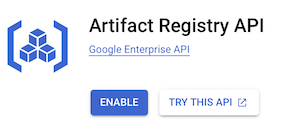

  - Press `Enable`
  - Enable billing
  - `+ CREATE REPOSITORY`

      ><details><summary>Screenshot</summary>
      >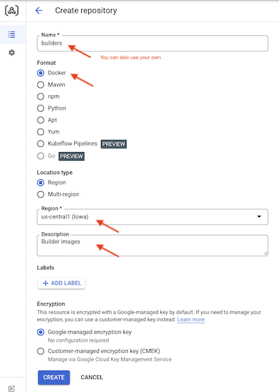
      ></details>

      |||
      |---|---|
      |Name|`builders`<sup>[1]</sup>|
      |Format|`Docker`|
      |Location type|`Region`|
      |Region|`us-central1`|
      |Description|free text|

Push `CREATE`. Now, Docker images used by the CI/CD can be stored in this central location.

<!-- the address is
- `us-central1-docker.pkg.dev/{ project id }/builders/{docker image and tag}`
-->

>Note: You can name the `builders` folder differently, but then need to change the name where referenced.


<!-- tbd. UNDONE:  
### Enable write access to Cloud Storage (build project only)

- GCP Console > `IAM & Admin`
-->

### Enable Cloud Build API (both build and deployment projects)

- [GCP Console](https://console.cloud.google.com/home/dashboard) > `≡` > `APIs & Services`
  - `+ Enable APIs and Services`

     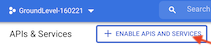

      - `Cloud Build` > `Enable`

### Enable IAM API (deployment project)

- [GCP Console](https://console.cloud.google.com/home/dashboard) > `≡` > `APIs & Services`
  - `+ Enable APIs and Services`

      - `Identity and Access Management (IAM) API` > `Enable`

  >While here, also check that the following are enabled:
  >
  >- Firebase Management API
  >- Firebase Hosting API
  >- Cloud Resource Manager API

  <!-- hidden note:
The above need to be enabled, by GCP docs, but since our deployment project already is a Firebase project, they are likely already enabled.
-->

### Deployment project

In addition to the above, do these:

<details><summary>Grant roles to the Cloud Build service account</summary>

- Google Cloud console > `Cloud Build` > `Settings`
  - Change `Firebase Admin` to `Enabled`
  - Change `Service Account User` to `Enabled`

   >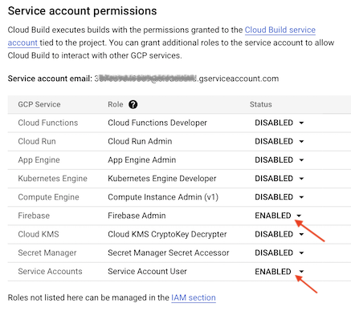

>Hint: Pick up the `Service account email`. You'll need it, shortly.
</details>

<!-- tbd. needed, in 2022?? -->
<details><summary>Add "API Keys Admin" role to the Cloud Build service account</summary>

>*Note: [Deploying to Firebase](https://cloud.google.com/build/docs/deploying-builds/deploy-firebase) mentions this but the community Firebase builder `README` doesn't. Things might work without it, too?*

- Google Cloud console > `IAM & Admin`
- Spot `@cloudbuild.gserviceaccount.com` account on the list > <font size="+1.5">`✎`</font> (edit)
- Add the `API Keys Admin` role:

>
</details>

<details><summary>Enable access to CI Builder's Artifact Registry</summary>

Each deployment project needs to be able to read the builder image. This means granting them the `roles/artifactregistry.reader` IAM role.

- For the deployment project, pick up their "service account email":

   - Google Cloud Console > (*deployment project*) > Cloud Build > `Settings`
     - pick up the **Service account email**, like `123...987@cloudbuild.gserviceaccount.com`

- GCP Console > (*builder project*) > IAM & Admin

   - `+👤 ADD`

   >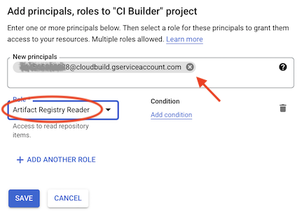

   - 
   Push `SAVE`.

Your deployment project Cloud Build runs should now be able to pull the builder images.
</details>

<details><summary>Enable access to CI Builder's Cloud Storage</summary>

We also grant `storage.objects.list` role so that the deployment project can see, whether tests have successfully passed for a given commit.

- GCP Console > (*builder project*) > IAM & Admin

   - Pick the principal created for the deployment service account (it has `Artifact Registry Reader` access

   - Edit > `+ ADD ANOTHER ROLE` > `Storage Object Viewer`

   >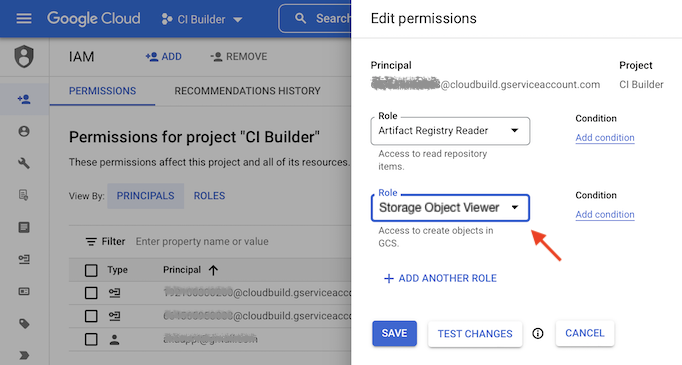
   
   Push `SAVE`.

Your deployment scripts will not be able to see whether tests have passed for a given git SHA.
</details>


<details><summary>Allow access to secrets</summary>

Within GCP, the Cloud Build service account doesn't by default have access to read the same project's secrets.

>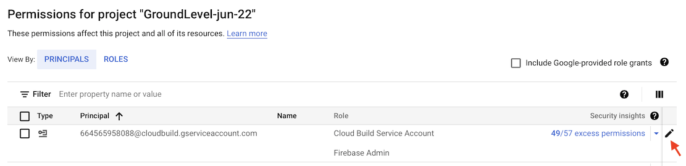

<p />

>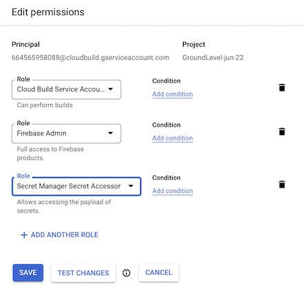
</details>


## Enable GitHub / Cloud Build integration

To bridge GitHub with Cloud Build, let's enable the "Cloud Build Github app". This is an integration that Google has prepared that lets Cloud Build get triggered when something (push or merge) happens in the GitHub repo.

- GitHub Marketplace > Apps > [Google Cloud Build](https://github.com/marketplace/google-cloud-build) > `Enable`
- Add your GitHub repo to the Cloud Build app (covers all GCP projects where Cloud Build is enabled)


>Note: The UI uses the term "purchase", but installing the application is completely free (Jun 2021). The costs - if any - are based on your agreements with GitHub and Cloud Build.


## Create the triggers

Finally, we can create the triggers we want to run in CI.

GCP Console > (project) > `Cloud Build` > `Triggers` > `+ Create Trigger`

>Note: These settings are *not* in the version control. The workflow relies on you to have set them up, appropriately. The suggested initial settings are below, to get you started.

### Run tests

For the GCP project responsible of running tests.

||`master-pr-backend`|
|---|---|
|Description|PR that affects `packages/backend`|
|Event|(●) Pull Request (GitHub App only)|
|**Source**|
|Repository|*pick (\*)*|
|Base branch|`^master$`|
|Comment control|(●) Required except for owners and collaborators|
|Included files filter (glob)|`packages/backend/**`, `package.json`|
|Ignored files filter (glob)|`*.md`, `.images/*`|
|**Configuration**|
|Type|(●) Cloud Build configuration file (yaml or json)|
|Location|(●) Repository: `ci/cloudbuild.backend.yaml`|

It makes sense to keep the name of the CI entry and the respective `yaml` file the same (but the name cannot have a `.`).

<p />

>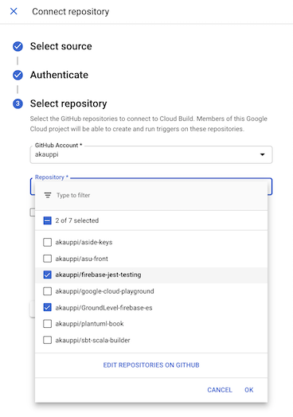
>
>*(\*): The `Connect New Repository` uses a popup to connect GitHub Cloud Build Application and the Cloud Build project, to access a certain repo. THIS DOES NOT WORK ON SAFARI (unless popups are enabled). Follow setup below or use eg. Chrome for connecting a repo.*
>
><details><summary>Allow popups on Safari for `console.cloud.google.com`</summary>
>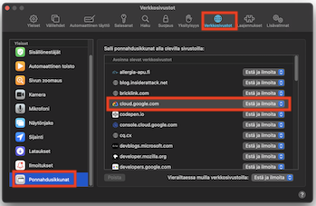
><ul>
>  <li>`Preferences` > `Websites` > `Pop-up Windows` (lowest in left pane)</li>
>  <li>`console.cloud.google.com`: `Allow`</li>
></ul> 
></details>

Screenshot of the actual dialog:

>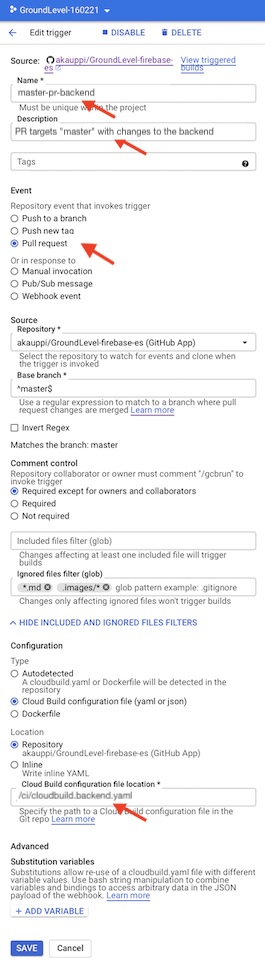

||`master-pr-app`|
|---|---|
|Description|PR that affects `packages/app`|
|Event|(●) Pull Request|
|**Source**|
|Repository|*pick*|
|Base branch|`^master$`|
|Comment control|(●) Required except for owners and collaborators|
|Included files filter (glob)|`packages/app/**`, `package.json`|
|Ignored files filter (glob)|`*.md`, `.images/*`|
|**Configuration**|
|Type|(●) Cloud Build configuration file (yaml or json)|
|Location|(●) Repository: `ci/cloudbuild.app.yaml`|

>Hint: The easiest way to do the secondary triggers is `⋮` > `Duplicate`.

<p />

These two CI steps now allow seeing the 🟢🟠🔴 status of pull requests that target `master`.

**Test it!**

Make a Pull Request in GitHub.

You should see these (under `Checks`):

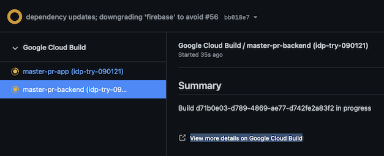


### Deploy

Create these triggers in the deployment project.

||**`backend-deploy`**|
|---|---|
|Description|Merge to `master` (affects backend)|
|Event|(●) Push to a branch|
|**Source**|
|Repository|*pick*|
|Base branch|`^master$`|
|Included files filter (glob)|`packages/backend/**`, `package.json`|
|Ignored files filter (glob)|`*.md`, `.images/*`|
|**Configuration**|
|Type|(●) Cloud Build configuration file (yaml or json)|
|Location|(●) Repository: `ci/cloudbuild.backend.merged.yaml`|

This takes care of deploying the backend.

For the front-end, create a similar trigger (you can use `duplicate` in the triggers list as a start):

||**`app-deploy`**|
|---|---|
|Description|Merge to `master` (affects app)|
|Event|(●) Push to a branch|
|**Source**|
|Repository|*pick*|
|Base branch|`^master$`|
|Included files filter (glob)|`packages/app/**`, `package.json`|
|Ignored files filter (glob)|`*.md`, `.images/*`|
|**Configuration**|
|Type|(●) Cloud Build configuration file (yaml or json)|
|Location|(●) Repository: `ci/cloudbuild.app.merged.yaml`|

With these two jobs in place, your deployments will track the contents of the `master` branch.

To make multiple deployments, just dedicate a certain branch to each, create a Firebase project for it and add these steps.

<!-- hidden
>**Note**: What if...
>
>my front-end and back-end deployments need to be aligned?
>
>The author is thinking of adding a version number to the back-end that the front-end deployment script can detect, and refuse to deploy if the version is not what is requested. If your front-end deployment fails for this reason, just manually restart it. *This is not implemented, yet.*
-->


## Development

<!-- hidden (why mention?)
### `cloud-build-local` (does not work!)

There is a `cloud-build-local` tool [documented](https://cloud.google.com/build/docs/build-debug-locally) by Google, but it's practically abandoned.

- It does not work<sup>[1]</sup>
- The last commit is from Nov 2020 ([repo](https://github.com/GoogleCloudPlatform/cloud-build-local)) and has this to say:

   >The Cloud Build local builder is maintained at best effort [...]

You can use it to check for syntactical compliance of the CI scripts, but that's pretty much it. Let the author know, if you get further.

As it currently (July 2022) is, Google would do well in removing the documentation and abandoning the tool. It's only confusing us developers to have not-really-maintained toolchains floating around. 🍁🍁🍁

<small>`[1]`: see comments</small>

<_!--
Run in Jul 2022:

<font size="-50"><pre>
$ cloud-build-local  --config=cloudbuild.backend.yaml --dryrun=false ..
2022/07/14 17:49:08 Warning: The server docker version installed (20.10.17) is different from the one used in GCB (19.03.8)
2022/07/14 17:49:08 Warning: The client docker version installed (20.10.17) is different from the one used in GCB (19.03.8)
Using default tag: latest
latest: Pulling from cloud-builders/metadata
2408cc74d12b: Already exists 
47e72f29f511: Pull complete 
Digest: sha256:438be5127b7cee5aa23786ff015ca9a4a11381f8584410f994d6db2bca6395df
Status: Downloaded newer image for gcr.io/cloud-builders/metadata:latest
gcr.io/cloud-builders/metadata:latest
2022/07/14 17:49:59 Started spoofed metadata server
2022/07/14 17:49:59 Build id = localbuild_01d45e53-bdf5-4fcd-a235-53e05c53d73a
2022/07/14 17:50:00 status changed to "BUILD"
BUILD
Starting Step #0
Step #0: Already have image (with digest): node:16-alpine
Step #0: docker: Error response from daemon: error while creating mount source path '/host_mnt/private/tmp/step-0': mkdir /host_mnt/private/tmp/step-0: permission denied.
Finished Step #0
2022/07/14 17:50:01 Step Step #0 finished
2022/07/14 17:50:01 status changed to "ERROR"
ERROR
ERROR: build step 0 "node:16-alpine" failed: exit status 126
2022/07/14 17:50:02 Failed to delete homevol: exit status 1
2022/07/14 17:50:02 ERROR: failed to update docker credentials: context canceled
2022/07/14 17:50:02 Error updating docker credentials: context canceled
2022/07/14 17:50:02 RUNNER failed to kill running process `/usr/local/bin/docker [docker run --name cloudbuild_update_docker_token_15b9e889-<..>-8cc903af3c40 --rm --volume homevol:/builder/home --env HOME=/builder/home --volume /var/run/docker.sock:/var/run/docker.sock --entrypoint bash gcr.io/cloud-builders/docker -c sed -i 's/b2F1dGgy...TFadzAxNzQ=/g' ~/.docker/config.json]`: os: process already finished
2022/07/14 17:50:04 Build finished with ERROR status
</pre></font>
--_>
-->

### Run CI jobs manually (`gcloud builds submit`)

The below commands pack your sources, send them to Cloud Build and let you see the build logs, in real time.

```
$ gcloud builds submit --config=cloudbuild.{app|backend}.yaml ..
```

```
$ gcloud builds submit --config=cloudbuild.{app|backend}.merged.yaml ..
```

When using these, make sure you are logged into the correct GCP project.

The author finds the `gcloud builds` workflow great for developing one's CI scripts, since you don't need to commit the changes to version control! 🙂


### See what is being sent out

It makes sense to optimize the "tarball" going out. Not shipping unnecessary files speeds up your debug cycles, and also saves storage space (Cloud Build keeps these around).

>Unfortunately Cloud Build is not quite capable of using `.gitignore` files in various subdirectories. This is why we've prepared a `../.gcloudignore` that tries to duplicate the logic in those files. `#hack`

```
$ gcloud meta list-files-for-upload ..
```

This set of files is controlled by `.gcloudignore` in the project root.


<!-- #later; not a big thing (see DEVS.md)
## Maintenance: clean up the tarballs

*tbd. Where are they; what do we need to do?*

`#contribute` by suggesting text, maybe?? ;M
-->

## References

- [Cloud Build](https://cloud.google.com/build/) (GCP)
   - [Creating GitHub App triggers](https://cloud.google.com/build/docs/automating-builds/create-github-app-triggers) (Cloud Build docs)
   - [Deploying to Firebase](https://cloud.google.com/build/docs/deploying-builds/deploy-firebase) (Cloud Build docs)
   - [Building and debugging locally](https://cloud.google.com/build/docs/build-debug-locally) (Cloud Build docs)
   - [Configuring access control](https://cloud.google.com/artifact-registry/docs/access-control) (Artifact Registry docs)

- `gcloud builds submit --help`
