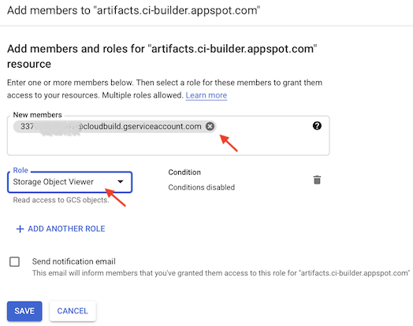

# CI setup

All command line commands are expected to be run in the `ci` folder.

## Aiming 🎯

Let's first set the target - what do we want the CI/CD pipeline to do for us?

### For a PR targeting `master`

|Files changed in...|then...|
|---|---|
|`packages/backend` (or `/package.json`)|test `packages/backend`|
|`packages/app` (or `/package.json`)|test `packages/app`|

<!-- tbd.
Testing with Cypress still WIP.
-->

### For changes already merged to `master`

|Files changed in...|then...|
|---|---|
|`packages/backend` (or `/package.json`)|test and deploy `packages/backend`|
|`packages/app` (or `/package.json`)|test and build `packages/app`<br />build and deploy `packages/app`|

**With Cloud Build integrated with GitHub, one *cannot restrict* merges to `master` - only be informed after the fact. We can live with this, but needs some discipline.**

<!-- author's note:

We'd like to:
- restrict merges to `master` altogether, if they would break the tests
- have two people approve PRs
  - [ ] check what options GitHub itself provides
-->

### Suggested GCP projects layout

The model recommended by the author is such:

```
                                    ┌──────────────────────────┐               ┌──────────────────┐
                                    │                      (1) │               │                  │
                                    │   CI/CD project          │   PR changed  │  GitHub repo     │
                                    │                          │◄──────────────┤                  │
                                    │   - builder images       │               │                  │
                                    │   - PR CI tasks          │               │                  │
                                    │     "does it pass?"      │──────────────►│                  │
                                    │                          │   pass/fail   │                  │
                                    └────────────────────────┬─┘               └────────┬─────────┘
                                                             │                          │   ▲
         xxxxxx                     ┌─────────────────────┐  │ provide image            │   │
    x   x     xxxx         deploy   │                 (2) │◄─┘                          │   │
  xxxxxxx         xxxxxx  ┌─────────┤   Staging project   │  |         merge to master  │   │
 xx    xx         x     x ▼         │                     │◄────────────────────────────┘   │
x       x                xxx        │   - deploy CI task  │  |                              │
xx                         x        │                     ├─────────────────────────────────┘
 xx                     xxx         │                     │  |         pass/fail
  xxxxxxxxxxxxxxxxxxxxxxx           └─────────────────────┘  |
                          ▲                                  |
                          |         .---------------------.  |
                          |         |                     |<-'
                          '---------|   2nd staging proj  |
                                    |                     |
                                    '---------------------'
```
<!-- drawing with Asciiflow -->

#### CI/CD project (1)

This is a separately created GCP project (has no counterpart in Firebase) that:

- carries the builder Docker image(s)
- runs any "does this pass the tests?" CI tests (that don't involve deployment)

#### Staging project(s) (2)

These GCP projects are created automatically by creation of a *Firebase* project.

They are used (by Firebase) for the deployments themselves, and we piggy-back them to also help in CI/CD. They:

- run deployments, if a certain branch changes

#### Benefits

The main benefit this layout provides is that "production keys" don't need to be shared - at all. The GCP projects **deploy onto themselves** (the arrows in the picture kind of lie..) and someone in the organization already has admin access to them.

Deployment rights are moved from *production* to *version control* access control, since now anyone who can merge to `master` can also deploy (they become the same thing).

The raison d’être of the dedicated CI/CD project is that it centrifies things. 

- It's good to find all (non-deploying) CI/CD tasks in one place
- Access to it can be provided to all developers (to set up new test runs, or modify existing ones)

This layout seems light enough, yet flexible, to recommend. In the following text we expect you have it in place.


## Requirements

- `gcloud` CLI

   <details><summary><b>Installing `gcloud` on macOS</b></summary>
      
   1. Download the package from [official installation page](https://cloud.google.com/sdk/docs/install)
   2. Extract in the downloads folder, but then..
   3. Move `google-cloud-sdk` to a location where you'd like it to remain (e.g. `~/bin`).
   
      When you run the install script, the software is installed *in place*. You cannot move it around any more.
      
   4. From here, you can follow the official instructions:
   
      `./google-cloud-sdk/install.sh`
   
      `./google-cloud-sdk/bin/gcloud init`
   
   To update: `gcloud components update`
   </details>
   <details><summary><b>Installing `gcloud` on Windows 10 + WSL2</b></summary>

   ```
   $ apt-get install google-cloud-sdk
   ```
   
   >Note: This version may lack a bit behind, and doesn't have support for `gcloud components`, but should be enough.
   
   To update: `sudo apt-get upgrade google-cloud-sdk`
	</details>      

- Docker


### Create a "CI Builder" GCP project

Create a GCP project for the CI builder role, and make it the active project for `gcloud`. 

<!-- tbd. more details
- enabling Artifact Registry etc. (a link to the Wiki?)
-->

```
$ gcloud auth login
```

```
$ gcloud projects list
```

Pick the right one, then:

```
$ gcloud config set project <project-id>
```

>Query the current active project by:
>
>```
>$ gcloud config get-value project
>```

<p />
>Note: Unlike the Firebase CLI projects (which you may be familiar with from earlier life), `gcloud` project is system-wide. You can change terminals and folders; the same project is selected.

>**Clean up (security advice)**
>
>You don't need `gcloud` after this stage, any more. It's healthy to log out of it.
>
>```
>$ gcloud revoke <your-email>
>```
>
>Now, any future access will need to go through the authentication you just did.

### Deployment GCP project(s)

These are already created, by Firebase.


### Build and push the builder image

The CI scripts require your `gcloud` builder project to have the `firebase-emulators:11.2.1` image in the Artifact Registry. We'll build such an image, and push it there.

1. Log into your "CI builder" GCloud project (see steps above).
2. Build and push the image

   ```
   $ ./build
   ...
   Going to push us-central1-docker.pkg.dev/ci-builder/builders/firebase-emulators:11.2.1
   
   Continue (y/N)?
   ```

   If everything seems well, press `y` and you'll have the image stored in `us-central1` Artifact Registry.

<details style="margin-left: 2em"><summary>Why `us-central1`?</summary>

It's good to have the image in the same region where your Cloud Build (CI) runs.

Note that this has no implications to GDPR and other privacy aspects: the CI runs simply compile the sources from your GitHub repo, and deploy the products. The CI jobs don't deal with your users, or their data, ever.
</details>

>**Costs involved (and how to have none)**
>
>Storing Docker images in Artifact Registry has a cost. The free tier provides 1GB of free storage (July 2022). The image is slightly less than 500MB, so you can have two versions without inducing billing.
>
>You may want to occasionally visit the [GCP Console](https://console.cloud.google.com/artifacts) and clear away earlier versions.


### Update the references to `ci-builder` GCP project

The `cloudbuild.merged.*.yaml` scripts are run under your *deployment* GCP project, not the builder. 

They reference the builder image as such:

```
substitutions:
  _1: us-central1-docker.pkg.dev/ci-builder/builders/firebase-emulators:11.2.1
```

Replace `ci-builder` with the name of the builder project you created.

<!-- tbd. Eventually, we'll need to come up with a solution that doesn't require edits to the template. (Public pull rights, or build using Kaniko???)
-->

>The `ci-builder` project belongs to the author and doesn't provide public pull access. We need to eventually do something about this (it is not the intention that you need to edit *anything* in the repo, to customize it). Using Kaniko image caching would be a likely solution (but needs testing)...


Next, let's introduce GitHub and Cloud Build to each other.


## Cloud Build setup

### Enable APIs

- [GCP Console](https://console.cloud.google.com/home/dashboard) > `≡` > `APIs & Services`
- `+ Enable APIs and Services`

   

- `Cloud Build` > `Enable`

*Without this, you run into problems. Google's instructions did not mention this step, for some reason. (May 2021)*

Also check that the following are enabled:

  - Firebase Management API
  - Firebase Hosting API
  - Cloud Resource Manager API

<!-- from: https://cloud.google.com/build/docs/deploying-builds/deploy-firebase#before_you_begin
-->

### Steps for the deploying project

*Not ready with this, yet. Coming `#later`*

<!-- NOT HERE YET!!!  tbd.

For the GCP project that handles deployment (the one matching a Firebase project's name), in addition to the above, do these steps:

<details><summary>Grant Firebase IAM roles to the Cloud Build service account</summary>

- Google Cloud console > `Cloud Build` > `Settings`
- Change `Firebase Admin` to `Enabled`

>

<!_-- YEEAAH... 
There was one more role needed, not covered in the normal documentation. Deploying Cloud Functions needs this.

- Get the number from the "Service account email" (above screenshot).
- Using the Firebase project id:

   ```
   $ MEMBER=serviceAccount:337......369@cloudbuild.gserviceaccount.com
   $ PROJECT_ID=...
   $ gcloud iam service-accounts add-iam-policy-binding $PROJECT_ID@appspot.gserviceaccount.com --member=$MEMBER --role=roles/iam.serviceAccountUser
   Updated IAM policy for serviceAccount [...]
   ...
   ```

>tbd. If re-enabling this section, give the instructions using Cloud Shell (not needing to log into staging/production accounts ever, from one's development machine..) #help

```
$ gcloud auth logout
```

>Note: Would changing the `Service Account User` in the screenshot have done the same? Likely. (tbd. test) 

<!_-- whisper
Interestingly, the GUI does not change the state of `Service Account User` to `ENABLED` - maybe it contains more roles than the one we changed at the command line?
--_>
</details>

<details><summary>Add "API Keys Admin" role to the Cloud Build service account</summary>

>*Note: [Deploying to Firebase](https://cloud.google.com/build/docs/deploying-builds/deploy-firebase) mentions this but the community Firebase builder `README` doesn't. Things might work without it, too?*

- Google Cloud console > `IAM & Admin`
- Spot `@cloudbuild.gserviceaccount.com` account on the list > <font size="+1.5">`✎`</font> (edit)
- Add the `API Keys Admin` role:

>
</details>

<details><summary>Enable access to CI Builder Container Registry</summary>

1. You'll need the Cloud Build service account (and email adress) of the *deploying project*.

   - Google Cloud console > project *deploying* > Cloud Build > `Settings`
   - pick up the **Service account email:** `337...369@cloudbuild.gserviceaccount.com` value

From the [official guide](https://cloud.google.com/container-registry/docs/access-control#granting_users_and_other_projects_access_to_a_registry) (Container Registry docs):

> You control access to Container Registry hosts with Cloud Storage permissions.

We need to grant the `Storage Object Viewer` role to the needing service account.

&nbsp;2. 

   - (change to `ci-builder` project) > Cloud Storage > `artifacts.ci-builder.appspot.com`
   - `Permissions` > `+👤 Add` > *provide the service account*
      - Role: `Cloud Storage` > `Storage Object Viewer`

   >

Your deployment project Cloud Build runs should now be able to pull the builder images.
</details>
-->

## Enable GitHub / Cloud Build integration

- GitHub Marketplace > Apps > [Google Cloud Build](https://github.com/marketplace/google-cloud-build) > `Enable`
- Add your GitHub repo to the Cloud Build app (covers all GCP projects where Cloud Build is enabled)

You need this, in order to create Cloud Build triggers on GitHub PRs.

>Note: The UI uses the term "purchase", but installing the application is completely free (Jun 2021). The costs - if any - are based on your agreements with GitHub and Cloud Build.


## Create the triggers

Finally, we can create the triggers we want to run in CI.

GCP Console > (project) > `Cloud Build` > `Triggers` > `+ Create Trigger`

>Note: These settings are *not* in the version control. The workflow relies on you to have set them up, appropriately. The suggested initial settings are below, to get you started.

### Run tests

For the GCP project responsible of running tests.

||`master-pr-backend`|
|---|---|
|Description|PR targets "master" with changes on the backend|
|Event|(●) Pull Request (GitHub App only)|
|**Source**|
|Repository|*pick (\*)*|
|Base branch|`^master$`|
|Comment control|(●) Required except for owners and collaborators|
|Included files filter (glob)|`packages/backend/**`, `package.json`|
|Ignored files filter (glob)|`*.md`, `.images/*`|
|**Configuration**|
|Type|(●) Cloud Build configuration file (yaml or json)|
|Location|(●) Repository: `ci/cloudbuild.backend.yaml`|

It makes sense to keep the name of the CI entry and the respective `yaml` file the same (but the name cannot have a `.`).

<p />

>
>
>*(\*): The `Connect New Repository` uses a popup to connect GitHub Cloud Build Application and the Cloud Build project, to access a certain repo. THIS DOES NOT WORK ON SAFARI (unless popups are enabled). Follow setup below or use eg. Chrome for connecting a repo.*
>
><details><summary>Allow popups on Safari for `cloud.google.com`</summary>
>
><ul>
>  <li>`Preferences` > `Websites` > `Pop-up Windows` (lowest in left pane)</li>
>  <li>`cloud.google.com`: `Allow`</li>
></ul> 
></details>

Screenshot of the actual dialog (UI things may change):

>

||`master-pr-app`|
|---|---|
|Description|PR that affects `packages/app`|
|Event|(●) Pull Request (GitHub App only)|
|**Source**|
|Repository|*pick*|
|Base branch|`^master$`|
|Comment control|(●) Required except for owners and collaborators|
|Included files filter (glob)|`packages/app/**`, `package.json`|
|Ignored files filter (glob)|`*.md`, `.images/*`|
|**Configuration**|
|Type|(●) Cloud Build configuration file (yaml or json)|
|Location|(●) Repository: `ci/cloudbuild.app.yaml`|

>Hint: The easiest way to do the secondary triggers is `⋮` > `Duplicate`.

<p />

>Note: We consciously have omitted changes to (only) `package.json` (in the root) and `tools/**` from running app tests. These *may* affect that such tests would break but it's relatively unlikely. **Tests do not need to be perfect**; it's enough that they are useful.

These two CI steps now allow seeing the 🟢🟠🔴 status of pull requests that target `master`.

**Test it!**

Make a Pull Request in GitHub.

You should see these (under `Checks`):


<!-- tbd. #later??
### Deploy

You may have 1..n deployment projects (eg. production and staging). Each such would listen to a different branch of the GitHub repo.

Create these triggers in the project that gets deployed, itself. This way, you don't need to spread deployment rights.

||**`merged-backend`**|
|---|---|
|Description|Merge to `master` (affects backend)|
|Event|(●) Push to a branch|
|**Source**|
|Base branch|`^master$`|
|Included files filter (glob)|`backend/**`, `*.*`, `tools/**`|
|Ignored files filter (glob)|`*.md`, `.images/*`|
|**Configuration**|
|Type|(●) Cloud Build configuration file (yaml or json)|
|Location|(●) Repository: `ci/cloudbuild.merged.backend.yaml`|

This takes care of deploying the backend.

For the front-end, create a similar trigger (you can use `duplicate` in the triggers list as a start):

||**`merged-app`**|
|---|---|
|Description|Merge to `master` (affects app)|
|Event|(●) Push to a branch|
|**Source**|
|Base branch|`^master$`|
|Included files filter (glob)|`app/**`, `app-deploy-ops/**`, `*.*`, `tools/**`|
|Ignored files filter (glob)|`*.md`, `.images/*`|
|**Configuration**|
|Type|(●) Cloud Build configuration file (yaml or json)|
|Location|(●) Repository: `ci/cloudbuild.merged.app.yaml`|

With these two jobs in place, your deployments will track the contents of the `master` branch.

To make multiple deployments, just dedicate a certain branch to the deployment, create a Firebase project for it and add these steps.

>**Note**: What if...
>
>my front-end and back-end deployments need to be aligned?
>
>The author is thinking of adding a version number to the back-end that the front-end deployment script can detect, and refuse to deploy if the version is not what is requested. If your front-end deployment fails for this reason, just manually restart it. *This is not implemented, yet.*

<_!-- hidden; `cloud-build-local` doesn't get love
## Run CI jobs manually (`cloud-build-local`; doesn't work)

You are supposed to be able to use `cloud-build-local` to package files, and run locally like Cloud Build, but it does not seem to work.

```
$ cloud-build-local  --config=cloudbuild.backend.yaml --dryrun=false ..
2021/06/06 20:01:31 Warning: The server docker version installed (20.10.6) is different from the one used in GCB (19.03.8)
2021/06/06 20:01:31 Warning: The client docker version installed (20.10.6) is different from the one used in GCB (19.03.8)
2021/06/06 20:02:34 Error copying source to docker volume: exit status 1
```

`cloud-build-local` seems to be pretty abandoned by Google, so the author looked further... 

>`#help`: Anyone know how to fix this?
--_>
-->

## Run CI jobs manually (`gcloud builds submit`)

The below commands pack your sources, send them to Cloud Build and let you see the build logs, in real time.

```
$ gcloud builds submit --config=cloudbuild.{app|backend}.yaml ..
```

```
$ gcloud builds submit --config=cloudbuild.{app|backend}.merged.yaml ..
```

When using these, make sure you are logged into the correct GCloud project.

The author finds the `gcloud builds` workflow great for developing one's CI scripts, since you don't need to commit the changes to version control! 🙂


### See what is going out

It makes sense to optimize the "tarball" going out. Not shipping unnecessary files speeds your debug cycles, and also saves storage space (Cloud Build keeps these around). 

```
$ gcloud meta list-files-for-upload ..
```

This set of files is controlled by `.gcloudignore` in the project root.


<!-- #later; not a big thing (see DEVS.md)
## Maintenance: clean up the tarballs

*tbd. Where are they; what do we need to do?*

`#contribute` by suggesting text, maybe?? ;M
-->

## References

- [Cloud Build](https://cloud.google.com/build/) (GCP)
- [Creating GitHub App triggers](https://cloud.google.com/build/docs/automating-builds/create-github-app-triggers) (Cloud Build docs)
- [Deploying to Firebase](https://cloud.google.com/build/docs/deploying-builds/deploy-firebase) (Cloud Build docs)
- [Building and debugging locally](https://cloud.google.com/build/docs/build-debug-locally) (Cloud Build docs)
- `gcloud builds submit --help`
