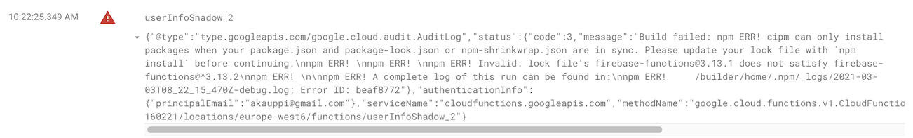

# Troubles hooting


## Cannot find `package.json` of the root

```
Step #0: npm ERR! code ENOENT
Step #0: npm ERR! syscall open
Step #0: npm ERR! path /workspace/package.json
Step #0: npm ERR! errno -2
Step #0: npm ERR! enoent ENOENT: no such file or directory, open '/workspace/package.json'
Step #0: npm ERR! enoent This is related to npm not being able to find a file.
Step #0: npm ERR! enoent 
```

Did you miss the `..` at the end of:

```
$ gcloud builds submit --config=cloudbuild.app.yaml ..
```

## Deploying manually gives `[secretmanager.googleapis.com] not enabled`

```
API [secretmanager.googleapis.com] not enabled on project 
...
```

- Maybe you are trying to deploy using the `ci-builder` GCP project (that doesn't have secrets enabled)?

   - Change project by `gcloud config set project ...`

- ..or you haven't configured secrets for the deployment project.

   - See [Working with GCP secrets](Working with GCP Secrets.md) for guidance.


## Debugging Cloud Function deployment failures

If a deploy fails, and the local CLI does not give proper details, try:

Firebase Console > project > `Functions` > `Logs`

>

This was enough detail to fix it.
