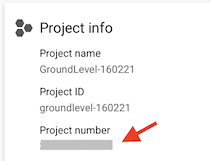
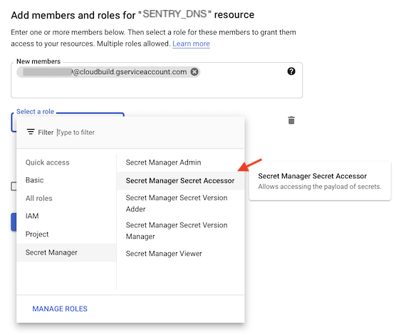

# Working with GCP Secrets

*Based on: [Using secrets from Secret Manager](https://cloud.google.com/build/docs/securing-builds/use-secrets) (Cloud Build docs)*

The Raygun API KEY we use as an example is not quite a secret, since we need to embed it in the client web app. However, it allows us to show how Cloud Build treats secrets.

## Requirements

The *project number* of the GCP project running the Cloud Build.

- GCP Console > (deployment project) > Home

   
   

## Secrets Manager

1. GCP Console > (deployment project) > `Security` > `Secret Manager`

	- `Enable` > `Create Secret`:

   >

2. `Permissions` (tab) > `+ Add` > `<project-number>@cloudbuild.gserviceaccount.com`:

   >

	- `Roles` > `Secret Manager` > `Secret Manager Secret Accessor`

## Steps

The necessary steps are made in the `ci/*.yaml` file, deploying the front-end.

