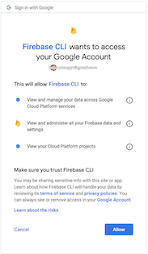
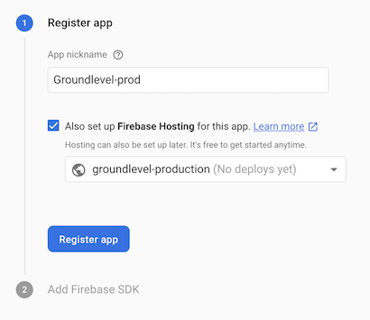

# Deployment

There are many, many ways to deploy a web application and I'm hesitating enforcing any rule or guidance at this part.

Having said that, there needs to be a way to deploy the template app to "production", so here goes...

---

**Philosophical note**

One strong intention is to keep deployment details away from the source code. Consider this akin to the Star Trek's "prime directive": the way things are deployed should not matter too much to how they are being built.

In some cases, people prefer to make separate deployment repos. Maybe that's the way to go also here. For now, these things live in the main repo but try to sneak unnoticed.

---

## Separate Firebase project for production

This seems to be a common pattern with Firebase. Use a completely different project for development and production. 

<!-- 
---
>Note: The developer's local computer can be seen as the "test" / development stage, with the Firebase emulator running making deployment unnecessary.
>
>You would still need a Firebase project for this, for e.g. authentication. 

---
-->

Having separate Firebase projects ensures that production data doesn't seep through to developers and allows one to have different access rights to these two projects (or three; is someone using staging?).

Development project does not necessarily need to be deployed to the cloud. Having the Firebase emulator available on the local development machine can be seen as this tier.


## GitHub CI/CD

Seems like a natural choice. What you use doesn't matter that much. The steps are described here and in the `.github/*.yml` files.


### When to trigger?

Decided to use a tag. If something is pushed to `master` with a tag that states `release-prod-<anything>`, that stuff would be deployed to the production Firebase project.

This can mean that releases are done from the GitHub web UI.


### Authentication 

There are two ways: token and `GCP_SA_KEY`. Ideally, both could be discussed here since I'm not quite sure of their differences (pros/cons).

#### Token

```
$ firebase login:ci
```

Firebase documentation [tells to use this](https://firebase.google.com/docs/cli#update-cli) to get a refresh token, but...

>

This dialog makes me a bit unnerved.

The `firebase` command likely already has (and needs) access to the Firebase cloud, but I hesitate and press 'Cancel'. 

I don't see why my local development machine needs to be involved in getting a production token - can I not get it online?

##### Fetch a Token online

- Go to your production project at [Firebase Console](https://console.firebase.google.com)
- While in here, **Create a web app**. This is needed for Firebase hosting to work (if I remember correctly).

   >

🤨 Did not find an online terminal like GCP has. Maybe I need to bite that bullet and fetch me a refresh token, as being told..

---

( So essentially the warning can mean that since Firebase CLI fetches the token, it could do the above mentioned. It does not mean that it stores the token, so... Guess it's fine. )

---

Place the token under GitHub `Settings` > `Secrets` as `FIREBASE_TOKEN`. 

Note: Here could be yet another reason to keep a separate repo just for deployments. Anyone you invite as a GitHub contributor now has access to your production environment. 

<!-- Editor's whisper:
You might think the collaborators cannot read the secret. True. Can they make a script that prints it out? Yes. They'll leave a trail so you know whodunnit, but it's not that difficult to get such a secret out.
--> 


#### `GCP_SA_KEY`

Demands work at the Google Cloud Platform console side. 

Why and when would this be more suitable?

<font color=tbd.>Explain.</font>


## Privacy, billing, ...

- [ ] You may also want to visit the **Data privacy** page (Firebase Console > Settings > Data privacy) to enter your GDPR contact info. But this depends on what kind of information you store, and how "large scale" your app is.

- [ ] Please pay attention to **Billing**, and place budgets. 


## References

- [Deploy to Firebase Hosting with Github Actions](https://medium.com/@puuga/deploy-to-firebase-hosting-with-github-actions-f795785fde6b) (blog, Oct 2019)
- [Deploy Gatsby to Firebase Hosting with Github Actions](https://blog.bitsrc.io/deploy-gatsby-to-firebase-hosting-with-github-actions-f24e3b807ea3) (blog @ Medium, Feb 2020)  
- [Automate Firebase deploys with Github Actions](https://www.webscope.io/blog/firebase-and-github-actions) (blog, Jan 2019)

- [GitHub Actions for Firebase](https://github.com/marketplace/actions/github-action-for-firebase) (GitHub Marketplace)
  - Note: Like with any GitHub Action, you can study its [source](https://github.com/w9jds/firebase-action)

