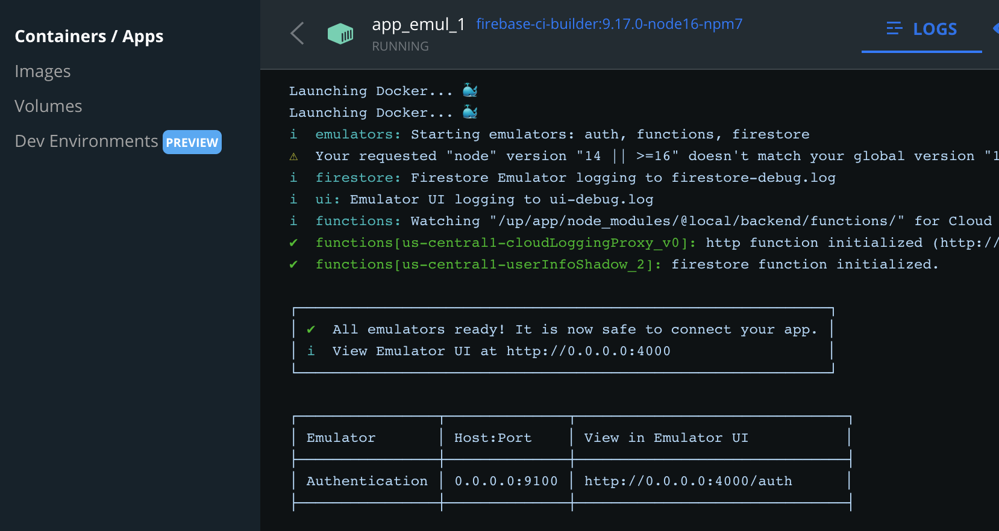

# Living with Docker Compose

Docker Compose (DC for short) is used to launch Firebase emulators in both `packages/backend` and `packages/app`. This is intended to happen behind the scenes, but there are a few things you - as a developer - should know. 


## Lesson 1

When you do this:

```
$ npm run dev
...
[+] Running 3/3
 ⠿ Network app_default       Created          0.1s
 ⠿ Container app_vite-exp_1  Created          0.2s
 ⠿ Container app_emul_1      Created          0.1s
[+] Running 2/2
 ⠿ Container app_emul_1      Started          0.9s
 ⠿ Container app_vite-exp_1  Started          0.8s
wait-for-it: waiting 15 seconds for emul:6767
wait-for-it: emul:6767 is available after 4 seconds
wait-for-it: waiting 10 seconds for emul:9100
wait-for-it: emul:9100 is available after 5 seconds
wait-for-it: waiting 10 seconds for vite-exp:3000
wait-for-it: vite-exp:3000 is available after 0 seconds
```

... you return to the same command prompt.

The services are still running in the background, and take up the ports (in this case):

|||
|---|---|
|6767|Cloud Firestore|
|9100|Firebase authentication|
|3000|Serving the front-end files (Vite)|


## Lesson 2

Since the services did not need another terminal to be opened, where can you see their output?

Docker > `Dashboard` > `Containers / Apps` > `app` > `app_emul_1`



Docker Desktop becomes your periscope to all things running below the surface. Study it - use it!


## Lesson 3

To bring things down (and release the ports), either:

- `docker compose down` from the terminal

   This brings down the services launched *in this particular folder* (and defined by the default `docker-compose.yml`).
   
- Docker > `Dashboard` > `Containers / Apps` > (pick) > `Delete` (trash bin icon)

- Docker > `Restart` (or close Docker Desktop)


This abstraction will hopefully grow into you. Instead of running things *on your machine* - you are running them in the Docker Compose parallel universe.


## Implications

Commands like `npm test` launch the emulators behind the scenes. On the first run, this takes somewhat longer (~30s .. 1min) since the Docker images need to be pulled and the containers started. Later launches are way faster.

These same services are used for your development, as well, so if you have done `npm test` there's no need for an `npm run dev`.

To use the same ports in another context, just run down the containers. 

>Obviously, you can also decide on a port numbering scheme across your projects where port numbers don't overlap. In this way, it's fine to leave the containers running.


## Why we use it?

The repo needs some way of managing the Firebase emulators and Vite, and DC turned out to be better than the alternatives.

- helps keep `package.json` simpler
- is suitable for both development and CI use
- is a standard tool good to gain experience with
- helps make execution environments more alike between different users, machines and OSes
- does not require extra terminals to be kept open, but allows centralized access to the service output, when needed

Before DC, the repo used `concurrently`, an `npm` package. This worked, but fell short of DC in most of the above cases.

### Some downsides

The main downsides of using DC are:

- dependency on Docker being installed
- one needs to remember to `docker compose down`, to release the ports
- some stability issues (we're keeping an eye on this!)


## Troubleshooting

We're only moving to DC, and there may be some stability issues with the stack. 

If you meet these, a Docker > `Restart` is often sufficient.

<!-- hidden
If you understand what causes them, please share the knowledge / suggest a PR to avoid them.
-->

### Network error in bringing DC down

```
$ docker compose down
[+] Running 1/1
 ⠿ Container app_emul_1  Removed                                                                                                                                                                                                                 10.4s
 ⠿ Network app_default   Error                                                                                                                                                                                                                    0.0s
failed to remove network bf7b0a66db9138f6e9bf85c8d7dcb9643830e2c5f520d124d226e92e7232b7d8: Error response from daemon: error while removing network: network app_default id bf7b0a66db9138f6e9bf85c8d7dcb9643830e2c5f520d124d226e92e7232b7d8 has active endpoints
```

Not known what's causing this.

Docker > `Restart` and things can be fine, again.

Sometimes, one needs to remove the whole container group (as described above).

Seen on:

- Docker Desktop for Mac 4.0.0


### Hot Module Reload doesn't work!!

**File changes in the host are expected to be seen inside the containers, so that services can act accordingly.**

This is **not** true for Docker Desktop for Mac (4.0.0), at least not consistently.

A "factory reset" seems to momentarily help, but soon the problems are back.

A hack (-ehem- fix) is underway... Use it if:

- you develop on Mac, and
- ..you are developing backend, and want emulators to realign when Security Rules or Functions sources change (and they don't)
- ..you are developing app, and changes in source are not reflected in the browser

Links to real open issues where this is discussed are in the `TRACK.md`.


## Tips

Some unrelated `docker compose` commands that may be useful:

||what it does|
|---|---|
|`ps`|Lists the services currently running|

