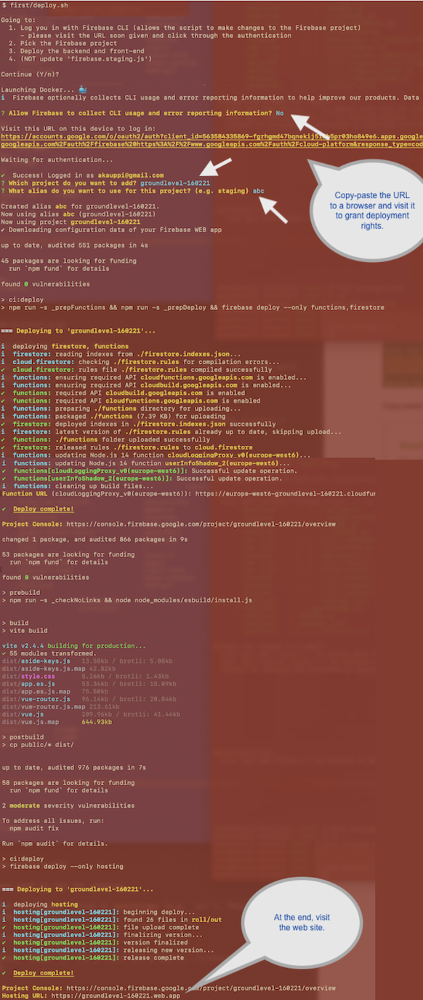
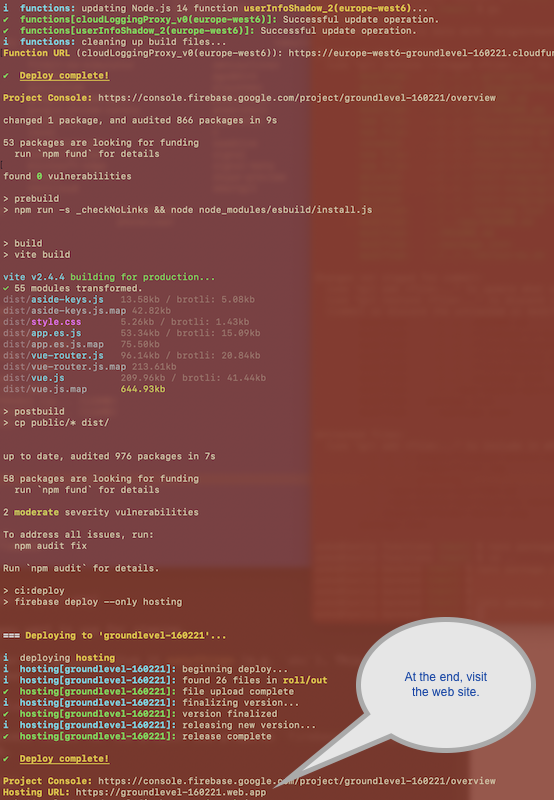

# First

Instructions on how to manually deploy the backend, and build and deploy the front-end.

The commands are to be executed in the `first` folder.


## Requirements

- You have a Firebase project created
   - it has "Blaze" plan with these enabled:
      - [x] Cloud Firestore
      - [x] Cloud Functions
      - [x] Realtime Database
      - [x] Hosting
  - it has an "application"
- Have Docker running


## Steps

```
$ ./deploy.sh
```

This asks you to log into the Firebase project.

>Security note. Authentication is done using Docker containers; your deployment credentials should not get stored on the development machine.




>Hint: On macOS, try Cmd (⌘)-double click on the URL in the terminal, to open it.

Did you reach the end?

Visit the stated URL - is there an app?

**This may be your first deployment!**. Let's celebrate for a while!! 🎉🎉🎪🤹‍♀️🎺

>Note: Let the author know if there were any problems (by filing a [GitHub Issue](https://github.com/akauppi/GroundLevel-firebase-es/issues)). This stage is important because it's early on in the onboarding. But it's also done "just once" - you'll likely turn to CI/CD if you remain using the template.


Then [return to main README](../README.md).

