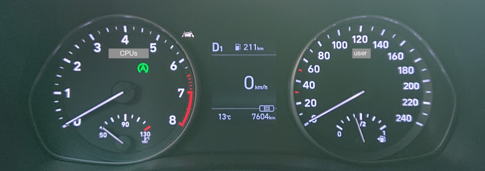

# Observability (with Grafana Cloud)

>Observability is the ability to measure the internal states of a system [...] [source](https://www.splunk.com/en_us/data-insider/what-is-observability.html)

To manage any reasonably complex entity, such as a web app with stateful backend and multiple kinds of clients; users with different needs and behaviours - you need *observability*.

Grafana Labs is a leading maker of observability products. The observability stack of this repo is based on their cloud offering, the 
Grafana Cloud.

<!-- tbd. L image, with Grafana Cloud pillar?
-->

## About Grafana Cloud  

[Grafana Cloud](https://grafana.com/products/cloud/) is a hosted service with generous [free tier](https://grafana.com/pricing/) (14 days retention; 50GB logs; alerting and other features).

With Grafana Cloud, you can pull in information about your various applications, into the *same ecosystem* where you have tools to query them, and find insights.

While you can integrate Grafana Cloud with various other tools, it is *self sufficient* in the way that you don't necessarily need *anything else*, to successfully run a web app. Also, it will scale (webcasts mention terabytes of logs; more than you'll likely be able to create)!

### Read (also) the documentation

You'll do well by studying the Grafana Cloud documentation, alongside these shorter and more focused instructions. This gives you both the "big picture" and the hands on experience on applying it to *your* product.

The focus of this guidance is in setting your repo up, and explaining where you'd find certain data. It's like driving instruction; to become a fluent driver, you'll need more.

>Note: Grafana Cloud [documentation](https://grafana.com/docs/grafana-cloud/) now (Nov 2022) seems to be separate from other Grafana products (open source; Enterprise), but earlier, the author noticed some parts of the documentation contained parts (e.g. about managing the services) which do not apply to the cloud offering.
>
>Maybe this is now a foregone worry. But be adviced. Grafana Labs creates multiple products. Grafana Cloud is their cloud offering.

## Why Grafana?

The author tried two products (and surveyed multiple others) before gravitating to Grafana Cloud. It offers *everything* we need, and provides it in a clear packaging; with a generous free tier.

Unlike some earlier monitoring/logging products, Grafana stores its data in cloud buckets, and indexes only the tags specially provided. This means a few really nice things: practically instantaneous seeing of data in the console; cheap storage. The author admirers these technical solutions and feel great, recommending the product.

A monitoring product easily becomes crucial for a company or a project. While you can use any web framework (and in 2023, likely multiple serverless backends), the repo offers *no alternative* for Grafana Cloud. It's one of the strong pillars the repo is based on (others being ES Modules, Docker Compose, Vite and maybe Cypress). 

## Requirements

- Grafana Labs account

   In particular, you will need:
   
   - Prometheus User ID
   - Loki User ID
   - Metrics provider API key

   The guidance will show you where to get these.

## Contents

- Setting up Grafana Cloud
- Collecting data
   - Core Web Vitals
   - Custom Metrics
   - Logs
   - Performance monitoring
- Alerts

- Synthetic monitoring
- Load testing

---

<a href="1-setting-up.md">Setting up Grafana Cloud</a> ▶︎

