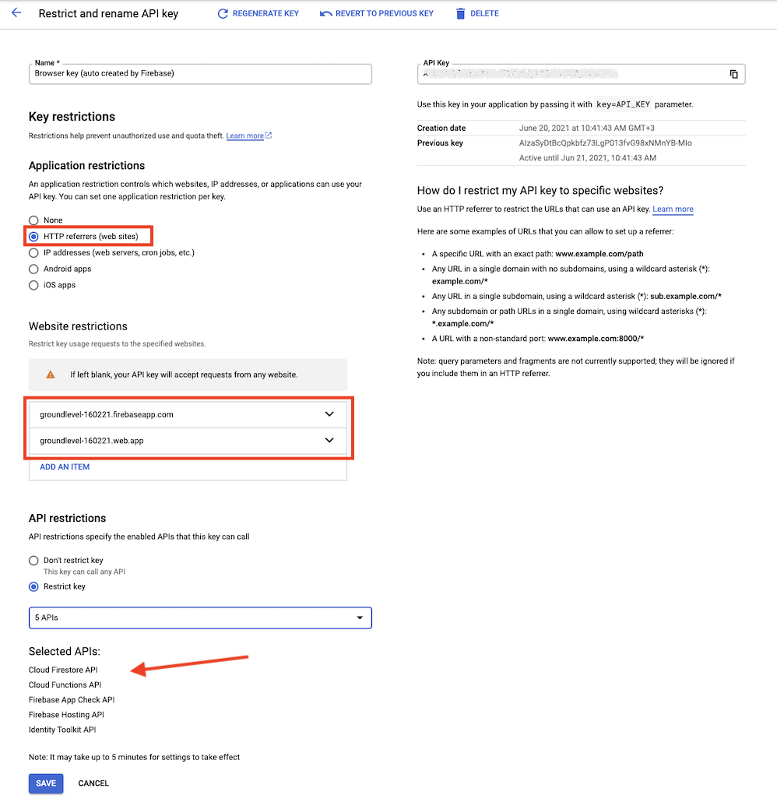

# Hardening ops

For deployments used outside of your own teams (production, long-lived staging), take a few steps to restrict access to them.

>

The main benefit of this is likely against denial-of-service attacks and other attempts that could cause use of your billable resources (eg. Cloud Functions).

>If you can describe the importance of this in more detail, please `#contribute`. Also a link is great!

