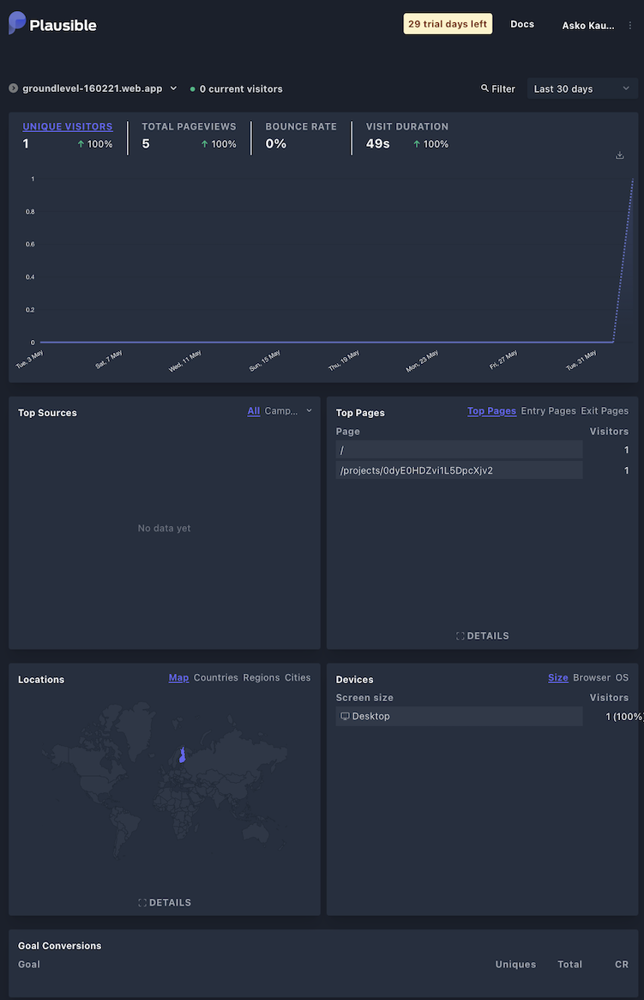

# 1.1 User analytics

We've selected [Plausible](https://plausible.io) as the suggested user analytics provider.

This is a bit controversial. It's the *only* recommended package that doesn't have a free tier, but it's still worth a try (30 days trial).

## Questions to ask

With user analytics in place, you can answer questions such as:

|||
|---|---|
|**Userbase**|
|- how many users does the application have?|
|- where are they from, geographically?|
|- how many are frequent users?|
|- what devices are they using?|
|- is the the number of active users increasing, or declining?|
|**Interaction tracking**|
|- is a certain feature / application state being used?|

## Plausible Analytics

[Plausible Analytics](https://plausible.io)

Plausible provides a simple dashboard:

 *This dashboard is [publicly available](https://plausible.io/groundlevel-160221.web.app).*

<!-- tbd. Update once there's more data available! -->

Let's see how we can find answers to the above mentioned questions, using the dashboard.

||Plausible&nbsp;use|
|---|---|
|**Userbase**|
|- how many users does the application have?|Topmost, "Unique visitors"|
|- where are they from, geographically?|`Locations`|
|- how many are frequent users?|*can we see this?*|
|- is the the number of active users increasing, or declining?|Visitors trends are available in `Unique visitors` (different from active users, though)|
|**Interaction tracking**|
|- is a certain feature / application state being used?|One can create "goals" for these (bottom).|

You can change the time window from `30 days` to something else. This is important to be able to see trends and possible peaks.

>Idea... For frequent (returning) users, one could think of using Firestore to store some "last seen" date for each user and then sending an event to Plausible when a user logs back in. This is a bit complex, though, and other products might answer this one, better. The underlying issue likely is that Plausible as such is not connected to our app's user id's.

**Verdict**

The product is simple to use, at it states. If your web app is not part of a larger advertisement network (to either bring in users to it, or to show ads within the web app), the author recommends it. It's nicer towards your users, knowing that their identity is not shared with third parties.

>If you *are* dealing with ads, [Google Analytics for Firebase](https://firebase.google.com/docs/analytics) and its [events logging](https://firebase.google.com/docs/analytics/events?platform=web) may be the better fit.

|||
|---|---|
|**Pros**|&nbsp;&nbsp;Simple|
||&nbsp;&nbsp;Appreciative of user privacy (less bother, more focus on one's app)|
|**Cons**|&nbsp;&nbsp;A monthly fee (reasonable)|
||&nbsp;&nbsp;No insight on individual users (by design)|

---

  
⩓ <a href="1-ops.md">Operational monitoring</a>

  
<a href="1.2-errors.md">1.2 Error monitoring</a> ≫

