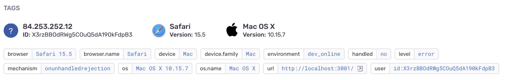

# 1.2 Error monitoring

Error monitoring is crucial. 

It is like a fire alarm. It should normally not ring, but if it does, you need to fast be able to figure out what's burning and how to fix it.

Here the quality of the tooling you use matters. Great tools bring together just the crucial information (stack traces, release history) etc. as context for the error itself.

What are these errors, then?

Let's say you mistyped a function name. Boom. It causes an error.

A network end point does not response (and you cannot work without it). An error.

Becoming fluent with error monitoring is beyond the purpose of this page. You should spend your time reading the [Sentry documentation](https://docs.sentry.io/product/sentry-basics/), instead. 

What we'll tell is how the web app template has been set up, so that Sentry will hear of your errors.

## How do errors look?

>

Here, we have two issues. An Issue is a Sentry grouping for an error, avoiding the dashboard from flooding if there's a great influx of them.

Let's dive in one.

>

We can see the browser type, environment (`dev_online`, i.e. this happened on development), and the logged in user's id.

>GroundLevel template informs the Sentry client of the current user (see `src/user.js` for this). You can map the id to more information about such user in the Firebase Auth console. You can also attach the user's email to  Sentry but that isn't done by default).

But what if there are multiple kinds of browsers, getting hurt?

>

The `Tags` sidebar shows this. For our sample, there's only one error. See Sentry's documentation and demos for how this pane looks in reality.

### Breadcrumbs

Sometimes, the error is obvious. Other times, it's somehow contextual and it's good to be able to follow the trail of events that lead to it. This is where breadcrumbs become useful:

>

Sentry collects your console output, network requests, navigation, UI events, to provide a trail that lead to the error.

There might be a lot of stuff here. Thankfully, Sentry has easy filtering for the entries:

>

This should allow you to focus on the parts that you think matter most. Understand the error. Correct it in the codebase. Deploy.

Mark the issue as dealt. 👊

## How to code?

Sentry doesn't need anything special from your code, to catch the errors. You can provide extra breadcrumbs to it via console logging, or via explicit calls to `Sentry.addBreadcrumb`[more info](https://docs.sentry.io/platforms/javascript/enriching-events/breadcrumbs/#manual-breadcrumbs).

---

  
≪ <a href="1.1-perf.md">1.1 Performance monitoring</a>

  
<a href="1.3-logging.md">1.3 Logging and counters</a> ≫

