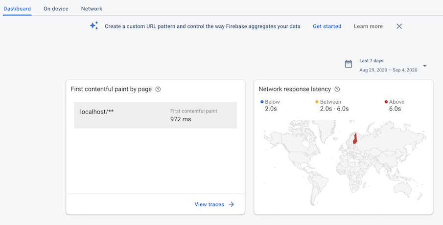

# Ops

Everything that has to do with the life after initial deployment.

There is no single way to do these things, and you may choose to use tools other than us. That's okay. We want to show some "defaults" so that you are not stranded, when it comes to ops.

## Performance monitoring

**What we want:**

- performance monitoring of actual use
- stats on end user hardware, resolution, physical screen sizes (desktop/tablet/phone?), browser type and version
- client side logging ("custom events")
- ability to work over offline gaps (i.e. caching)

**Usage:**

[Firebase Performance monitoring](https://firebase.google.com/docs/perf-mon) (in "beta" stage for Web; Sep 2020) is enabled for the production build.

When you do `npm run prod:rollup:serve` or use the deployed instance, performance data should get collected to the Firebase Console.

>Note: "Make sure to keep the browser tab open for at least 10 seconds after the page loads", so that data is shipped. (Firebase docs)

Then, you should see this in the Firebase Console > Performance:

**Now is a good time to read the manuals.** (link above) You really must read them carefully, to understand what to gain from the metrics.

After 24h, you'll see something like this:

<!--
**tbd. what is Performance Monitoring good for?**
-->

**Learning resources:**

- [Faster web apps with Firebase](https://www.youtube.com/watch?v=DHbVyRLkX4c) (Youtube 23:29; Sep 2019)

## Central logging

**What we want:**

- centralized, filterable dashboard for seeing logs
- especially seeing warnings / errors, to help develop the source code
- retention time: 1 week is likely enough
- offline friendliness; cache and send when the client can

tbd. How to do this with Firebase??

<!--
## Analytics
-->

<!--
- Metrics
- Logging
- A/B testing
-->

<!--
## References

**tbd. actually good performance monitoring links**
-->

