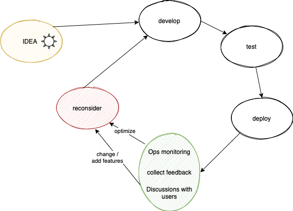

# Operations

<!--
*Figure 1. Development loop*
-->
<!-- source (draw.io):
href="https://app.diagrams.net/#G1QM56IXBlnFXuJvLmKuDH8QiGTHjfPMkS
-->

Without feedback, you operate in the blind. You don't know, whether you have any users, and not what their experience might be like. Your users have no voice to express their gratitude or wishes.

Closing the development loop (figure above) is mostly a *cultural* issue. If you *want* to learn from and interact with your user base, we'll show you the tools how.

>Before diving into the details, realize that running the loop depends on *automating* as much as you can - this helps save time for the human-to-human interactions, which collecting feedback and reconsidering the next steps inevitably are. It's in these steps - not in development - where your application really gets baked.

<!-- hidden
>Note: In test-based development, one writes tests first and the implementation after. Meaning the two ovals about them can be blurred, swapped or merged. It does not matter to this level.
-->

If you haven't deployed your application, yet, please consider doing so first and returning here once its first version is "out there". Without a deployed version you are not going to have an audience to talk with.

Release early and often.

---

## Tools

We've selected some tools for you.

||Used for|
|---|---|
|[Firebase Performance Monitoring](https://firebase.google.com/docs/perf-mon)|- collecting web vitals - collecting custom code traces (duration, counts)|
|[Sentry.io](https://sentry.io/welcome/)|- collecting web vitals - ...|
|Proxy to [Cloud Logging](https://cloud.google.com/logging)|- centralized logging|

<!--
- A/B testing; add mention of the tool(s), once selected (own config + Sentry filters??)
-->

>Author's impressions.
>
>Firebase Performance Monitoring is included because "why not" - we are using Firebase anyhow. However, it doesn't actually blow my mind as to the usefulness of the charts it generates (May 2022).
>
>Sentry, on the other hand, is a tool exclusively made for performance and other monitoring. It's awesome. There is some overlap between the two tools (eg. both collect web vitals). Check what use is comfortable for you.
>
>Logging is not covered by Sentry (it collects breadcrumbs that are similar to logging, but those only get sent to the server in case they lead to an error). 
>
>There is a use case for centralized logging, even for web applications. The author is not aware of a great browser-to-logging-service product, so the solution is to route logs via Cloud Functions in the Firebase backend.
>
>*See [Sentry vs. Logging](https://sentry.io/vs/logging/) for a great (and short) discussion on the relationship of the two.*

## Requirements

- A [Sentry account](https://sentry.io/welcome/)
   - free developer tier should be enough
   - Go through [Setting up Sentry](./Setting up Sentry.md) before continuing.

## Next steps

- [Operational monitoring](./1-ops.md)
   - [Performance monitoring](./1.1-perf.md)
   - [Error monitoring](./1.2-errors.md)
   - [Logging and counters](./1.3-logging.md)
   - [Uptime monitoring](./1.4-uptime.md)

- A/B testing

   tbd. Planning to add material on A/B testing. Likely using configuration and Sentry tagging (not introducing a separate tool).
   

- Meet your users

   tbd. Planning to add material on setting up and using [Discord](https://discord.com).
   

---

<a href="1-ops.md">Operational monitoring</a> ≫

