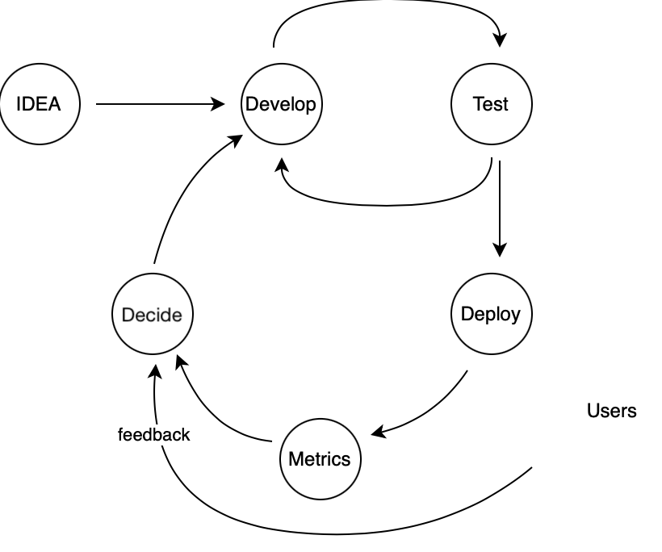

# Operations

*Figure 1. Iterative development*

## Why operations matters so much

If you do iterative development, you know the develop/test loop, topmost in Figure 1. It pays to get things (features, fixes) deployed to users often. 

Another, slower iteration starts there. Are your users happy with the delivery? Is it working as intended?

This, *operational iteration loop* consists of automatically collected metrics, and feedback (or even discussions!) you get from your users.

In order to *decide, what to do next* you need this information. Otherwise, you are running blind.

### Terminology

observability 
metrics
...

## Different kinds of operational tools

...

