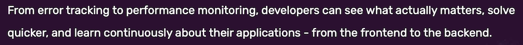

# Operations

This section is best read once you have completed the rest of the repo (backend, app), and you have deployed your web application.


## Requirements

- [Sentry.io](https://sentry.io/welcome/) account

   A [free developer tier](https://sentry.io/pricing/) should be enough.


## Sentry

[Sentry](https://sentry.io/welcome/) is a fun, high quality and affordable way to track how your app (and its users) is doing.

Let's let it present itself:

>

We use Sentry for front-end monitoring, but - as the description says - it can be used for backend tracking, as well.


### Creating a project

Name the project as you like[^1]. You can collect events from multiple stages (`dev[:local]`, `dev:online`, `staging`, ...) under the same Sentry project. 

Once you have the project, visit `Settings` > `Projects` > (project) > `Client Keys (DSN)` and pick up the Data Source Name (DSN) <sub>[more info](https://docs.sentry.io/product/sentry-basics/dsn-explainer/)</sub>. It can look like:

```
https://66b7...127@o39..58.ingest.sentry.io/52...04
```

This is an identifier for your client to be able to talk to the right Sentry project.

>Note. The DSN might not be forever. You can re-generate more DNS's if needed, and there may be more than one pointing to your Sentry project, at any one time.

[^1]: The author prefers attaching a creation name to such id's, eg. `groundlevel-110522`.


### Using Sentry at development

Just add `SENTRY_DNS` env.var to the launch command:

Within `packages/app`:

```
$ SENTRY_DNS=... npm run dev
```

Notice in the browser console:


And in the Sentry dashboard:

>*tbd. Do something that shows up here...

---

You can do exactly the same for `npm run dev:online`.

The environments are selectable in the Sentry dashboard:

>


### Using Sentry at production


### What do we collect???


