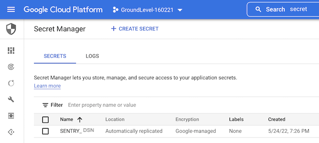
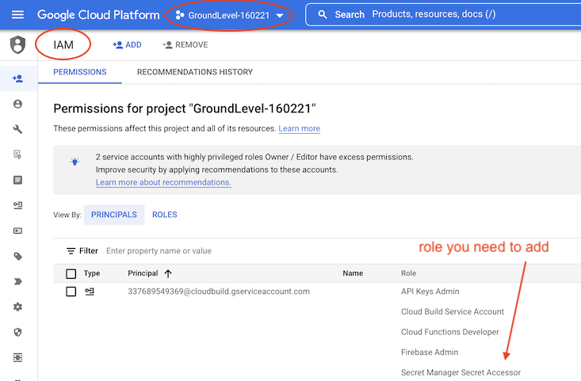
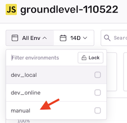

# Setting up Sentry

[Sentry](https://sentry.io/welcome/) is a fun, high quality and affordable way to track how your app (and its users) are doing.

Let's let it present itself:

>

We use Sentry for front-end monitoring only, but - as the description says - it can be used for backend tracking, as well.


## Creating an account

Visit [signup](https://sentry.io/signup/) and create your account.

<!--
tbd. Is any more guidance needed?  Check the steps...
-->

[Pricing information](https://sentry.io/pricing/)


## Creating a project

Name the project as you like<sup>[1]</sup>. Sentry is designed for collecting events from all your stages (development, `staging`, ...) under the same project. You'll then use filters to differentiate between them.

### Pick up a DSN

A Data Source Name (DSN) is a unique identifier that the Sentry client uses to pass your monitoring information to the right project (so it shows up in the dashboard).

Once you have the project, visit:

- `Settings` > `Projects` > (project) > `Client Keys (DSN)` and pick up your DSN. <sub>[more details](https://docs.sentry.io/product/sentry-basics/dsn-explainer/)</sub>

>A DSN looks like: `https://66b7127@o3958.ingest.sentry.io/5204` (fake)

The DSN is not strictly secret. It gets baked into your front-end code and people will be able to uncover it.

The most damage this can do is trying to flood your Sentry end point. If this were ever to be suspected, you can rotate the DSN.

### Rotating the DSN

You can generate more DSN's if needed, and circulate them. There may be more than one pointing to your Sentry project, at any one time.

But one is all we need to get started.

*<sup>`[1]` The author prefers attaching a creation date to such id's, eg. `groundlevel-110522`.</sup>*


## Using Sentry in production

We need to provide the Sentry DSN to CI scripts, and don't want to save it in the source code (version control).

There are at least two ways for doing this. We'll treat it as a secret, and make the Cloud Build deployment script pick it up from Secrets Manager.

### Create the secret

- Go to [GCP console](https://console.cloud.google.com)
   -  Pick the right project
   - (search bar) > `Secrets Manager`
      - `+ CREATE SECRET`
      - Provide name `SENTRY_DSN` and the value; leave other fields as-is
      - `CREATE SECRET`



You now have a "secret" created, but Cloud Build does not yet reach it. Let's change that.


### Provide access to the builder to the secret

- Go to [GCP console](https://console.cloud.google.com)
   - Pick the right project
   - `≡` > `IAM & Admin`

      

      - Click `edit` (pencil icon) on the `...@cloudbuild.gserviceaccount.com` line.
      - `+ ADD ANOTHER ROLE`
   
         Start typing "secret" to the filter field and pick `Secret Manager Secret Accessor` role.

         >More information: [https://cloud.google.com/secret-manager/docs/configuring-secret-manager](https://cloud.google.com/secret-manager/docs/configuring-secret-manager)

That should be it!

If you have multiple Firebase projects (eg. `staging`, `prod`), repeat these steps for each of them. The DSN may be the same (since there's just one Sentry project for the N Firebase projects).


### Check that Sentry gets used

Run the front-end -deploying CI script, either manually of from the GCP console.

```
$ cd ci
$ gcloud builds submit --config=cloudbuild.app.merged.yaml --substitutions _STAGE=manual ..
...
Step #4: Hosting URL: https://groundlevel-160221.web.app
Finished Step #4
```

>Details: Within `cloudbuild.app.merged.yaml`, there's a reference to the secret we created. The build script sees it as `SENTRY_DSN` env.var. and bakes into the browser's code as `import.meta.env.VITE_SENTRY_DSN` - which is used to initialize the Sentry client.

After deploying, open your app and development tools (browser console). You should see:

```
➦ Sentry initialized
```

You can also check the Sentry dashboard for your Sentry project. Does it have a drop-down with your stage name on it?

>


## Using Sentry at development

You can use Sentry also when developing the app. Just define `SENTRY_DSN` with the right value to the launch commands:

```
$ SENTRY_DSN=... npm run dev
```

and/or:

```
$ SENTRY_DSN=... npm run dev:online
```

This may help in optimizing performance, or you might want to see that changes to new Sentry instrumentation are being appropriately picked up.


---

⩓ [Ops](README.md)

