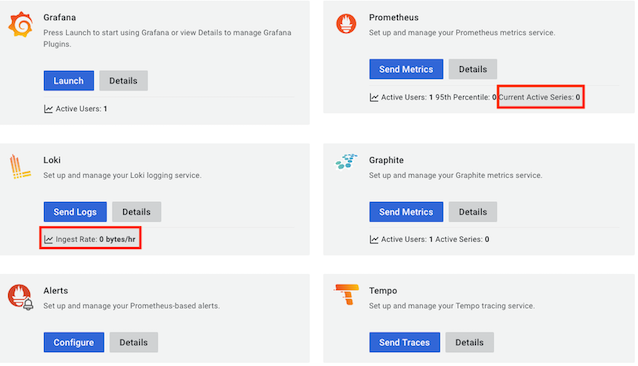

# Track

## Firebase Crashlytics: Availability for web

- [ ] [FR: Crashlytics firebase](https://github.com/firebase/firebase-js-sdk/issues/710) (GitHub issue; Apr 2018)

   Not available for web, as of May 2022.

   If it becomes, let's consider it vs. Sentry.

## Grafana Cloud: Overview should indicate data is in

>

This is after we're feeding the service, and able to read back the data.

Grafana Labs has acknowledged this is an issue. They will eventually fix the UI.

>Part of the problem is us using new ways (at least Influx Line Protocol was a factor in them not showing the data here).

- [ ] highlighted parts should indicate there's data
- [ ] instead of buttons `Send Metrics`, `Send Logs`, there will be something else

**Expected:**

- Once data has been pushed (via `/api/v1/push/influx/write` = InfluxDB Line Protocol for Prometheus; via `/loki/api/v1/push` for Loki), the overview page should idicate this, somehow.
- In particular, there should no longer be `Send Metrics` and `Send Logs` buttons that lead to a page telling *how* to feed data.

**Actual:**

- Prometheus: `Current Active Series: 0` remains, even once data is in.
- Loki: `Ingest Rate: 0 bytes/hr` remains (and may be correct)

**Reported:**

- Sent an email about this to `cloud-success@grafana.com`, as asked by David Dorman in [his comment](https://community.grafana.com/t/how-to-push-prometheus-metrics-in-grafana-cloud/47297/19?u=akauppi).
   