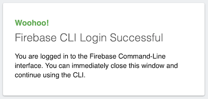

# app-deploy-ops

Takes the app developed in `../app` sister package and prepares it for operations.

Adds:

- `@ops/central` implementation that connects the app's logging calls to a cloud service
- crash reporting
- Firebase production initialization
  - bakes in Firebase access values

We get the application logic as a module dependency, and don't expect anything from it (apart from it needing Firebase initialized and an implementation for `@ops/central`). It can use any web framework, and any libraries.

### Adapters

Available integrations:

||adapters|comments|
|---|---|---|
|Performance monitoring||Raygun considered|
|Logging|[Cloud Logging](https://cloud.google.com/logging)|
|Crash reporting||Raygun considered|

>Note: You can use more than one adapter of a specific kind at any one time. This may be useful if evaluating vendors or transitioning between them.


## Requirements

- npm

### Have the app built

```
$ (cd ../app && npm install && npm run build)
```

>⚠️ We don't set up a watch from the app folder. The latest build done there is picked up by `app-deploy`. If you change app sources, also rebuild it.

### Have staging prepared

This means there's a `../../firebase.${ENV:-staging}.js` file that contains the means to reach the backend:

```
export default {
  "projectId": "testing-123",
  "appId": "...",
  "locationId": "...",
  "apiKey": "...",
  "authDomain": "testing-123.firebaseapp.com",
}
```

## Getting started

Install dependencies:

```
$ npm install
```

Build for deployment:

```
$ RAYGUN_API_KEY=x ENV=[production|staging|...] npm run build
...
created roll/out in 8.1s
```

>Note: Above, we give a fake Raygun API key. If you have a real one, and want to use it before deployment, just provide it, instead.

<!-- tbd.
Revisit this. How to tag reports differently so that local runs don't blur the real '${ENV:-staging}' data? 'dry-run' tag, maybe?, in addition to the env tag.

- [ ] 'dry-run' tag: true
- [ ] 'env' tag: "staging"|...
-->


### Try it out

```
$ npm run serve
...
Application served at: http://localhost:3012
```

Visit [http://localhost:3012](http://localhost:3012) and you should see a UI.


### Pulling things back

To pull down the DC stack used for hosting the pages (reserves port 3012), do:

```
$ docker compose down
```

>Note: It may be wise to do this, if you switch from one staging environment to another. And to clear browser cache.

<!-- tbd. Consider placing the `staging` env. name in the URL, to make sure there are no misunderstandings.
-->


<!-- REMOVE all?  (it's now done as part of root, right??)
## Deploying

Deploying is intended to be done via CI/CD.

We'll cover that in `../../ci` but for now, you can do one deployment manually.

<details style="border: 1px solid lightblue; padding: 0.5em;"><summary>Manual deploying...</summary>

### Manual deploying (just in case..)

```
$ docker run -it --rm -v $(pwd)/..:/work -w /work -p 9005:9005 firebase-ci-builder:9.16.0-node16-npm7 /bin/bash
```

Within Docker:

```
# firebase login
...
Visit this URL on this device to log in:
https://accounts.google.com/o/oauth2/auth?client_id=563584335869-...9005
```

Copy-paste the URL to a browser, visit it and sign in.



Close the browser and return to the Docker.

```
# cd app-deploy-ops
```

```
# firebase use --add
```

Select the right project, give a fake alias (eg. `abc`), and you're in. 

>This is the state that CI/CD would normally operate in. You can now run commands intended for CI.

```
# npm run ci:build
...
worker in 370ms
...
@firebase/app (imported by src/main.js, adapters/cloudLogging/proxy.js)
@local/app (imported by src/main.js)
created roll/out in 575ms
```

>The CI build picks the activation values from the active project. It does not need a `../../firebase.{env}.js`.

If all went well, proceed with deployment:

```
# npm run ci:deploy
...
=== Deploying to 'groundlevel-160221'...

i  deploying hosting
i  hosting[groundlevel-160221]: beginning deploy...
i  hosting[groundlevel-160221]: found 14 files in vite/out
✔  hosting[groundlevel-160221]: file upload complete
i  hosting[groundlevel-160221]: finalizing version...
✔  hosting[groundlevel-160221]: version finalized
i  hosting[groundlevel-160221]: releasing new version...
✔  hosting[groundlevel-160221]: release complete

✔  Deploy complete!

Project Console: https://console.firebase.google.com/project/groundlevel-160221/overview
Hosting URL: https://groundlevel-160221.web.app
```
</details>

You can now try the web app at the URL shown on the console:

[https://&lt;<i>your project id</i>&gt;.web.app](https://YOUR-PROJECT-ID.web.app)

The rest of this `README` discusses development of the `app-ops` operational layer. If you are not interested, you can skip it (proceed to `../../ops` and `../../ci`, in that case).

---

If you continue, we have a look at the adapter system and how you can develop them.

There are adapters for:

- performance monitoring
- central logging
- crash analytics

Let's first look at development commands in general, then peek at each of the adapter types, in particular.
-->

## Development

This development refers to when you are developing a new ops adapter, for example - not the app.

### Watch mode

If you develop the integration part (code in `src/`), it may be useful to have the code automatically repackaged after changes.

```
$ npm run watch:roll
```

>Note: This might not have Hot Module Reload (as `app` development has). Just press Refresh on the browser.

<!-- contributions on setting up HMR for Rollup are welcome :) #help
-->

### Stats

It's good to keep an eye on the packaging sizes.

There are many Rollup packages for this, and the choices done in this repo may not be the best.

We have:

- `rollup-plugin-analyzer` showing the output sizes on every build
- `rollup-plugin-visualizer` creates `roll/stats.html` showing the same info in a graphical manner

>💡: Please suggest your favourite plugins to the author; we can also think of stripping these completely away - it's a very personal thing and maybe best left for tools that visualize a directory already created (not needing to be part of the build setup).


<!--
## Performance monitoring

...tbd.
-->

## Logging

Logging is very organization specific (or personal, if you are a one-person organization). The reasons to pick a logging system might be:

1. **You already have one.** 

	There's no choice - you are told which one to use and how to use it.

2. **Integrations**

	It's part of your larger ops framework and you know a certain logging provider fits in well (to have alerts etc. function).

3. **The user interface**

	Logs are analyzed by people. The speed, ease of use and familiarity of the user interface matters, greatly!
	
	Don't burden yourself with a clumsy logging provider. Switch them! Compete them! We give you the means for that.

### Adapters

The GroundLevel central logging is based on adapters, allowing you to ship logs to or **or multiple** providers. You can eg. ship them both to the company standard logging provider, and a secondary one that you prefer for manual analysis.

You can create adapters yourself, and even publish and share them with others as npm packages.

>**Current state**
>
>The [Cloud Logging](https://cloud.google.com/logging) adapter is intended to be the initial one, but it's **work in progress** since Cloud Logging does not provide a browser facing logging client.
>
>Another nice one could be [Datadog](https://www.datadoghq.com). 

<!--
## Crash analysis

...tbd.
-->

## Final yards 🏃‍♂️🏃‍♀️

You've now covered building the backend, the front end and preparing the front end for deployment.

You have likely done one preliminary deployment (as part of the root `README`), to get all things going.

Next, you can check these two sub-folders in either order:

- [CI/CD](../../ci/README.md)

   Shows setting up a CI/CD pipeline, using [Cloud Build](https://cloud.google.com/build), for continuous testing and deployment.

<!-- tbd. too early
- [Operations](../../ops/README.md)

   Discussion about the operational aspects of running an application. The contents are firmly connected to what's in this sub-package but more general and discussive in nature (thus they aren't here).
   
- [People](../../people/README.md)

   How to handle the social side of your app. Getting more crowd - facilitating a meaningful discussion with them - without being their bitch.
-->

Getting your application deployed is simply the beginning of your journey. The author hopes that this repo helped you get faster to the beginning. 😋 

Be your bugs simple 🐞 and users friendly.
