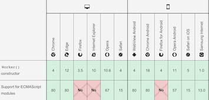

# Track

## Rollup: naming of output chunks

>Chunks containing multiple modules take the name string returned from manualChunks function.
Chunks containing only 1 module take a name derived from the module filename.

Explains the surprising behaviour we see:

```
app.es-c4d2a5af.js 		# should be 'app/...'
central-1a6cb2cd.js   	# should be 'ops-...'
```

- [Unexpected naming of chunks after manualChunks function](https://github.com/rollup/rollup/issues/3973)

## ECMAScript module support for web workers

- [https://developer.mozilla.org/en-US/docs/Web/API/Worker/Worker](https://developer.mozilla.org/en-US/docs/Web/API/Worker/Worker)

   

i.e. with Firefox and Safari one needs to transpile modules

