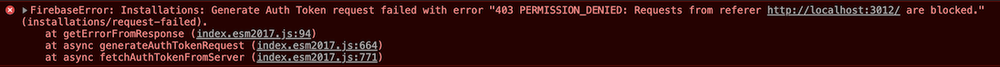
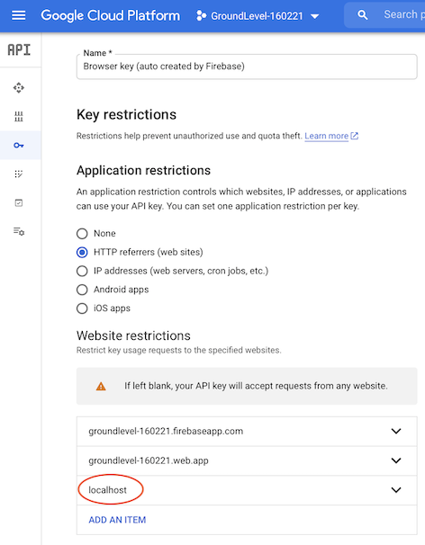

# Troubles

## "Referer blocked"

If you see this in the browser console (`npm run serve`):

..you have likely set up API restrictions in Google Cloud Platform, yourself. **This is great**. For production projects you should have these in place, but in order to use this *staging* project, you must allow `localhost` in the mix.

Remedy:

- Google Cloud Console > (project)
- `APIs & Services` > `Credentials`
- `Browser key (auto created by Firebase)` > Edit
- `Application Restrictions` > `HTTP referrers (web sites)`
- Add `localhost`

>

That should do it! 😊

