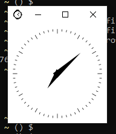
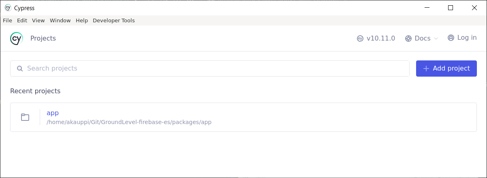
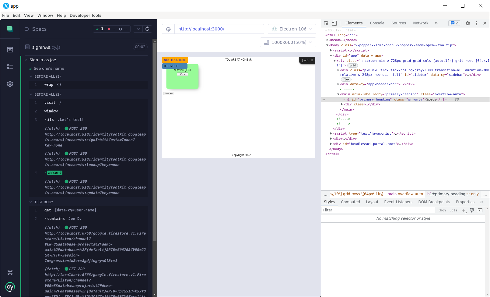

# Interactive Cypress with X410 (Windows 10)

Cypress can be used in two modes: running tests on command line, and interactive Test Driven Development. This document describes one way, how you can set Cypress up for TDD, using Windows 10 and the X410 client.

>Note: The author switches the client/server terminology on purpose. Technically, X Window calls the desktop part (that offers graphical services) a "server", but calling it "client" is more in line with any other remote mechanism a 2020's developer might be exposed to.

## Why is this a problem?

With WSL2, you run a virtual Linux operating system alongside the Windows GUI. If we run Cypress alongside the source code (on the Linux side), we need a way to route this graphical GUI to your Windows desktop.

On Windows 11, Microsoft provides [WSLg](https://github.com/microsoft/wslg/blob/main/README.md) for this use, but Windows 10 does not have it.

There are multiple ways to provide this interaction, though. X Window (the networked graphical application layer of Linux) is designed for this, but Windows clients used to be quirky to set up and operate, for a long time.

That seems to have changed, by the introduction of [X410](https://x410.dev/).

>Hint: You could roam around their nice web page for a while, get acquainted, then return if you feel X410 is okay for you.

## Requirements

- X410

   You can install it from the Microsoft Store (15 day free trial), or standalone. These are described on their website.

### It's commercial software - why would I want this?

There are open source X Window clients (servers? :) for Windows, but they are clumsy and won't necessarily perform that well. You'll easily waste some time. They were simply **created for another era (Windows XP or so)** and this is exactly where X410 shines:

X410:

- can be installed from Microsoft Store (trusted delivery channel)
- "only supports Windows 10 and later" (no legacy burden; modern UI; performance)

## Steps

### Installation and "smoke test"

The author installed X410 from Microsoft Store (with 15 days trial).

>Note: Read [Using X410 with WSL2](https://x410.dev/cookbook/wsl/using-x410-with-wsl2/) before or alongside these steps; it has more details. That document provides multiple options. We follow only one of them, below.

After launch, there's a X Window icon on the taskbar: 

- Click it and enable `TCP` > `WSL2` 

Within WSL2, point `DISPLAY` to the right IP:

```
$ export DISPLAY=$(cat /etc/resolv.conf | grep nameserver | awk '{print $2; exit;}'):0.0
```

>Note: Eventually, append that command to `~/.bashrc` so it gets executed for each new terminal. See X410 doc for the details.

Try a X11 program:

```
$ xclock
```

>

You should be able to see the window, resize it and move around.

You can close the process either by closing its window, or by Ctrl-C in the WSL2 command line.

>Hint: Another nice app is `xeyes`. 👀

### Preparing Cypress

On Linux, there is no desktop installer at the time of writing (Nov'22). Install Cypress via `npm`:

```
$ sudo npm install -g cypress
```

>Note: We install Cypress globally. Ignore the warnings about that. For `make test` we use a specific version (via `Dockerfile`), but for interactive use we behave in a manner similar to installation of desktop apps.

```
$ cypress -v
Cypress package version: 10.11.0
Cypress binary version: not installed
Electron version: not found
Bundled Node version: not found
```

Were you to try using `cypress open` now, it would state that the binaries are not installed. Install them by:

```
$ cypress install
```

>Hint: Cypress collects binaries in `~/.cache/Cypress`. If you update it multiple times, you should occasionally clean old stuff away by `cypress cache prune`.

**One more thing..**

```
$ make prep-cy-open
```

This links two `npm` modules (see `Makefile` for details) so that running Cypress tests would work.

## Launch Cypress

```
$ cypress open
```

>

You can now follow the normal instructions about interactive Cypress testing.

To launch the front-end, you'll need a second WSL2 terminal:

```
$ make dev
```

>Note: One could streamline the launch of `dev` (within Docker) so that it gets automatically done, when you launch Cypress. It's a matter of developer experience.



When using Cypress GUI, as suggested elsewhere, enable the developer tools (right click, `Inspect Element` or in the menu: `Developer Tools` > `Toggle Developer Tools`). This gives you a deeper view to what was happening, while the tests ran.


## Summary

You can now use Cypress for interactive testing, within Windows 10 + WSL2 setup.

- X410 takes care of binding the virtual Linux and the graphical Windows environments
- Cypress is installed and able to reach the service run by `make dev`

There are other ways to reach this. One would be to install desktop Cypress on the Windows side, and expose the necessary folders (`packages/app/cypress` and `packages/app/node_modules`, at least) in the Windows filesystem (these are visible in `\\wsl$\`). But that's another story - for the author this solution is sufficient, and the authors of X410 deserve the income they can make with the app.


<!--
## References

- [Using X410 with WSL2](https://x410.dev/cookbook/wsl/using-x410-with-wsl2/) (X410 docs)
-->
