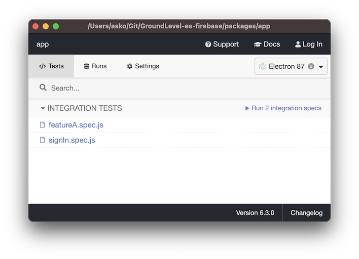
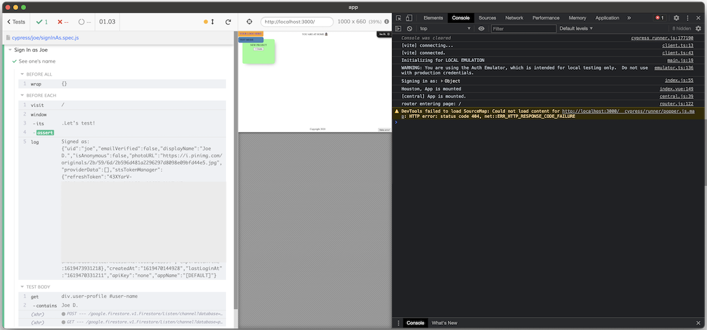

Prev: [README](./README.md)

*This second half of the `README` discusses tests and co-developing with the back-end.*


## Running tests

### Introducing Cypress

We use [Cypress](http://cypress.io) for testing the front-end.

It is a heavy install, and that's why we skipped it at first. Now we'll take it into use:

```
$ npm install
```

Cypress is a full desktop application. It carries its own browser (Electron), but can also be used with Chrome, Chromium and Firebase.

Why do we want to install it via `npm`?

- Cypress [recommends](https://docs.cypress.io/guides/getting-started/installing-cypress.html) doing so.
- It is a versioned tool: this way we can hopefully steer clear of version incompatibilities (less annoyance)
- It does cache the binary parts, and they are reused across projects.

Learning Cypress is a worthy thing. Please have a look at their [documentation](https://docs.cypress.io/guides/overview/why-cypress.html#In-a-nutshell) to "learn the ropes".


### Testing approach

We don't use (need to use) any stubs or proxies that Cypress mentions in their doc. Since a full Firebase back-end is emulated, all necessary features are available for the front-end.


### Run them all (CI style)

There are two ways to run the tests. `npm test` launches everything needed by the tests, then runs them. This is suitable for when you expect tests to pass.

Try it now.

```
$ npm test
```

`npm test` launches the same local server as `npm run dev`. If you already have that running, please close it first. `npm test` is intended for things like CI systems where no prior processes are running.


### Test based development

The other way is to keep `npm run dev` running, and edit both one's code and tests while keeping an eye on the test results.

Have `npm run dev` running in the background. Then:

```
$ npx cypress open		# in a new terminal (note: we do this only for the first time)
```

You should see:



Try to run the tests.



><font color=red>tbd. change image once tests pass</font>


Now edit some test in the IDE (they are under `cypress/integration/`).

Cypress will automatically re-run tests while you make changes to the source - or the tests. A big display may become useful, here!

In short, you can:

- *time travel* to see what the UI looked, at the time the tests were executed.

The Cypress approach changes the way we do software. The more time you spend with it, the more time it likely will save you.

>Hint: It's practical to launch Cypress from an OS icon. To do this in macOS, first launch like above. Then make the icon permanent (right click > Options > Keep in Dock). Other OS'es have similar mechanisms.

#### Give feedback!

If you find that some tests can be implemented better, do the Right Thing and tell the author. The tests we sport are intended to showcase good, modern way of testing web applications.


### Tests as a communication medium

You probably are already doing this... 

Tests are often simpler than actual code. They are more readable. This makes them something that one can discuss with one's Mom, Grandma, kids, or... the boss. Even a project manager.

Maybe you wish to write tests together. Heck! Teach them Cypress and they can write tests for you (to refine, and pass).

Let us know in the [Gitter](https://gitter.im/akauppi/GroundLevel-firebase-web) how it went! 🤡🤖👩‍🔧👨‍🎨


<!-- disabled (we don't need to mention it; used to be trickier)
## Changes to the back-end

If you need to do changes to the back-end, while test-based developing the front, just restart the server (`npm run dev`) and refresh the browser.
-->


## Contribution

As always, contributions and discussions are welcome.

Please use primarily the [GitHub Issues](https://github.com/akauppi/GroundLevel-es-firebase/issues) for questions and bug reports.

For casual conversation, head to the [Gitter](https://gitter.im/akauppi/GroundLevel-firebase-web). 

Have Fun, and spread the word!!
