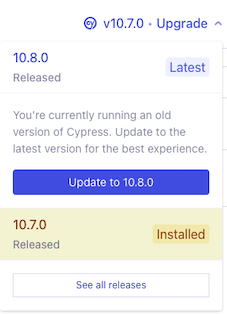

# App

Web application sample project.

## Requirements

- `npm`
- GNU `make`
- `docker`
- Cypress desktop app; 10.8.0+ (optional)

### Cypress setup (for test based development; optional)

[Cypress](https://www.cypress.io) is used in this repo for automatically running front-end "end to end" tests. For this, you don't need to do further installs.

If you want to use Cypress as a **desktop application** (which it really is!), for test-based development, you need to separately install it on your system. This use is *recommended* (because it offers a great developer experience!) but optional.

*Note: You may skip this section now; return to it later.*

To install Cypress:

<details><summary><b>macOS</b></summary>

- Visit `Installing Cypress` > [Direct download](https://docs.cypress.io/guides/getting-started/installing-cypress#Direct-download) 
   - download `cypress.zip`
- unzip it
- move `Cypress.app` to a destination of your liking, e.g. the user specific `Applications` folder.
- launch `Cypress.app`
</details>

<details><summary><b>Linux</b></summary>

There is no dedicated desktop download for Linux. Instead, you need `npm` (or some other Node.js package manager) to install it.

Follow instructions at Installing Cypress > [Linux Prerequisites](https://docs.cypress.io/guides/getting-started/installing-cypress#Linux-Prerequisites):

```
$ sudo apt-get update
$ sudo apt-get install libgtk2.0-0 libgtk-3-0 libgbm-dev libnotify-dev libgconf-2-4 libnss3 libxss1 libasound2 libxtst6 xauth xvfb
```

Then:

```
$ npm install -g cypress
$ npx cypress open
```
</details>

<details><summary><b>Windows 10 + WSL2</b></summary>

**NOTE: While the installation will work, THE WORKFLOW STILL NEEDS SOME WORK. Opening `\\wsl$\...\packages\app` did not work. Let's make an Issue about this, and find a way!!!**

- Visit `Installing Cypress` > [Direct download](https://docs.cypress.io/guides/getting-started/installing-cypress#Direct-download) 
   - download `cypress.zip`
- unzip its contents (right click > `Extract All`) to a suitable location, e.g. `C:\Users\{username}\bin`
- launch `Cypress.exe` in that folder

>Note: There's a Firewall confirmation dialog. *tbd. Take a screenshot, mention right options?*


Note that Cypress does not install as a normal Windows program, and it does not show in the `Start` menu. To uninstall Cypress, just trash the whole folder it's in.

<!--
>Hint: You can use this to have multiple versions of Cypress "installed", simultaneously. Just name their folders accordingly (e.g. `bin/Cypress 10.7.0`).
-->
</details>

<!-- disabled; at least until the author has access to Win11
<details><summary><b>Windows 11</b></summary>

<!_-- tbd. Consider, whether we'd like to take same approach as with Win10+WSL2 (if it turns out smooth). --_>

Windows 11 brings WSLg, allowing one to [run Linux GUI apps](https://docs.microsoft.com/en-us/windows/wsl/tutorials/gui-apps).

This means you should be able to run the Cypress installed within Linux, and use its GUI from Windows.

*The author does not have access to Windows 11, so any guidance on how this works in practice is appreciated. i.e. a PR :)*
</details>
-->

**Updating Cypress..**

Once there are more recent versions available, you'll see it in the Cypress GUI:



You'll see the changes by clicking `See all releases`, before updating.

This feature does not support the "direct download" route of installing that we took, but requests you to use `npm`, instead. You can, however, use it to be informed of new versions. If you want to upgrade, repeat the installation above.


<!--
Development is done with: 

- macOS 12.6
- node 18.8
- npm 8.18
- Docker Desktop 4.12.0 with: 3 CPU cores, 2 GB RAM
  - experimental > Enable VirtioFS
-->

## Getting started

```
$ make install
```

### Launch the app

```
$ make dev
...

  VITE v3.2.0-beta.2  ready in 690 ms

  ➜  Local:   http://localhost:3000/
  ➜  Network: http://172.20.0.2:3000/

...
```

This serves the UI locally, against an emulated Firebase back-end.

Try it: 

[`http://localhost:3000?user=dev`](http://localhost:3000?user=dev)

>Within local mode, you sign in by `?user=dev` query parameter.

Make some changes in the `src/**` files and see that they are reflected in the browser.

<!-- tbd. some more fun mod, perhaps?
>
-->

>Note: The IP (`172.20.0.2`) mentioned above exists only within the Docker container. Ignore it.

<!--
tbd. Use color-preserving piping (with `socat`) within the DC, taking the `Network` line out.
-->

## Two development workflows

The above command started a local, emulated version of Firebase.

The other way is `make dev:online`. This works against your cloud Firebase project. We'll come to it shortly.

Differences of these modes:

||Back-end|Data|Users|Authentication|Central logging|
|---|---|---|---|---|---|
|`local`|emulated|primed from `local/docs.js`|primed from `local/users.js`|with `&user=<id>`|To emulated Realtime Database only|
|`online`|in the cloud|in the cloud; changes are persistent|←|against real accounts|Via online Realtime Database to Grafana Cloud; stage `"{stage-id}"`, release `""`|

For local mode, the priming happens anew at each Docker Compose launch.

>Note: Tests (`make test`) use the same Docker Compose service as local mode, but bring their own data and users. You can use both `make dev` and `make test` at the same time. The two use different Firebase project id's so their data and users won't overlap.


### `dev[:local]`

Use this mode when:

- you are developing back-end features (Firestore security rules, Cloud Functions) and want to test that they work with the front-end.
- you want to start with primed data and users, each time, instead of persisting the changes
- you want to skip the sign-in dialog, to speed up development a few clicks
- you don't have a Firebase account, yet

With local mode, you can test back-end features while developing them, and only commit stuff that works.


### `dev:online`

With "online" development, you run against the Firebase back-end services, but still have hot-module-reload to help in developing the UI.

Use this when:

- the back-end is stable, and you are working on UI features
- the back-end is deployed
- you don't mind actually changing data
- you have a Firebase account
- you want to sign in as a real user

The mode needs `firebase.staging.js` in the project's root, to find the staging project. This will be created during your first deployment.

>Note: You can choose another project by `ENV=abc make dev:online`.

#### Launch! 🚀

Launch the server:

```
$ make dev:online
...
```

Point your browser to `http://localhost:3001`.

Changes to your front-end files are still reflected in the browser, but back-end services are now run in the cloud. Changes you do to the data will persist. Metrics and logs are proxied to Grafana Cloud (if you have set it up). Traffic you create will be using your [Firebase quotas](https://firebase.google.com/docs/functions/quotas).

The two development modes are completely orthogonal - you can run them side by side, in different terminals. <!--By default, local uses port 3000 and online port 3001.-->


## Linting

Before we look at tests, a brief mention on linting.

```
$ make dev:lint
...
```

This gives you warnings that you may or may not wish to fix. Steer them at `.eslintrc.cjs`.

>Note: At the moment (<strike>Apr 2021</strike> Oct 2022) we're not focused on reducing the number of lint warnings.

<!--
With the sample app, there may be warnings but there should not be errors.
-->

## Testing

You can use Cypress for running all the tests at once from the command line, or run them one by one, in a desktop Cypress installation.

For running from command line, Cypress is brought in via Docker Compose and you don't need to do any installs. For test based development, a desktop application is used. Instructions for setting it up are above ("Requirements" section).


### Running all the tests

```
$ make test
```

This runs all the front-end tests and returns you back to the OS prompt.

>Note: `make test` runs things within Docker Compose. Building the Cypress image takes some time, the first time the command is launched.


### Test based development

The other way is to keep `make dev` running, and edit both one's code, tests and potentially backend Security Rules, while keeping an eye on the test results. Every time you do a change to the app sources or Cypress tests, Cypress automatically refreshes the test output.

Have `make dev` running in a terminal.

Launch Cypress and pick the `packages/app` subfolder.

- Choose `E2E testing`

  - Choose any browser (depends on what you have installed on your computer).


Try to run the tests.


As you can see in the image, always keep the developer tools open while running Cypress tests. It helps.

>Note: It seems, with Cypress 10 there is no longer a "Run all tests" option in the dashboard. That's a shame (so you'll end up `make test`ing for seeing what fails, and drilling into it here).

Now edit some test in the IDE (they are under `cypress/e2e`).

Cypress will automatically re-run tests while you make changes to the source - or the tests. A big display becomes useful, here!

In short, you can:

- *time travel* to see what the UI looked, at the time the tests were executed. (hover over the test steps)
  - *pin* your view to a particular step in time, by clicking on it
- Use the *regular browser tools* to inspect components, see the console etc. also within a time-travelled render!

<font size="+3">*The Cypress approach changes the way we do software. The more time you spend with it, the more time it likely will save you.*</font>


>**Note:**
>Some Cypress features like "stubs" and "proxies" are not need, at all. Those are intended for building scaffolding when running things locally, but we have the whole Firebase emulators so we can work against the Real Thing.


## Manual testing on other devices

Both `make dev` and `make dev:online` expose their ports to all network interfaces, within your computer.

This means, the web app is browsable also from a phone, tablet etc. in the same network. All you need is to find out the outwards-facing IP number of your computer (let's say it's `192.168.1.62`), and open `http://192.168.1.62:3000` (or 3001) from your other device.


### Finding your IP number

|OS|Steps|
|---|---|
|macOS|`Preferences` > `Network` > (adapter) > `IP address`|
|macOS (terminal)|`ifconfig`|
|Windows 10 + WSL2|...tbd.|

>Hint: For WLAN on macOS, you can also `Alt`-click the WLAN icon in the toolbar.

<!-- tbd. #contribute
|Windows 11|...|
|Linux|`ipconfig` ??|
-->

<!-- tbd.
Make a nice helper (`make show-ip`) to cover the OS differences.
-->

## Production build

```
$ make build
...
vite v3.0.0-beta.9 building for production...
✓ 197 modules transformed.
../dist/index.html                         1.51 KiB
../dist/aside-keys.42ab51fe.js             14.01 KiB / gzip: 5.86 KiB
../dist/aside-keys.42ab51fe.js.map         44.04 KiB
...
../dist/firebase-firestore.1ecd9c81.js     464.63 KiB / gzip: 111.93 KiB
../dist/firebase-firestore.1ecd9c81.js.map 1140.85 KiB
```

This builds your front end application in `dist/` folder.

>Hint. We also use [rollup-plugin-visualizer](https://github.com/btd/rollup-plugin-visualizer) to provide a browsable report of the modules. Check it out by opening `stats.html`.


<!-- Hidden; didn't get the DC solution to work.  Needs `npm install -g http-server`
### Serve the `dist` (optional)

Just to peek that the build results are useful, you can run:

```
$ npm run serve
```

>Note: `serve` simply serves what's in the `dist/` folder. It does not rebuild the application.
-->

## First deployment

Next, you should take your project to the cloud. While regular updates are intended to be done using CI/CD, you can do your first deployment more manually. Head to `/first/README.md` for instructions.

After you have completed that, `make dev:online` will work.


## Next steps...

You can now start developing your own application - both backend and front-end.

When you feel like it, take a look at the following folders that have information about managing the application's full lifecycle:

- [`/ci`](../../ci/README.md) - Continuous Integration, using [Cloud Build](https://cloud.google.com/build)

   You set up the cloud to track changes to your version control, so that code changes get automatically tested and deployed.
   
- [`/ops`](../../ops/README.md) - Operational monitoring, using [Grafana Cloud](https://grafana.com)

   Learn about how to see metrics and logs of your web application, so you can fine tune it - and the users' experience.
   
- **UPCOMING**: [/momentum](../../momentum/README.md) - How to gain users and form a community to support your web app.


This concludes the web app feedback loop. Be your bugs be few, and users delighted!
